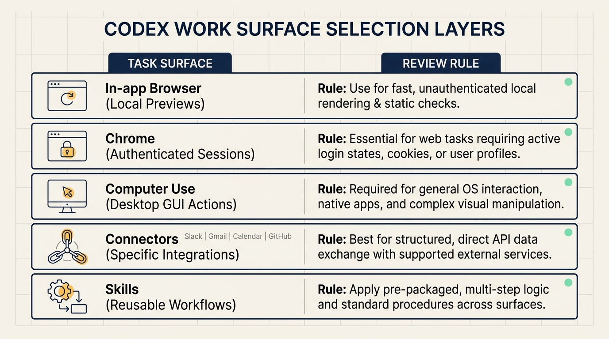
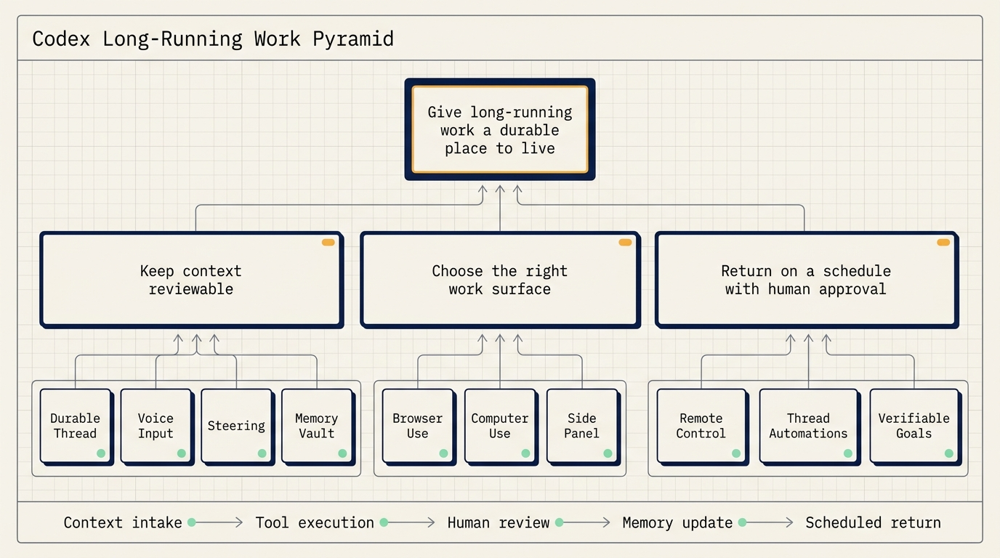
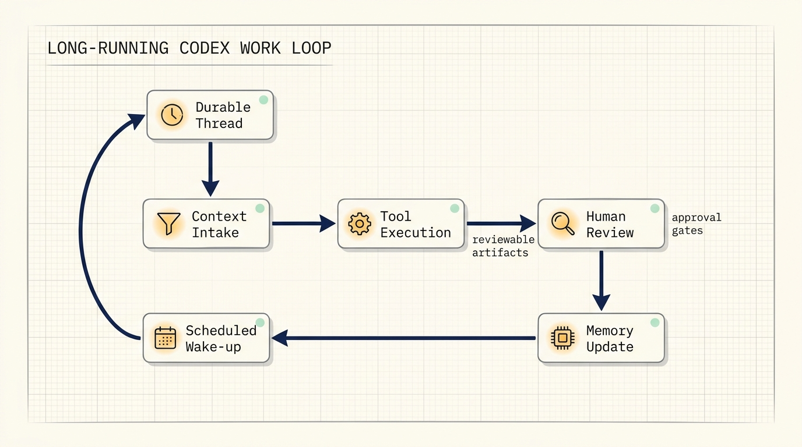

# Giving Codex a Durable Place to Work

OpenAI's white paper "Codex-maxxing for long-running work" is less about a single coding trick and more about a working pattern: Codex becomes useful when a task has somewhere to live, a way to keep context, access to the right tools, scheduled returns, and explicit human review points.

That matters because real work rarely fits into one prompt. A product change moves through design, implementation, preview, feedback, fixes, and release. A research article moves through source collection, structure, drafting, visuals, distribution, and review. A customer conversation may wait on email, Slack, support replies, logs, and approval. The white paper describes how to keep these loops moving without turning Codex into an unsupervised actor.

The useful frame is simple: long-running work needs a durable thread, reviewable memory, carefully chosen work surfaces, scheduled wake-ups, and goals that can be checked.

## Start with a durable thread

A durable thread is the home for a workstream. Short tasks can live in short conversations. Repeated work needs a place where context, preferences, decisions, open loops, and review history accumulate.

This is useful for workstreams such as open source maintenance, product documentation, recurring reporting, research synthesis, release preparation, or customer follow-up. If the same task will be revisited several times, a durable thread prevents every new session from starting with background reconstruction.

There is a tradeoff. A long thread carries more context and may cost more to run than a short one. The decision rule is practical: use durable threads for important workstreams that will be revisited; use short threads for one-off tasks.

## Capture rough thinking before it gets polished away

The white paper gives voice input a specific role. Voice is not only faster than typing. It captures the rough version of work: a half-remembered name, an uncertain reference, a loose direction, a reaction while reviewing a page, or a quick note after a meeting.

That rough input can be more useful than a polished prompt. Codex can turn it into a plan, draft, artifact, or next action. A user can say that someone in Slack mentioned an issue, ask Codex to find the context, and then let the thread turn that unclear instruction into a concrete search and response plan.

In practice, voice input works well as an intake layer. The user records the messy thought. Codex structures it. The user reviews whether the structure matches the intent.

## Steer while the task is moving

Steering means adding direction while Codex is already working. The white paper gives examples such as asking for smaller copy, correcting spacing, opening a pull request after a change, waiting for a preview deployment, or showing the preview before anything is posted.

This turns the thread into a queue that can be shaped while tool calls are happening. Instead of waiting for a complete output and then restarting, the user can correct direction as new information appears.

The key practice is to keep irreversible actions behind approval gates. Codex can prepare, edit, render, summarize, and propose. Sending, publishing, deleting, merging, paying, or changing production configuration should remain explicit human decisions.

## Put memory where it can be reviewed

Long-running threads need memory outside the chat transcript. The white paper describes a vault-like structure:

```text
vault/
  TODO.md
  people/
  projects/
  agent/
  notes/
```

Repositories hold code. The vault holds rolling context around the work: people, preferences, decisions, open loops, project state, and useful notes. When the vault lives in Git, memory changes become reviewable through diffs.

This matters because long-running systems should not silently accumulate vague impressions in conversation history. Important context should become a file that can be opened, edited, reviewed, and corrected.

A useful standing instruction is:

```text
When people are mentioned, update the relevant people notes.
When projects move forward, update the project page.
When loops close, mark them closed.
When decisions are made, write down the decision and why it matters.
```

## Choose the right work surface

The white paper separates several work surfaces:

- In-app browser: local web previews, Storybook, Remotion Studio, Streamlit, Jupyter, and small HTML artifacts.
- Chrome: authenticated sessions, signed-in browser state, and multi-tab web work.
- Computer use: desktop apps and GUI-only actions.
- Connectors: Slack, Gmail, Calendar, GitHub, and other work systems.
- Skills: reusable workflows that should not be re-taught every time.

This distinction keeps permissions understandable. A local preview does not require authenticated browser access. A signed-in web workflow should not be represented as a simple local file task. A desktop upload flow may require computer use, but only with review and clear permission.

For each task, decide what surface Codex can touch, what it can read, what it can write, and where it must pause for approval.



## Use remote control to unblock, not to skip review

Remote control helps long-running tasks continue when the user is away from the main machine. Codex can keep working where the files, permissions, and local setup live. The user can check in from another device, review progress, answer questions, approve the next step, or redirect the task.

The important distinction is that remote control should unblock review points. It should not remove review points.

For example, Codex can render a video, prepare a preview link, and wait. The user can review from a phone and ask for a layout adjustment. Codex can continue, then return with the next artifact. Publishing remains a human decision.

## Attach automation to the same thread

Thread automations are scheduled wake-ups attached to the current thread. They tell Codex to return on a cadence while preserving context.

This is useful for waiting tasks:

- checking Slack and Gmail for messages that may need attention,
- watching pull request comments,
- waiting for a deployment,
- checking whether a support agent has replied,
- monitoring a long-running command,
- preparing draft responses or next steps.

The structure should be explicit:

```text
Check this source.
Prepare this artifact.
Ask for approval before this action.
```

A recurring thread can prepare context and drafts, but human judgment should decide approval, tone, timing, publishing, sending, and irreversible operations.



## Learn from three loops

The white paper gives three example loops.

The first is a chief-of-staff loop. Codex checks Slack and Gmail on a schedule, finds messages that may need attention, searches for relevant context, drafts replies, and identifies questions requiring judgment. The user decides whether to send, how to phrase the reply, and when to act.

The second is a feedback-monitoring loop. Codex watches a Slack thread for animation feedback, updates a Remotion project, re-renders the piece, and prepares a review link. The loop crosses Slack, the project, rendering, and sometimes GUI review surfaces.

The third is a customer-support loop. Codex checks whether a support agent has joined, prepares the next response when the conversation changes, collects evidence, and recommends the next step. Consent and final approval remain with the user.

All three loops follow the same pattern:

```text
Trigger -> collect context -> prepare output -> human review -> next iteration
```



## Set goals Codex can verify

The white paper contrasts weak and stronger goals. A weak goal asks Codex to implement a plan. A stronger goal gives Codex something to test against: expected behavior, review criteria, constraints, or a definition of done.

One example is a library migration:

```text
Port this library, keep the public API compatible, and use the original unit tests as the success check.
The work is ready for review when the same tests pass and the differences are documented.
```

This goal gives Codex a concrete standard. The work is not complete because many changes were made. It is ready for review when the tests pass and the differences are recorded.

For long-running work, goals should include expected behavior, review criteria, constraints, and a completion condition.

## Bring artifacts into the loop

The side panel changes the collaboration surface. Markdown, spreadsheets, CSV files, PDFs, slides, local web previews, and browser surfaces can become shared artifacts inside the thread.

That means the user and Codex can inspect the same object while the work is still moving. Comments become instructions. The artifact becomes context.

For long-running work, this is more useful than a separate chat-only flow. The work product, review notes, and next instruction stay connected.

## A small practice workflow

A safe first practice workflow is a weekly project report.

Create a durable thread with a goal:

```text
Every Friday, prepare a Markdown report with project progress, risks, owners, and next actions.
Sources include project notes, pull requests, meeting notes, and manual updates.
The report is ready for review when every project has progress, risk, owner, and next action.
```

Create a vault:

```text
vault/
  TODO.md
  projects/
  people/
  decisions.md
```

Schedule Codex to prepare the draft. Keep it read-only at first. It can summarize, draft, and update notes after review. It should not send the report automatically.

The loop then becomes: collect context, prepare report, review, update memory, continue next week.

## Practical rules

Start with read-only automation. Let Codex check, summarize, and draft before giving it write access.

Keep approval gates for sending, publishing, deleting, merging, payments, and production changes.

Store durable context in reviewable files instead of relying only on conversation history.

Write goals with tests, preview links, documented differences, or explicit checklist states.

Choose the smallest work surface that can complete the job: local browser first, authenticated Chrome when needed, computer use only when GUI action is required.

## Source

- OpenAI, "Codex-maxxing for long-running work"
- Page: https://openai.com/index/codex-maxxing-long-running-work
- PDF: https://cdn.openai.com/pdf/8a9f00cf-d379-4e20-b06f-dd7ba5196a11/OAI_WhitePaper_Codex-maxxing26.pdf
- Published: June 22, 2026
