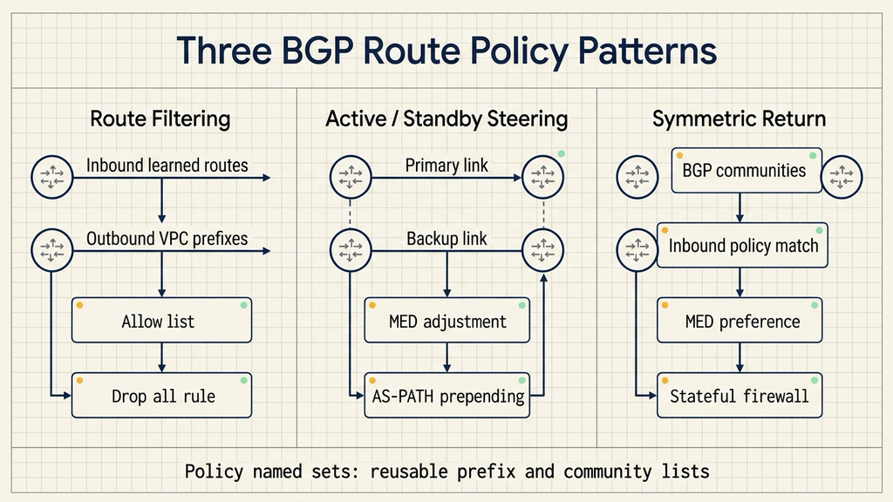
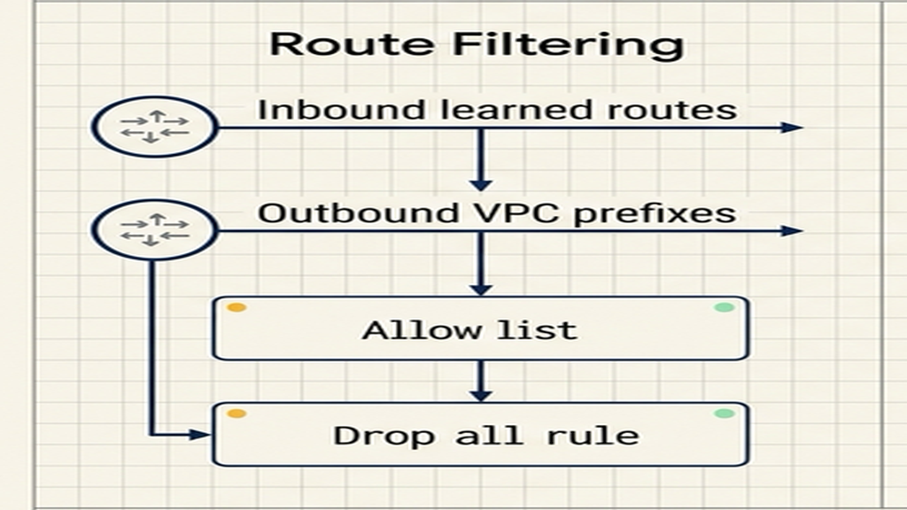
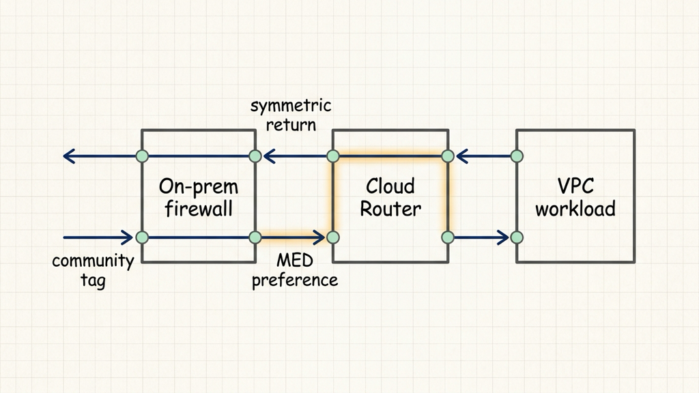

# Google Cloud 的 BGP 路由策略，解决了混合云三类老问题

## 资料来源

- 来源：Google Cloud Networking
- 链接：https://cloud.google.com/blog/products/networking/bgp-route-policies-top-3-use-cases-by-customer-demand
- 发布时间：2026 年 7 月 8 日
- 主题：Cloud Router 的 BGP route policies、policy named sets，以及三类混合云路由控制场景

混合云网络最麻烦的时刻，常常发生在线路还通、路径已经变得难以解释的时候：某些前缀被学进来，备用链路承担了不该承担的流量，回程路径绕过了原来的防火墙。

**BGP 路由策略**解决的就是这类问题。它把路由过滤、路径优先级和回程对称性，放到 Google Cloud 的 Cloud Router 里，用策略规则统一控制。

Google Cloud 这次文章值得看，是因为它没有只讲一个新功能名。它把过去一年客户最常用的三类场景列了出来：**路由过滤**、**主备路径控制**、**对称回程**。

## BGP 路由策略把控制点放进 Cloud Router

Cloud Router 原本负责在 Google Cloud 和本地网络之间交换动态路由。问题在于，路由一旦变复杂，团队需要控制的不只是“通不通”，还包括哪些路由能进来、哪些前缀能通告出去、哪条链路优先、返回流量走哪边。

BGP 路由策略把这些判断写成有顺序的规则。Google Cloud 使用通用表达式语言（Common Expression Language，CEL）描述匹配条件，再在 Cloud Router 里过滤 BGP 路由，或修改路由属性。

今年新增的策略命名集合（policy named sets），解决的是维护问题。团队可以把 IPv4/IPv6 前缀列表或 BGP communities 放进一个可复用集合，再被多个策略引用。

这对多 Cloud Router、多互连链路的环境有意义。前缀和 community 的清单变化时，团队改的是集合，不是到处复制同一段规则。

下面这张图把 Cloud Router 策略层、路由过滤、路径偏好和对称回程放在同一张关系图里。

## 第一类问题：先管住哪些路由能进出

混合云里最基础的一层控制，是路由过滤。Cloud Router 会从对等方学习路由，也会把 VPC 里的前缀向外通告。这里缺少限制时，风险会从“配置多一点”变成“路径不可控”。

Google Cloud 文章里提到，客户会用 BGP 路由策略过滤不需要的 learned routes，也会阻止特定 VPC 子网前缀向外发布。

更严的做法，是在策略评估列表最后追加一条“drop all”。这样默认模型会变成“只接受明确放行的路由”。这种设计适合安全要求高的网络，因为它能降低路由环路、错误通告和 BGP hijack 带来的风险。

这条兜底规则把路由入口和出口变成可审计的策略清单。出了问题时，团队可以直接检查哪些前缀被允许，哪些路由被丢弃。

这张文内图适合放在路由过滤一节，展示 allow list 和最后兜底丢弃规则的关系。

## 第二类问题：主备链路要能明确分流

很多混合云架构都有主动/备用链路。真实运行时，团队希望生产流量优先走一条链路，拥塞或故障时再切换到备用路径。

BGP 路由策略可以通过修改多出口鉴别器（multi-exit discriminator，MED）影响入站流量偏好。MED 可以理解为告诉对端：“同一个目的地，这条入口更适合。”

另一种常见手段是 AS-PATH prepending。它会在路由的 AS-PATH 里追加值，让这条路径看起来更长，从而降低它被选择的概率。

这两种能力放在 Cloud Router 里，含义是网络团队可以影响云侧路径选择，而不必每次都改本地硬件设备。对跨区域互连、成本敏感链路、备用专线来说，这会减少很多协调成本。

## 第三类问题：有状态设备要求回程走同一路

非对称路由是混合云里很常见的故障来源。请求从某台防火墙出去，返回流量却从另一台设备回来，有状态防火墙看不到完整会话，流量就会被丢弃。

Google Cloud 文章里的第三个场景，是用 BGP communities 解决这类对称回程问题。BGP communities 是给路由打标签的机制，本地网络可以给不同路径或设备打上特定 community。

Cloud Router 通过入站策略读取这些 community，再调整 MED，让返回流量更倾向于走原来的路径。这样云侧能理解本地网络的有状态拓扑，减少回程路径和出站路径不一致的问题。

这类设计适合有防火墙、网络虚拟设备、专线主备关系的企业网络。它关注会话路径是否一致，因为有状态设备需要看到完整请求和返回流量。

这张图用一条请求路径和一条回程路径，说明 BGP communities 如何帮助返回流量回到同一侧设备。

## 上线前先验证三件事

第一，路由过滤规则要能解释每一类前缀。哪些前缀允许进来，哪些 VPC 子网允许通告出去，最后一条兜底规则如何处理，都要在预发布环境里跑通。

第二，主备链路要验证 MED 和 AS-PATH prepending 的实际效果。路由属性写对了，还要看对端设备、运营商路径和组织现有策略是否按预期选择。

第三，对称回程要用真实流量路径验证。只看路由表还不够，涉及有状态防火墙时，返回流量经过哪台设备才是结果。

投入前也要确认场景是否匹配。不适用场景很明确：单一区域、单链路、前缀数量很少的网络，用普通路由配置就能处理；路由策略更适合多链路、多前缀、多设备参与的混合云环境。

Google Cloud 这次更新的价值，在于把复杂路由控制前移到 Cloud Router 的策略层。对网络团队来说，BGP 路由策略不是一个孤立功能，它更像一张规则表：明确哪些路由能进出，哪条路径优先，返回流量该回到哪里。

我会持续拆解 AI Agent 工程化方案，重点看安全架构、Claude Code、工作流和代码执行。

如果你正在做 Agent 应用，可以关注「大尹隐于网」，后面会继续写这一系列。
