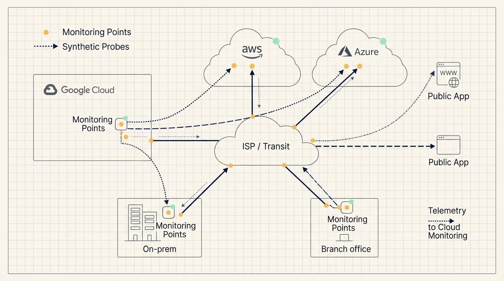
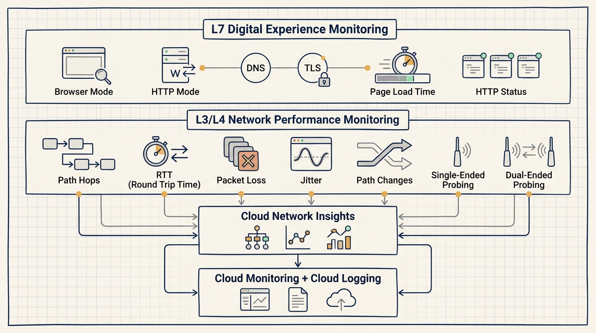
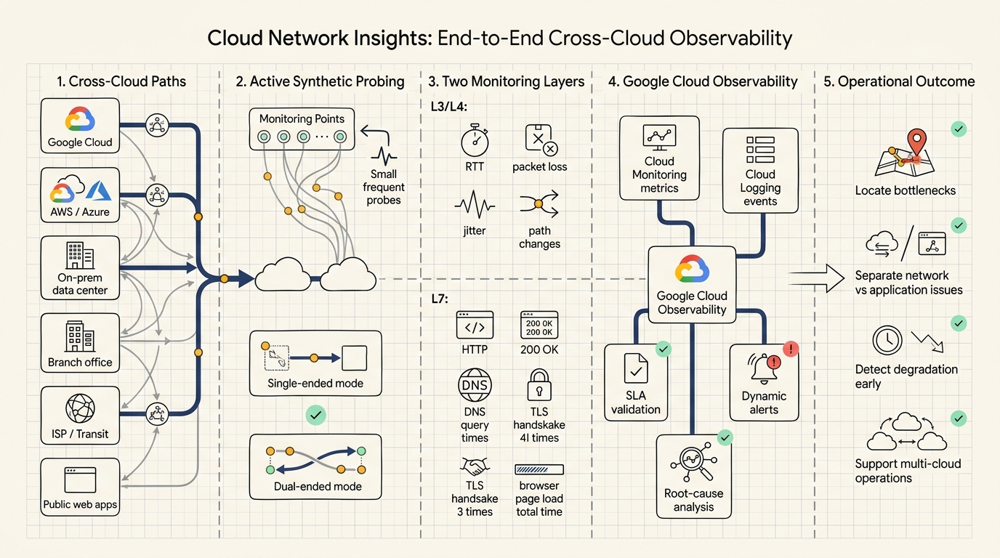

# Google Cloud Network Insights: End-to-End Observability for Cross-Cloud Networks

When an enterprise application slows down, the hardest part of the investigation often sits outside the application code. The request may cross Google Cloud, AWS, Azure, on-premises data centers, branch networks, ISPs, public web services, DNS, TLS, and the user’s browser before the team sees a symptom.

Google Cloud announced the general availability of Cloud Network Insights on June 18, 2026. The product is positioned as a Google Cloud-native way to observe network and digital experience performance across hybrid and multicloud environments.

The key technical idea is active synthetic probing. Cloud Network Insights deploys lightweight Monitoring Points into important network locations. Those Monitoring Points send small, frequent probes to targets, collect performance telemetry, and synchronize that data back into Google Cloud Observability through Cloud Monitoring and Cloud Logging.

## Cross-cloud troubleshooting is a path problem

In a single-cloud environment, teams can often narrow the problem to a resource, service, region, load balancer, database, or application trace. Hybrid and multicloud deployments make that harder because the user experience depends on a path that no single team fully controls.

Cloud Network Insights focuses on the source-to-destination path. Google’s post explicitly names Google Cloud, AWS, Azure, on-premises data centers, internet-facing applications, ISPs, and last-mile connectivity as parts of the visibility problem.

That is what end-to-end network observability means in this context: the team needs to see which hops the request crosses, where latency increases, where packet loss starts, whether jitter changes, and whether a browser slowdown is caused by network conditions or application behavior.

## Monitoring Points make the path observable

The core component is the Monitoring Point. It is a lightweight software agent that can be deployed as a container or virtual machine in locations such as a central VPC, a branch office, or an on-premises data center.

Monitoring Points perform three jobs.

First, they generate probes. They send small synthetic traffic bursts to destinations such as URLs, IP addresses, API endpoints, or other Monitoring Points.

Second, they collect path and performance data. This includes round-trip time, packet loss, jitter, path changes, and, in dual-ended mode, richer measurements such as one-way latency and asymmetric routing detection.

Third, they synchronize telemetry. Performance data is sent to a backend service and then synchronized into Google Cloud, with metrics exported to Cloud Monitoring and events sent to Cloud Logging.

The active nature of the probing matters. Teams can observe critical paths even when real user traffic is low or absent.

## L3/L4 explains the path, L7 explains the experience

Cloud Network Insights has two monitoring layers.

Network performance monitoring covers Layers 3 and 4. It gives hop-by-hop network visibility and captures metrics such as RTT, packet loss, jitter, and path changes. It supports single-ended mode for probing external targets that do not have a Monitoring Point installed, and dual-ended mode for probing between two Monitoring Points.

Digital experience monitoring covers Layer 7. Browser mode uses Selenium to load complete web pages, execute JavaScript, render content, and measure page-load time. HTTP mode sends HTTP/S requests to check availability, response time, DNS behavior, and TLS performance.

Together, these two layers help separate network degradation from application-level issues. A slow page can be caused by route changes, packet loss, DNS latency, TLS overhead, server-side delay, or browser rendering. The value comes from reducing the search space.

## Observability integration makes the data operational

Cloud Network Insights integrates with Google Cloud Observability. Metrics flow into Cloud Monitoring, while alarms and events flow into Cloud Logging. Alerts can be routed through email, Slack, or PagerDuty, and the system supports OpenTelemetry for metrics and logs.

Google’s post also describes auto-baselining for dynamic thresholds. This is useful in cross-cloud networks because the normal range for latency, packet loss, or jitter can vary across regions, ISPs, and time windows.

SLA validation is another major use case. If a provider has committed to a performance level, continuous path telemetry gives the operations team data to verify whether that commitment is being met.

Root-cause analysis depends on location. Cloud Network Insights tries to help determine whether a slowdown is inside Google Cloud, at the ISP level, inside another cloud, or at the application layer.

The Gemini Cloud Assist integration should be understood as an interface for querying and correlating telemetry. It can reduce dashboard switching, but it is not the core mechanism. The core mechanism is still synthetic probing plus telemetry synchronization.

## Where it fits

Cloud Network Insights is most relevant for teams already operating hybrid, multicloud, or globally distributed systems.

Cross-cloud application teams can use it when services running in Google Cloud depend on AWS, Azure, on-premises systems, or external SaaS. Network and SRE teams can use it to connect network performance, cloud metrics, provider behavior, and user experience in a single troubleshooting flow.

It is also relevant for businesses where latency, packet loss, and browser experience affect customer outcomes, such as travel, video collaboration, financial workflows, global support, and high-frequency API consumption.

The prerequisites matter. Teams need to choose meaningful paths, deploy Monitoring Points in representative locations, maintain monitoring policies, and connect alerts to an operational response process. Without that operational loop, the telemetry can become noise.

Cloud Network Insights should be treated as the network and digital experience layer of a broader observability stack. It complements APM, distributed tracing, logs, RUM, and service-level dashboards. It does not replace them.

The operational lesson is practical: cross-cloud observability depends on representative probe placement, meaningful path selection, alert routing, and post-incident review. The product provides telemetry, but teams still need to decide which paths matter, which thresholds map to business impact, and which remediation playbooks should run when degradation appears.

## Source

- Source: Google Cloud Blog
- Article: Cloud Network Insights: end-to-end observability for the Cross-Cloud Network
- URL: https://cloud.google.com/blog/products/networking/cloud-network-insights-end-to-end-cross-cloud-observability
- Published: June 18, 2026
- Author: Poonam Yadav, Product Manager

## Key takeaways

1. Cloud Network Insights uses active synthetic probing to observe critical paths even when real user traffic is absent.
2. Monitoring Points are the core probes deployed into VPCs, branches, and on-premises environments.
3. L3/L4 monitoring explains path health, while L7 monitoring explains web and API experience.
4. Cloud Monitoring and Cloud Logging turn network telemetry into operational alerts and events.
5. Gemini Cloud Assist is a query and correlation interface, not the core observability mechanism.
