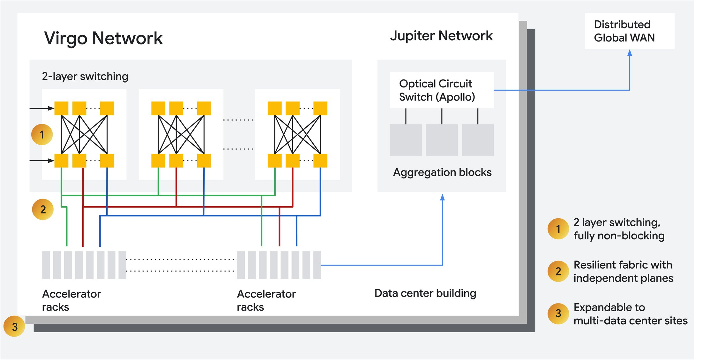
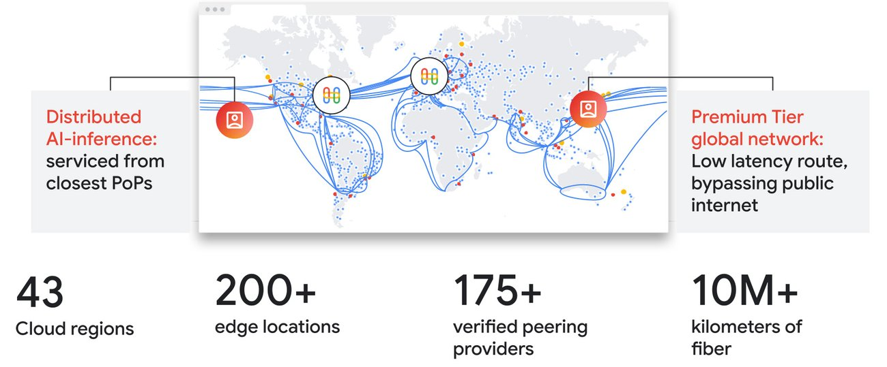
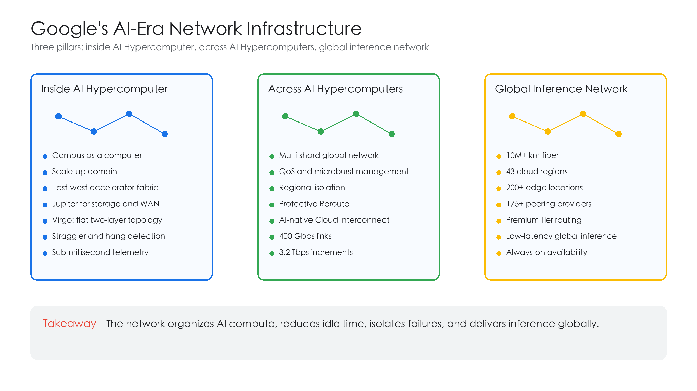

# Google's AI-Era Network Infrastructure: A Learning Note

Google's article is useful because it frames AI infrastructure as a network problem, not just a compute problem.

The core idea is simple: AI workloads need a network that can organize compute across sites, move data quickly, isolate failures, and deliver inference globally. Google breaks that network into three pillars: the fabric inside AI Hypercomputer, the fabric across AI Hypercomputers, and the global network for inference.

## Why AI changes network design

AI training traffic is different from conventional web or cloud application traffic. Large synchronous training jobs are sensitive to tail latency, synchronized bursts, hardware failures, and slow instances. A single stalled component can waste expensive accelerator time.

Google also points to a physical constraint: moving electrical power is harder than moving data over fiber. Since a single facility can hit space and power limits, the network becomes the mechanism for pooling compute across campuses.

## Pillar 1: Inside AI Hypercomputer

Inside AI Hypercomputer, Google uses a "campus as a computer" model. The network is separated into three domains:

- A scale-up domain for intra-pod connectivity.
- A dedicated east-west scale-out accelerator fabric.
- Jupiter frontend networking for north-south compute, storage, and WAN access.

Virgo Network is the AI-oriented scale-out data center fabric in this design. It uses high-radix switches, a flat two-layer non-blocking topology, and a multi-plane architecture for fault isolation.

Google says Virgo can link 134,000 TPU 8t chips in a single fabric, with up to 47 petabits/sec of non-blocking bisection bandwidth. It also provides up to 4x bandwidth per TPU 8t accelerator compared with the previous generation, and 40% lower unloaded fabric latency for TPU 8t.

Reliability matters as much as bandwidth. Virgo includes autonomous reliability features such as straggler detection, hang detection, fault localization, faulty instance isolation, and checkpoint-based recovery. Google also uses sub-millisecond telemetry to detect microbursts that conventional 30-second monitoring can miss.

## Pillar 2: Across AI Hypercomputers

The second pillar is cross-campus and cross-site networking. AI workloads may need data from on-prem environments, other clouds, or different regions. Traditional WAN designs were not built for AI-scale bandwidth and burstiness.

Google describes three WAN-level ideas:

- A multi-shard global network for horizontal scaling.
- QoS and real-time microburst management for fair bandwidth allocation and isolation.
- Multi-shard isolation, where each shard has its own control, data, and management planes.

Regional isolation and Protective Reroute are used to reduce blast radius and shorten user-visible outages.

AI-native Cloud Interconnect is the data-movement piece. Google gives a concrete example: moving 1 PB over a 100 Gbps link takes about 22.2 hours, while a 3.2 Tbps connection reduces that to about 0.7 hours. That is a 97% reduction in compute idle time spent waiting for data.

## Pillar 3: Global inference network

Inference has a different shape from training. Global AI applications need low latency, high availability, deep peering, and access to expensive AI compute that may be located far from the user.

Google's global network spans more than 10 million kilometers of terrestrial and subsea fiber, connects 43 cloud regions, and includes more than 200 edge locations. Premium Tier networking is used to optimize traffic entry and exit points for consistent global application performance.

## Key takeaway

The network is no longer a passive connectivity layer. For large AI systems, it becomes part of the compute architecture itself. It decides how accelerators synchronize, how failures are isolated, how training data reaches compute, and how inference reaches global users.
