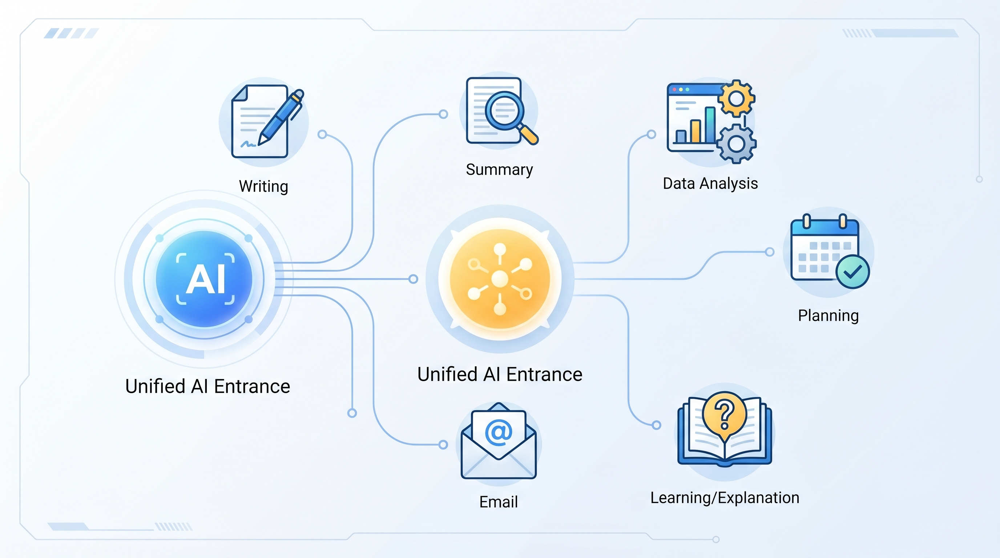
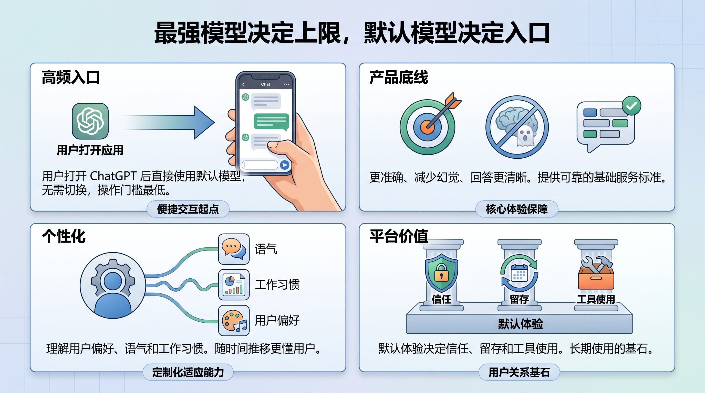
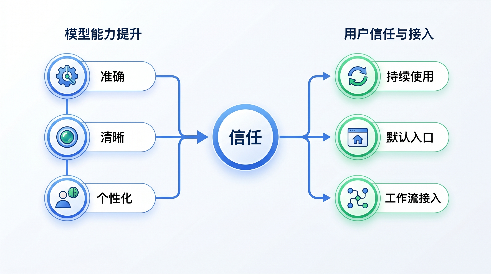

# GPT-5.5 Instant 的真正变化：OpenAI 在争夺默认入口

OpenAI 发布 GPT-5.5 Instant，表面上看是一次默认模型升级。

但这件事真正值得关注的地方，不是“又出了一个更聪明的模型”，而是 OpenAI 正在继续强化 ChatGPT 的默认入口地位。

默认模型不是最炫的模型，却是最重要的模型。

因为大多数用户不会每天研究模型列表，也不会反复切换推理模型、编码模型、语音模型或专业模式。他们只会打开 ChatGPT，然后直接提问。

所以默认模型承担的是 OpenAI 最核心的产品任务：让普通用户在最少选择成本下，得到足够稳定、足够清楚、足够像自己的回答。

GPT-5.5 Instant 的意义就在这里。

## 默认模型的竞争，不是参数竞争

很多人看模型发布，习惯先问：能力是不是最强？基准分有没有刷新？能不能处理更难的问题？

但默认模型的竞争逻辑不完全一样。

默认模型当然要强，但它首先要稳定。

它面对的是最大规模、最多样、最不可预测的日常请求：写邮件、总结文件、解释概念、做计划、改文案、分析表格、陪用户反复打磨一个想法。

这些场景里，用户不一定需要最长的推理链，也不一定需要最高成本的深度思考。

用户更在意的是三件事：

第一，回答是不是直接。

第二，事实是不是可靠。

第三，风格是不是符合自己的习惯。

OpenAI 这次强调 GPT-5.5 Instant 更聪明、更清晰、更个性化，正好对应这三个方向。

这说明默认模型的升级重点，已经从“能不能答”转向“能不能持续以合适方式答”。

## 降低幻觉，是默认模型的底线工程

GPT-5.5 Instant 的一个核心信号，是继续强调更准确回答和减少幻觉。

这不是普通优化，而是默认入口必须解决的问题。

如果一个高级研究模型偶尔出错，用户可能会理解为任务太难。但如果默认模型在日常问题上频繁编造事实，用户会直接降低对整个产品的信任。

默认模型越常用，它对信任的影响越大。

这也是为什么“减少幻觉”不是安全团队或研究团队的附属目标，而是产品增长的基础条件。

ChatGPT 想成为日常工作入口，就必须让用户敢把更多工作交给它。

敢交给它的前提，不是它每次都显得聪明，而是它在不知道时能承认不知道，在不确定时能说明不确定，在需要查证时能提示用户不要直接采用。

对普通用户来说，这比一次惊艳回答更重要。

## 更清晰，其实是在降低使用成本

OpenAI 还强调 GPT-5.5 Instant 的回答更清晰。

这句话容易被低估。

模型回答清晰，不只是语言更好看，而是减少用户二次追问和二次修正。

很多 AI 使用成本不是发生在第一次提问，而是发生在后面的反复纠偏：太长、太虚、没有结论、结构混乱、没有按场景落地。

如果默认模型能更准确理解用户想要的是摘要、判断、行动清单还是正式文本，它就能减少这种来回成本。

这会直接影响 ChatGPT 的日常粘性。

用户真正喜欢的不是“模型很强”，而是“它懂我这次要什么”。

所以清晰度不是文风问题，而是产品效率问题。

## 个性化控制，是默认入口的下一层护城河

GPT-5.5 Instant 另一个重点是改进个性化控制。

这可能比模型能力本身更重要。

因为当基础能力越来越接近时，用户会更在意模型是否适合自己。

同样是写一段汇报，有人要正式克制，有人要直接有判断，有人要面向领导，有人要面向客户。通用答案越标准，越容易显得没有用。

个性化的价值，是让同一个模型在不同用户面前呈现不同工作方式。

这也是 ChatGPT 和单纯 接口（API）模型不同的地方。

接口（API）模型卖的是能力接口；ChatGPT 卖的是持续使用关系。

只要用户不断在 ChatGPT 里形成偏好、记忆和工作习惯，默认模型就不只是一次调用，而会变成个人工作入口。

这才是 OpenAI 真正在积累的东西。

## Instant 不是低端模型，而是高频模型

很多人容易把 Instant 理解成“便宜、快、轻量”的模型。

这个理解不完整。

Instant 更准确的定位是高频模型。

它不一定承担最复杂的推理任务，但它承接最多真实使用场景。

这类模型的价值不在单次峰值能力，而在每天被调用无数次时，能不能保持体验一致、成本可控、响应迅速、风险可控。

从产品角度看，Instant 模型决定的是用户打开 ChatGPT 后的第一印象。

如果默认体验足够好，用户才会在更复杂任务里继续使用更高级模型和工具。

所以 Instant 并不是边缘能力，而是整个产品漏斗的入口。

## 为什么要和系统卡（System Card）一起看

同一天发布的 GPT-5.5 Instant 系统卡（System Card）也值得关注。

主文告诉用户模型变好了，系统卡（System Card）则告诉外界 OpenAI 如何看待这次模型的安全边界。

这两个文件放在一起，说明默认模型升级已经不是单纯产品问题。

当一个模型成为默认入口，它的能力提升会立刻放大到海量用户场景里。

因此安全评估、滥用防护、网络安全和生物化学风险分类，都不能等模型发布后再补。

这也是今天大模型发布越来越像基础设施发布的原因：你发布的不是一个功能，而是一个会被大量人直接使用的智能入口。

## 结论

GPT-5.5 Instant 的重点，不是 OpenAI 又多了一个模型名字。

重点是默认模型正在变成 AI 产品竞争的核心战场。

谁能把默认模型做得更可靠、更清晰、更懂用户，谁就能占住最多日常使用场景。

最强模型决定技术上限，默认模型决定用户入口。

从这个角度看，GPT-5.5 Instant 不是一次普通升级，而是 OpenAI 继续把 ChatGPT 做成日常工作入口的一步。

接下来真正值得观察的是：默认模型会不会越来越少依赖用户手动选择模式，而是自动判断任务需要速度、深度、工具调用还是个性化表达。

如果这个方向成立，未来用户面对的就不是“我该选哪个模型”，而是“我只要把事情交给 ChatGPT，它自己知道该怎么处理”。

这才是默认入口最有价值的地方。
