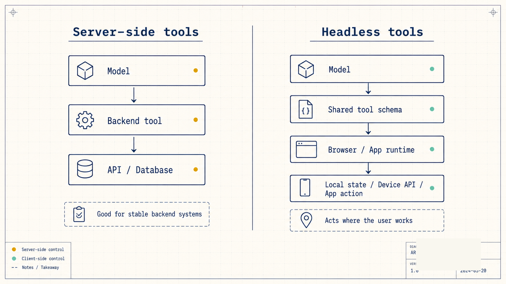
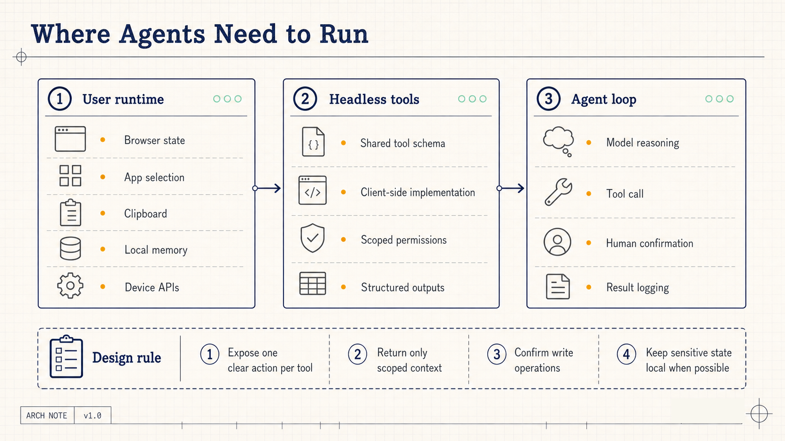
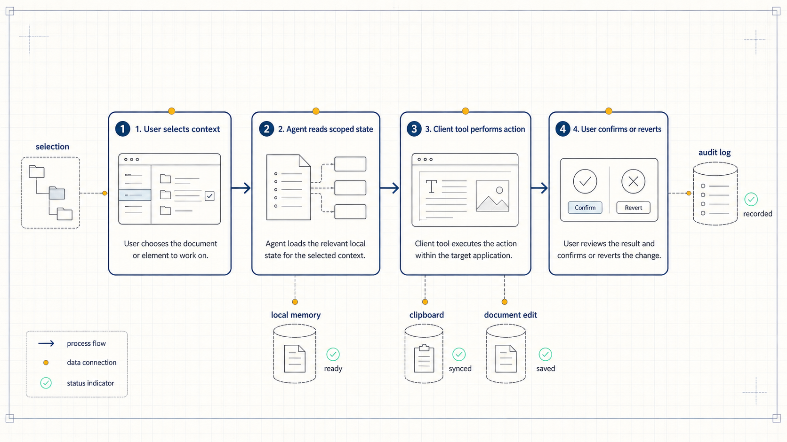

# Headless Tools: Why Agents Need Access to the User Runtime

Most agent systems start with a familiar question: what tools should the model call?

Teams connect databases, internal APIs, ticketing systems, CRMs, knowledge bases, and MCP servers. The more tools an agent has, the more capable it appears on paper.

LangChain's article on headless tools pushes the design question one layer closer to the user. If an agent can only call tools on the server, it often cannot touch the place where the user is actually working. Writing in a document, editing a slide, changing a design object, opening a browser permission prompt, using the clipboard, selecting a local file, or reading app-local state all happen in the client runtime.

The server-side agent may understand the task. It may even produce the right next step. But it frequently cannot act on the current page, the current selection, the current application state, or the device capability that the task depends on.

That gap determines whether an agent remains a conversational assistant or becomes something that can complete work inside an application.

## The missing layer is often the client

A common agent loop looks like this:

The model decides what should happen next, then calls a server-side tool. The tool may be an API wrapper, a database query, an MCP server, or a backend function. The result returns to the model, and the model continues reasoning.

That structure works well for stable backend systems. It can look up orders, retrieve knowledge base entries, call internal services, generate reports, and update records.

The problem appears when the task depends on the active application state.

Imagine an agent inside a slide editor. A user says: "Make the current slide title shorter, then jump to the final slide." A server-side agent can understand the request and generate a shorter title. But the selected text box, the current slide index, the document model, and the editing commands live in the browser or desktop application.

When the server cannot see that state, teams usually create an ad hoc bridge. The frontend serializes some state, sends it to the backend, receives a response, and then imperatively patches the UI.

That approach can work, but it is fragile. The bridge is often hidden inside application code instead of being exposed as a structured tool. The model cannot reason over it cleanly. Logging, permissioning, and testing also become harder.

Headless tools address that layer.

## What headless tools change

The idea is simple: a tool can still have a name, description, schema, and structured output, while its implementation runs on the client.

The server and client share the same tool definition. The model sees a real tool in the reasoning loop. At execution time, the browser or application calls the local capability.

LangChain's example defines a `geolocation_get` tool. The tool is described as a way to get the user's current location from the browser. The client implementation binds the tool with `.implement(...)`, calls `navigator.geolocation.getCurrentPosition`, and returns latitude, longitude, and accuracy.

That example is small, but the product direction is large: agent tools are moving from backend APIs toward user runtime capabilities.

Geolocation, clipboard access, file pickers, browser storage, canvas rendering, current page state, current selection, and application-specific commands can all follow the same pattern. The agent does not need unrestricted access to the full application. It only sees capabilities that the developer explicitly exposes.

This matters for real products.

An agent inside a writing tool can read the current selection and replace it with a revised version. An agent inside a slide tool can navigate to a specific slide, update the title, and add speaker notes. An agent inside a dashboard can read current filters, adjust a chart, and export the result.

Those actions used to live in custom UI glue code. Headless tools turn them into callable tools.

## Product architecture changes with this pattern

Many agent applications have been split into two parts:

The model and backend tools handle reasoning, retrieval, and service calls.

The frontend collects input, displays results, and performs a small amount of interaction.

That split was enough for chatbots. A user asks. The agent answers. The user confirms. The system executes.

In a real application, the frontend is not just a display layer. It owns the user's working context.

The selected text, active layer, open local file, browser permission state, local storage, and unsaved session state can all determine the correct next action.

If all of that state must be synced to the backend, the system becomes heavier. Sync too little and the agent cannot act correctly. Sync too much and privacy, performance, and security risks rise.

Headless tools offer a narrower pattern: expose specific local capabilities as tools, and let the agent call only what the application has registered.

This changes the division of responsibility:

- The backend still handles durable data, organization permissions, business APIs, billing, and audit records.
- The client handles active session state, device capabilities, local memory, and app-native actions.
- The model reasons over a shared tool schema, while the execution location is determined by the implementation.
- Human confirmation can be attached around risky tool calls rather than added later through scattered UI prompts.

The deeper an agent enters a workflow, the more this division matters. Real work rarely happens only in backend systems.

## Privacy becomes more granular

Agents need context. More context usually improves task performance.

But more context also increases privacy pressure. A common default is to move data into the backend: store it centrally, retrieve it centrally, log it centrally. Enterprise systems often need that model.

For personal tools and lightweight workflows, local storage is also a serious option. LangChain's article mentions browser-backed memory, such as IndexedDB. Some memory can stay on the user's device by default, with low latency and natural scoping to the current user and browser.

That does not mean all memory should be local. A practical system usually separates categories:

- Accounts, organizations, billing, permission models, and durable business records belong in backend systems.
- Session state, temporary preferences, draft state, and device-specific signals can remain client-side.
- Cross-device sync should require explicit product and organizational choices.
- High-risk actions need confirmation and event records.

Headless tools make this separation available to the agent tool system itself. It does not remain a hidden frontend implementation detail.

When an agent needs to know which slide the user is viewing, the tool can return only the slide ID and a small amount of scoped context. When an agent needs local memory, the tool can return a task-relevant summary instead of uploading the entire local store.

The tool interface can limit what the model receives, where the data is processed, and which actions require user approval.

## Tool granularity becomes a product decision

Headless tools sound like a frontend feature, but they force a deeper tool design question.

If a tool is too broad, one call can modify too much. That raises risk and makes debugging harder.

If a tool is too narrow, the model must make many calls in sequence. The workflow becomes slower and more fragile.

A useful unit often matches an action a user can understand:

- Get the current document selection.
- Replace the current selection.
- Navigate to a slide by ID.
- Read the active dashboard filters.
- Export the visible chart as an image.
- Retrieve local preferences related to the current task.
- Write to the clipboard after user confirmation.

These tools do not need clever names. The closer they are to everyday application actions, the easier they are for both the model and the user to understand.

Each tool needs three design elements.

First, an input shape. A slide navigation tool needs a slide ID. A text replacement tool needs a target range and replacement text.

Second, an output shape. The result should include success state, modified object, relevant summary, and error details.

Third, a confirmation policy. Reading state may be silent. Writing to a document, accessing a file, calling device permissions, or writing to the clipboard should often trigger explicit confirmation.

Many agent failures are not reasoning failures. They are tool design failures. The tool leaves the model guessing, or gives the model a capability that is too vague to use safely.

Headless tools create the entry point for local capabilities. Teams still need to design that entry point carefully.

## What users will actually notice

For users, this technical pattern will show up as a simple product change: AI assistants will be able to act inside the application they are already using.

Today, if you ask an AI assistant to rewrite a paragraph, it often gives you a new paragraph. You copy it, paste it, fix formatting, and continue.

With client-side tools, the user can select a paragraph, ask for a specific revision, and let the agent replace the selected text directly, while preserving a way to review or undo the change.

Today, if you ask an AI assistant to organize a slide deck, it may produce an outline. You still move through slides, edit titles, and adjust order manually.

With client-side tools, the agent can read the active slide structure, jump to a target slide, shorten a title, add notes, and ask for confirmation before committing changes.

Today, if you ask an AI assistant to process a local file, uploading is often the default path.

With client-side tools, the agent can invoke a file picker, read only the authorized file, and keep the result inside the active application.

The competitive dimension moves from "which assistant chats better" to "which assistant understands the user's working environment." That environment includes application state, permissions, current selection, local memory, and task progress.

## A practical adoption path

Teams building agent products can start with one small workflow that depends on client-side action.

Examples:

- A support console reads the current customer record, drafts a reply, places it in the reply box, and waits for a human to send it.
- A sales CRM reads the current opportunity page, summarizes risk, proposes next steps, and creates a follow-up task.
- A document editor reads the current selection, rewrites a paragraph, inserts a comment, and keeps the original version accessible.
- A dashboard reads current filters, explains an anomaly, changes the chart view, and exports an image.
- A slide tool reads the active slide, shortens a title, adds speaker notes, and navigates to the next slide.

The first version should expose only a few tools. Each tool should be independently testable, should log inputs and outputs, and should return clear failure reasons.

Write operations should use confirmation. Read operations should return scoped fields. Sensitive data should be summarized locally whenever possible.

The evaluation questions are concrete:

- Did the agent choose the correct tool?
- Did the tool return enough information for the model to continue?
- Can the user understand each write operation?
- Can the user recover when the action fails?

Those questions say more about workflow readiness than natural-sounding model output.

## The cost is real

Headless tools add responsibility to the client.

The client implementation must handle browser permissions, application state, offline cases, user cancellation, version compatibility, and UI feedback. The backend still needs to record the right events, especially in enterprise applications with compliance requirements.

The security model also becomes more detailed. Reading the current page is different from modifying it. Writing to the clipboard is different from reading a local file. Each capability needs a product-level permission policy.

Tool count can also become a problem. As the number of available tools grows, the model has more chances to choose the wrong one. Clear descriptions, examples, failure responses, and task-specific tool grouping become important.

The direction is strong, but the implementation should remain narrow at first. Start with frequent, low-risk actions that users can inspect visually. Expand only after the team has evidence that the tool design works.

## The broader signal

The next stage of agent applications will not come only from larger models.

Models need access to the runtime where work happens: browsers, desktop apps, editors, dashboards, design tools, meeting tools, and enterprise workspaces.

LangChain's headless tools show a practical path. Agent tool systems are moving from backend-only API calls toward controlled client capabilities. The teams that can expose local state, app actions, privacy controls, and human confirmation as clear tools will be closer to useful agent applications.

The product question is simple: when a user finishes a task today, which step still requires copying, pasting, uploading, switching windows, or clicking through a known sequence?

That step is a strong candidate for a client-side agent tool.
