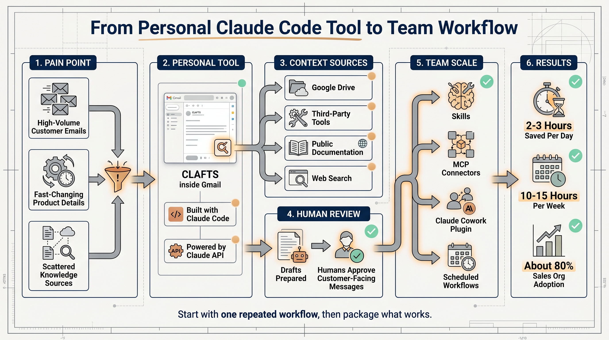
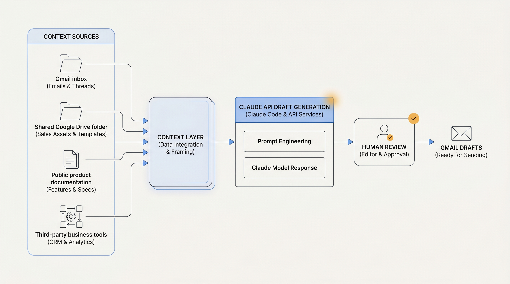
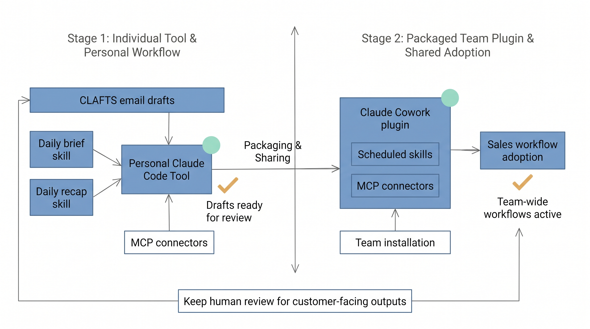

# How an Anthropic Seller Turned Claude Code into a Sales Workflow System

Many teams talk about using AI to redesign business operations. The useful starting point in this Anthropic story is much smaller: find one task that happens every day, consumes hours, requires fresh context, and still needs human review.

Jared Sires joined Anthropic without coding experience. He had never opened a terminal. As an account executive, he was responsible for 600 to 700 accounts, took 10 to 15 customer calls a day, and often answered customer emails until 9 or 10 p.m.

He used Claude Code to build CLAFTS, short for Claude Drafts. It runs inside Gmail, uses the Claude API, and drafts replies to customer emails. After several iterations, Jared estimated that it saved him two to three hours per day. Within 24 hours of sharing it in Slack, other people in the sales organization started using it too.

The important lesson is not that a non-engineer wrote code. The more useful lesson is how the workflow was shaped: connect real context, generate a reviewable draft, iterate the system prompt, and then package the working pattern for the team.

## Start with the slowest repeated task

Jared's inbox problem was not only email volume. Anthropic ships product changes every 24 to 48 hours, and customer questions often refer to the latest details: Batch API SLAs, prompt caching discounts, model pricing, and SDK behavior.

Answering well meant searching across Slack, Google Docs, internal knowledge bases, and developer documentation. That is the kind of workflow where an AI assistant can help because the task is frequent, context-heavy, and still safe to keep under human approval.

CLAFTS addressed that narrow task. It pulled context from a shared Google Drive folder and third-party tools, referenced Anthropic's public documentation through web search, and generated replies in Jared's writing style. At the end of the day, the drafts were waiting in Gmail for review.

The system did not send messages on Jared's behalf. It prepared drafts. That distinction matters for customer-facing work. The AI handles retrieval, synthesis, and first-pass writing; the human keeps responsibility for the final message.

## Connect the tool to current knowledge

The hard part of a sales reply is usually not the tone. It is whether the facts are current.

CLAFTS used several context sources:

- shared Google Drive folders
- third-party business tools
- Anthropic's public documentation
- web search for the latest product details

When Anthropic shipped a product update, the public documentation changed, and Claude could reference that updated material in the next draft. Jared no longer had to keep every product detail in memory.

For enterprise teams, this is the practical design pattern. A static prompt goes stale quickly. A useful workflow needs to know where trusted context lives, which source is current, and where human review remains required.

## Iterate the prompt from real writing samples

Out of the box, Claude's writing was longer and used more hedging phrases than Jared wanted. He kept refining the system prompt until the drafts matched his writing style. He said he may have gone through hundreds of iterations.

That is normal for a business-writing assistant. The first version is rarely good enough. A better workflow comes from using real examples:

1. Collect actual customer emails.
2. Mark common openings, explanations, commitments, and endings.
3. Put those style rules into the system prompt.
4. Review the drafts every day and turn corrections into the next prompt update.

Jared later built CLAFTS Tones, a feature that uses pattern matching to adapt to different relationships. Customer emails, peer emails, and family threads read differently, so the drafts changed accordingly.

He tested the feature by sending himself increasingly angry emails from a personal account. Claude picked up the tone, then refused to keep escalating the angry customer replies. That showed both tone matching and safety limits were still active.

## Measure time saved and accuracy improved

CLAFTS saved Jared 10 to 15 hours per week. The more durable improvement was accuracy. Customer replies were tied to the latest product documentation instead of whatever Jared happened to remember at the moment.

Teams can evaluate a similar workflow with four checks:

1. How much repeated work time did it save?
2. Did the draft cite or rely on current trusted sources?
3. Did the percentage of heavily edited drafts go down?
4. Did customers receive faster and more accurate replies?

Those checks are more useful than asking whether the model sounds fluent. Business workflow quality depends on throughput, source accuracy, review cost, and user experience.

## Package the personal workflow for the team

The workflow spread because another teammate, BDR John Albert, had the same late-night email problem and helped co-build CLAFTS. Once other business development teammates saw the time savings, they started using it and helped spread it themselves.

Jared then built a set of skills around his calendar:

- A daily brief skill reads his calendar, searches for the people he will meet, and produces talking points before the first call. It connects to Google Calendar and CRM data through MCP servers.
- A daily recap skill reads Google Docs and meeting notes to draft follow-up emails, similar to CLAFTS.

Together, those skills form a daily operating loop: prepare before meetings, support customer communication, and draft follow-ups afterward.

The next step was team distribution. Jared used Claude Cowork to package skills and MCP connectors into a plugin that teammates could install in minutes. Within months, roughly 80% of Anthropic's sales organization was using the Sales plugin.

Two skills anchor the plugin:

1. `/customer-context` pulls a 360-degree account view across Salesforce, Intercom, Gong, Google Calendar, Gmail, Google Drive, BigQuery, and related sources in about 90 seconds.
2. `/pipeline-management` surfaces at-risk deals, forecasting guidance, and progression recommendations.

Cowork scheduling also lets reps queue skills to run automatically.

## A practical replication path

The replication path is small:

1. Pick one repeated workflow that consumes time every day.
2. Connect the few sources needed to do that task correctly.
3. Generate a draft or brief that a human can review.
4. Use human edits to improve the prompt or skill.
5. Package the working version for the team only after the personal workflow is stable.

Customer email drafts are a good first use case for sales. Support teams can start with ticket reply drafts. Product teams can start with user-feedback briefs. Engineering managers can start with meeting notes and action items.

The common pattern is the same: context in, reviewable draft out, human approval before customer-facing action.

## NSSA practice scenario

For NSSA, the first practice should be a customer follow-up email draft workflow.

The workflow maps directly to CLAFTS: read customer context, product documentation, and previous communication; generate a Gmail draft; keep the permission model read-only for sources and draft-only for email; require manual approval before sending.

The first evaluation can be simple: compare one week before and after the workflow. Measure reply time, factual corrections, heavy-edit rate, and customer follow-up completion.

## Key takeaways

1. Start with one high-frequency workflow, not a company-wide AI platform.
2. Claude Code can help non-engineers turn a business workflow into a working tool.
3. Context sources matter more than the first draft's writing style.
4. System prompts should be improved from real human edits.
5. Team adoption requires packaging: skills, MCP connectors, plugins, and scheduled runs.
6. Keep human review for customer-facing outputs.

## Source

- Source: Anthropic Claude Blog
- Title: How one Anthropic seller rebuilt his team's workflows with Claude Code
- Published: June 5, 2026
- URL: https://claude.com/blog/how-anthropic-uses-claude-gtm-engineering
