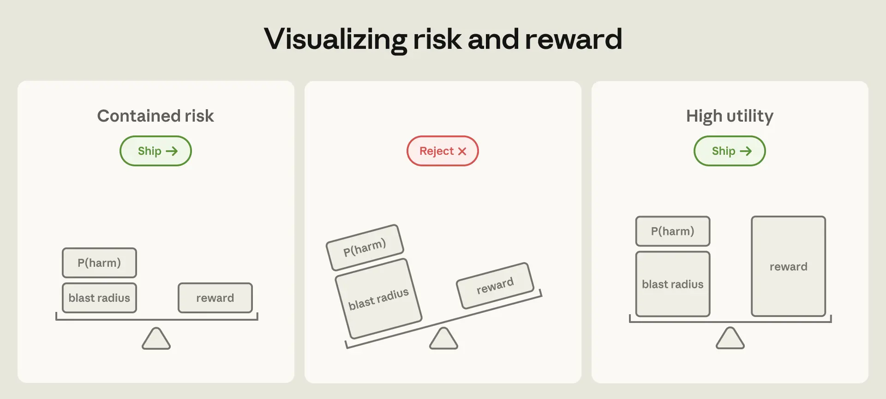
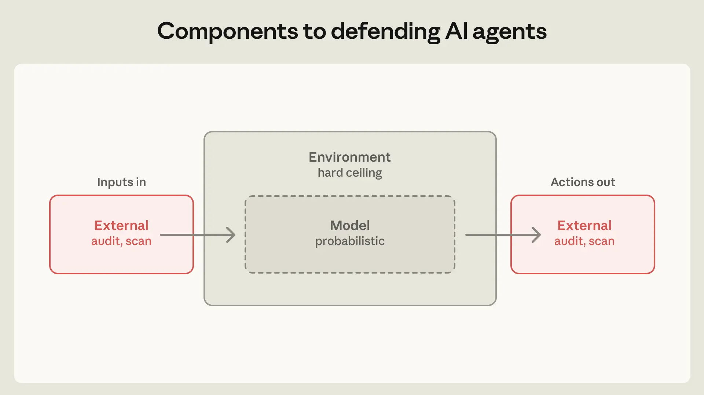
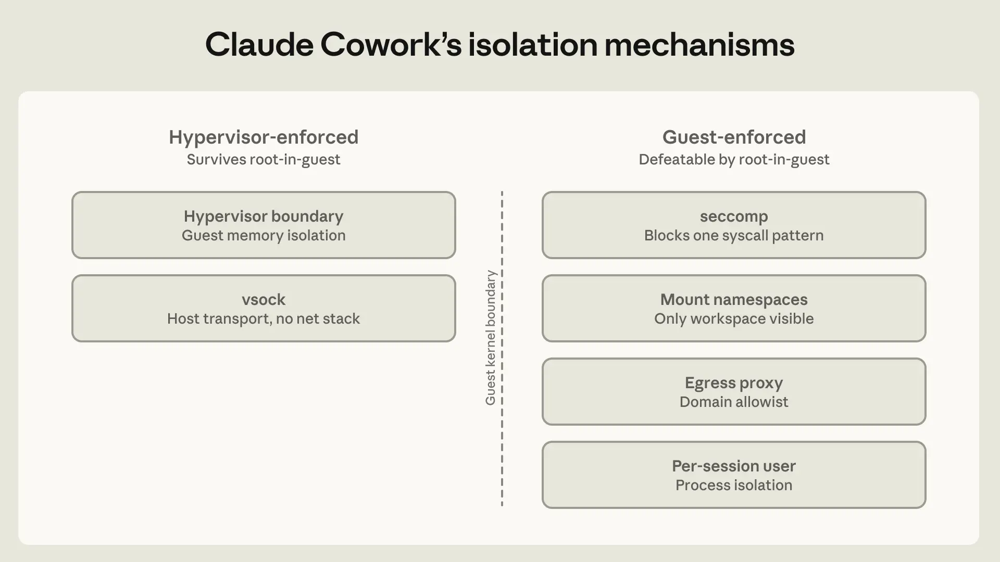
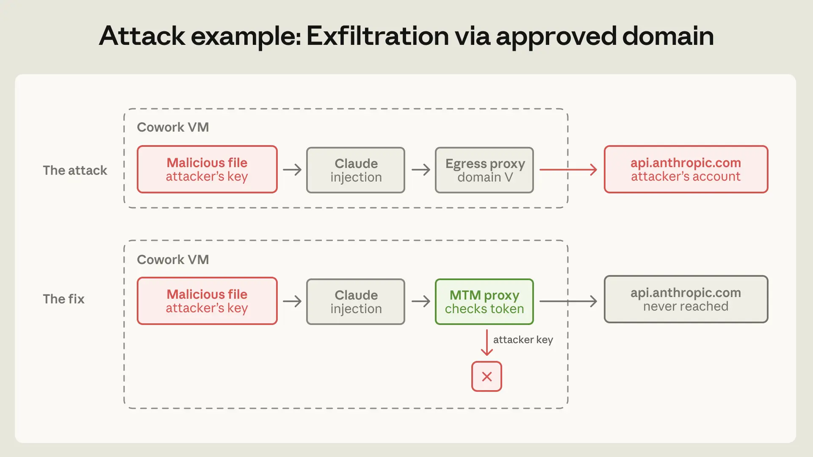
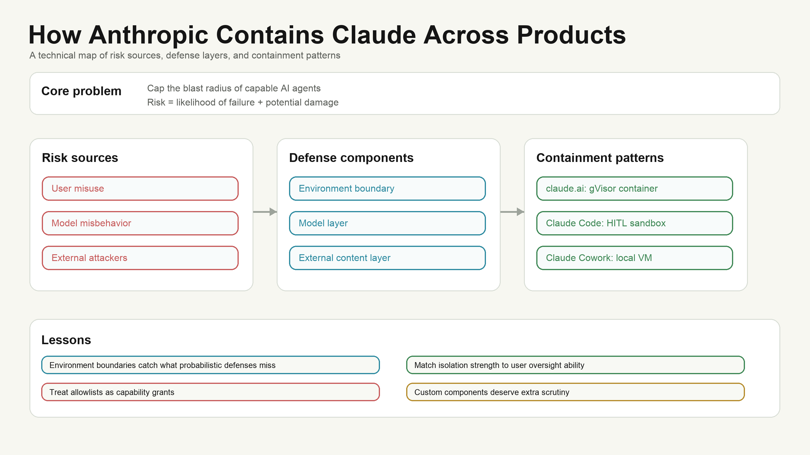

# How Anthropic Contains Claude Across Products

Anthropic's engineering article is useful because it treats agent safety as a systems problem, not only a model behavior problem.

The central question is simple: as agents gain more access, how do you cap their blast radius?

Anthropic separates risk into two parts: the likelihood of failure, and the damage a failure can cause. Model safeguards can reduce the first. But as products grant agents more capabilities, the second grows unless the environment places hard boundaries around what the agent can reach.

## Two ways to control agents

The first approach is human-in-the-loop approval. Claude Code originally used this pattern: reads were allowed, while writes, bash commands, and network access required user approval.

The weakness is approval fatigue. Anthropic says users approved roughly 93% of permission prompts. More prompts can make users less attentive, not more secure.

The second approach is containment. Instead of supervising every action, the system limits what the agent is able to do through sandboxes, virtual machines, filesystem boundaries, and egress controls.

## Three risk sources

Anthropic groups agent security risks into three categories:

- User misuse: a malicious or careless user directs the agent toward harmful behavior.
- Model misbehavior: the agent takes a harmful action no one explicitly requested.
- External attackers: the agent is attacked through tools, files, network access, prompt injection, or runtime vulnerabilities.

## Three defense components

The first component is the environment. This includes process sandboxes, VMs, filesystem limits, and egress controls. If credentials never enter the sandbox, the agent cannot exfiltrate them.

The second component is the model layer. System prompts, classifiers, probes, and training modifications can shape behavior, but they are probabilistic. They cannot form a hard boundary by themselves.

The third component is external content. MCP servers, connectors, web search, plugins, and tool outputs all feed data into the agent context. A trusted connector can still return untrusted data.

## Pattern 1: ephemeral containers for claude.ai

When claude.ai runs code, it does so server-side in a gVisor container on isolated infrastructure. The filesystem is ephemeral and per-session. This limits blast radius, but also limits capability: there is no persistent workspace and no local filesystem access.

This model looks closer to traditional cloud isolation. Anthropic's lesson is that mature primitives such as gVisor and seccomp held up better than newer custom components around them.

## Pattern 2: human-in-the-loop sandbox for Claude Code

Claude Code runs on the user's machine, so it needs filesystem, shell, and network access to be useful. Because developers can usually evaluate commands, Claude Code can rely more on human oversight than a general-purpose knowledge-work product.

But approval fatigue forced a stronger boundary. Anthropic added OS-level sandboxing: Seatbelt on macOS and bubblewrap on Linux. Inside the sandbox, reads are allowed, writes are allowed within the workspace, and network is denied by default. This reduced permission prompts by 84%.

The article highlights two missed risks.

First, project-local configuration must not execute before trust is established. A repository can include settings or hooks that run before the user accepts a trust prompt. The fix is to defer parsing and execution until after the trust decision.

Second, the user can become the injection vector. In an internal red-team exercise, a malicious prompt sent through a normal collaboration email caused Claude Code to read local credentials and POST them externally in 24 out of 25 attempts. Model-layer defenses could not help because the instruction came from the user. Filesystem and egress boundaries were the relevant defense.

## Pattern 3: local VM for Claude Cowork

Claude Cowork targets general knowledge workers, not users who can reliably evaluate bash commands. Anthropic therefore used a stronger containment strategy: code execution inside a local VM.

The VM has its own Linux kernel, filesystem, and process table. The selected workspace and `.claude` folder are mounted. Everything else on the host stays hidden. Credentials remain in the host keychain and never enter the guest.

Anthropic later moved the agent loop outside the VM while keeping code execution inside. This improved reliability because Claude could still respond if the VM failed to start. Local MCP servers were also moved outside the VM because they were harder to audit inside the guest and often needed host-level access anyway.

Filesystem mount modes include read-only, read-write, and read-write-no-delete. A key implementation detail is symlink handling: symlinks must be resolved before path validation, or an allowed folder can point outside the boundary.

## Lessons from Cowork incidents

One incident involved exfiltration through an approved domain. Cowork allowed access to `api.anthropic.com`, which the product needs. But a malicious file in the workspace could include an attacker's API key and hidden instructions. Claude could then upload workspace files to the attacker's Anthropic account. The destination allowlist passed the request because the domain looked valid.

The lesson is that allowlists are capability grants, not just destination filters.

Anthropic fixed this with a defensive man-in-the-middle proxy inside the VM. The proxy only allows requests carrying the VM's own provisioned session token and blocks attacker-supplied keys.

Another issue is endpoint visibility. The same VM isolation that contains Claude also prevents host-based EDR tools from seeing inside the guest. Anthropic currently mitigates this with pull-based OTLP log exports, but that is not the same as live monitoring.

## Tool trust and MCP

The MCP question is broader than MCP itself. Any resource that enters an agent's context is both a code execution risk and a prompt injection vector.

Local tools can be audited, pinned, and signed. Remote tools and hosted MCP servers can change behavior after approval. Tool output is also an attack surface: a trusted GitHub connector can still return a poisoned README.

Claude Code and Claude Cowork route tool calls through proxies that enforce file and network policy and can inspect returns before they enter the model context.

## Looking ahead

Anthropic calls out three future issues:

- Persistent memory poisoning: product memory, `CLAUDE.md`, mounted workspaces, and long-running agent state can reload injected content across sessions.
- Multi-agent trust escalation: sub-agent outputs can become a new injection path if treated as higher-trust than raw tool results.
- Agent identity: agents may need scoped, revocable identities rather than simply inheriting all user permissions.

## Key takeaway

The strongest lesson is that agent safety needs deterministic environment boundaries. Model-layer defenses are valuable, but when they miss, containment is what limits damage.

