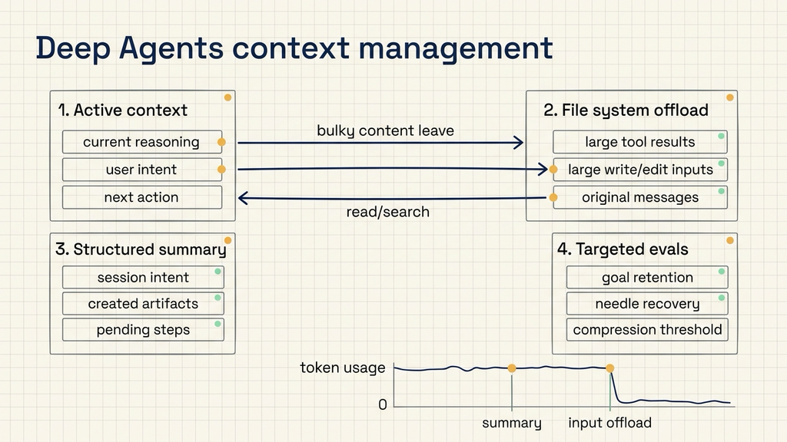
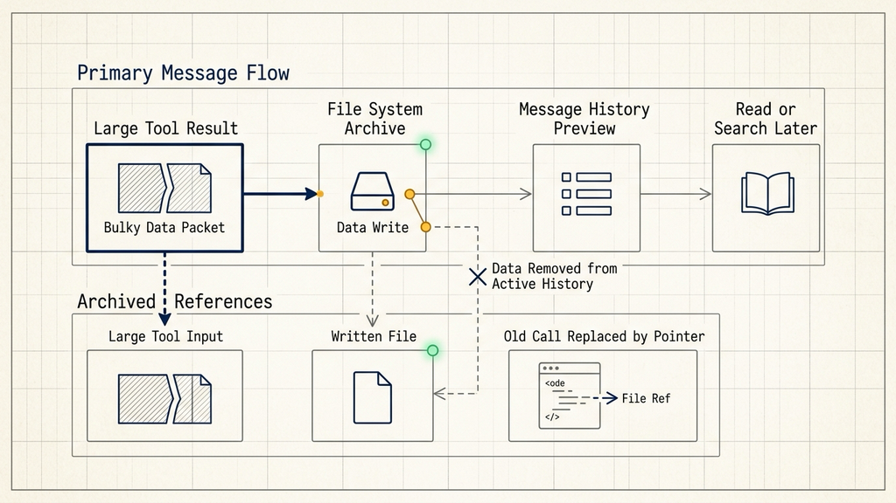
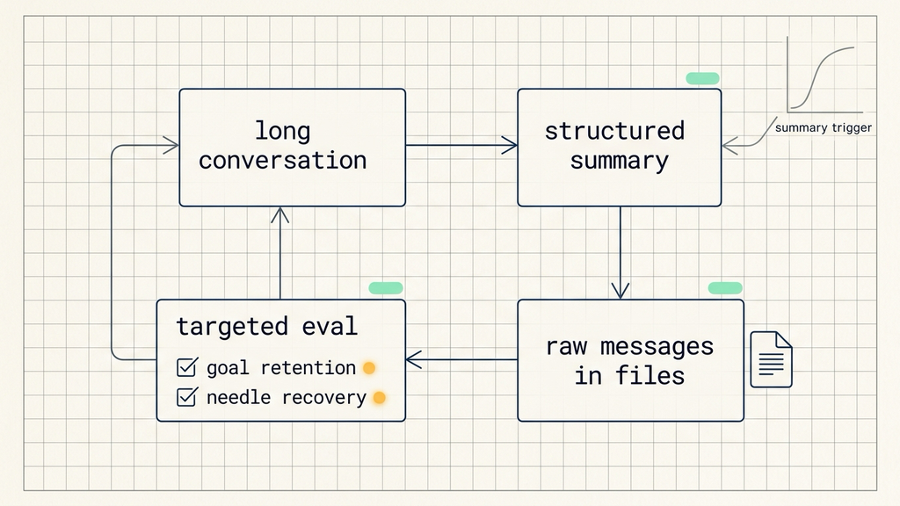

# How Deep Agents Manage Long Context

Source: LangChain Blog  
Original title: Context Management for Deep Agents  
URL: https://www.langchain.com/blog/context-management-for-deepagents  
Published: January 28, 2026  
Topic: context compression, file-system offload, summarization, and targeted evaluation for long-running agents

Long-running agents usually fail in a less dramatic way than benchmarks suggest. They do not simply run out of tokens and stop. They keep reading files, calling tools, writing intermediate artifacts, and accepting new user instructions until the active context becomes crowded with old outputs, tool arguments, partial plans, and stale details. At that point, the agent may miss the current objective, forget a constraint that appeared earlier, or treat a compressed summary as if it were the full record.

The main engineering point in LangChain's post is that a deep agent needs two different kinds of memory. One is active working context: the material the model must reason over right now. The other is recoverable durable context: complete tool results, full messages, created files, and previous inputs that can be retrieved when they matter again. Deep Agents uses a file-system abstraction to separate those two roles. The active context keeps the current intent and the next step. The file system stores the large or old material that should not keep occupying the model window.

This distinction is useful for teams building coding agents, research agents, document-processing agents, or internal workflow agents. In those systems, the agent often needs to preserve continuity across many operations, but it does not need every old payload inside the next model call. The system needs a disciplined way to move bulky information out of the live message history while keeping it recoverable.

## Long tasks fill the working memory

In ordinary chat, context management mostly means remembering what was said earlier. In a long-running agent, context management also covers tool results, file contents, write parameters, plans, subtask state, and intermediate artifacts. Those records are often much larger than the natural language conversation itself.

Deep Agents is LangChain's open-source agent harness. In this setting, a harness is the runtime structure around the model: it lets the model plan, call tools, create subagents, read and write files, and continue a task across many turns. The richer the harness becomes, the more context it can create. Planning creates notes. Tool use creates outputs. File editing creates large arguments. Subagents create their own histories. The agent becomes more capable, and the context pressure rises at the same time.

LangChain frames this as context rot. The active window gradually contains a lower share of information that is relevant to the immediate decision. Old tool results, previous file writes, and intermediate reasoning compete with the user goal and the next action. The issue is not only token limit exhaustion. It is also that a crowded context makes the next reasoning step less focused.

Deep Agents handles this by treating the file system as a durable record layer. A useful mental model is a desk and a filing cabinet. The model's active context is the desk: only the pages needed for the current decision should stay there. The file system is the filing cabinet: complete records remain available, but they do not clutter every step.

## Large tool results become file references

The first compression path is large tool result offload. A tool call may return a long file, a scraped web page, an API response, a repository search result, or a generated report. Keeping the entire result in the message history can consume a large share of the context window even if the agent only needs to know where the result is stored.

Deep Agents detects tool responses above 20,000 tokens and writes the full result into the file system. The message history then keeps a file path and a preview of the first ten lines. This changes the shape of the information available to the model. The model no longer carries the whole payload in every call. It knows that the full payload exists, where to find it, and enough preview text to decide whether it should read the file again.

That replacement is important because long tasks often include repeated large reads. A coding agent may open a large source file, inspect a generated log, or fetch a long document. A research agent may scrape many pages. A document agent may parse a long PDF. In all of those cases, storing the full output once and keeping only a pointer in the live history is more stable than repeatedly forcing the model to carry every byte forward.

## Large tool inputs also need offload

The second compression path is large tool input offload. This is easier to miss. When an agent writes a file or calls an edit tool, the tool input can contain the full file content or a large patch. After the file has been written, the file system already contains the durable state. Keeping the old write or edit argument inside the message history becomes duplicate memory.

Deep Agents starts truncating older write and edit tool calls when the session context exceeds about 85 percent of the model's available window. Those older inputs are replaced by file pointers. The agent still knows that the file exists and can read it if needed, but the old bulky argument no longer occupies active context.

This matters for agents that produce artifacts: code files, markdown reports, test scripts, configuration files, or structured notes. The runtime should preserve the artifact, not the whole historical argument that created it. If the agent later needs the content, it should read the current file. That is usually more accurate than reasoning over an old tool argument anyway.

## Summaries preserve intent and next action

After large outputs and inputs have been moved out of the live history, Deep Agents uses summarization as the next compression layer. The point is not to turn everything into a short generic recap. The summary has to preserve the session intent, the artifacts created so far, and the next actions that should drive the task forward.

LangChain describes two parts to this approach. First, an LLM generates a structured summary that replaces the full conversation history in the active context. Second, the original raw messages are still written to the file system so that the agent can search or read them later. The summary keeps continuity. The file system keeps recoverability.

This split is the core design lesson. If the summary alone is treated as the complete memory, the agent can lose details. If the raw history remains in the active context forever, the agent eventually loses focus. Deep Agents uses the summary as the live navigation layer and the file system as the archive.

The easiest failure mode is losing the user's intent. A summary that only lists facts may record which files were read, which pages were fetched, and which artifacts were created, while dropping whether the user wanted a bug fix, a comparison, a migration plan, or a decision memo. LangChain adjusted its summary prompt to give session intent and next steps dedicated fields because goal continuity matters more than a flat list of historical details.

## Compression needs targeted tests

End-to-end long-task benchmarks are useful, but they rarely explain which context-management mechanism helped or failed. A terminal-bench run can show whether an agent completed a task, but a score change may not reveal whether the summary preserved intent, whether a file pointer was usable, or whether an offloaded fact could be recovered.

LangChain's practical method is to trigger compression earlier during evaluation. Deep Agents normally compress around a high context threshold, such as 85 percent. For mechanism testing, the threshold can be lowered to 10 to 20 percent, or to the 25 percent setting shown in the post's examples. This creates more compression events in a single run, making failures easier to observe.

In the post's sample terminal-bench-2 run with Claude Sonnet 4.5, the token curve shows visible drops. One drop around turn 20 corresponds to summarization of the conversation history. Another drop around turn 40 corresponds to large file-write tool calls being moved out of the active context. The useful detail is not the exact chart shape. It is the ability to connect a token drop to a specific compression mechanism and then inspect whether the agent remained on track.

## Targeted evals check two behaviors

Deep Agents SDK maintains targeted evaluations for context management. These are closer to integration tests than broad capability benchmarks. They deliberately create a compression event and then check whether the agent can still complete the required behavior.

The first behavior is goal retention. The test triggers summarization in the middle of a task and checks whether the agent continues the original task afterward. This tests whether the structured summary preserved the task trajectory, not just a few facts from the old messages.

The second behavior is information recovery. A test hides a needle-in-the-haystack fact in the early conversation, then forces summarization so that the fact leaves the active context. A later instruction requires the agent to recall that fact and continue. Passing this test requires the agent to search or read the stored raw messages from the file system.

This style of testing is useful for any team building its own agent harness. Start with representative long tasks, lower the compression threshold so that summary and offload events happen more often, and then inspect three things: whether the goal survives the summary, whether important details can be recovered from files, and whether replacing old tool arguments with pointers affects later edits.

## Which teams should care

The strongest fit is long-running agent work: codebase analysis, multi-file editing, enterprise knowledge-base cleanup, long report generation, cross-tool research, and workflows that use subagents. These tasks share the same pressure pattern. There is a lot of intermediate material, many tool calls, and a user expectation that the agent will keep the goal continuous.

The mechanism is less important for short one-turn or two-turn agents. It is also less important when every task can be rebuilt from a database retrieval step and no long-lived working state is needed. File-system offload, summaries, and targeted recovery tests add system complexity. For short tasks, that complexity may not pay for itself.

There is also an observability requirement. When context compression fails, debugging requires access to the moved content, the generated summary, the file paths, and the later reads or searches performed by the agent. Without those traces, a context-management failure can be mistaken for a model-quality failure. A team may change the model when the real problem is a weak summary prompt, an unclear pointer format, or a search path the agent never used.

The practical adoption path is narrow and testable. Choose one task that naturally creates large tool results, such as repository analysis, multi-document synthesis, or repeated file editing. Lower the compression threshold in a test setting. Watch whether the agent keeps the goal, recovers old facts from the file system, and finishes without treating unfinished work as complete. Then adjust the summary schema, preview length, pointer format, and search instructions based on observed failures.

Long-context management is not about stuffing more content into the model. It is about reducing the amount of content the model must reason over at each step while preserving a reliable path back to the full record. LangChain's Deep Agents post is valuable because it makes that memory architecture concrete: active context, file-system archive, structured summaries, and targeted evals each have a separate job.
