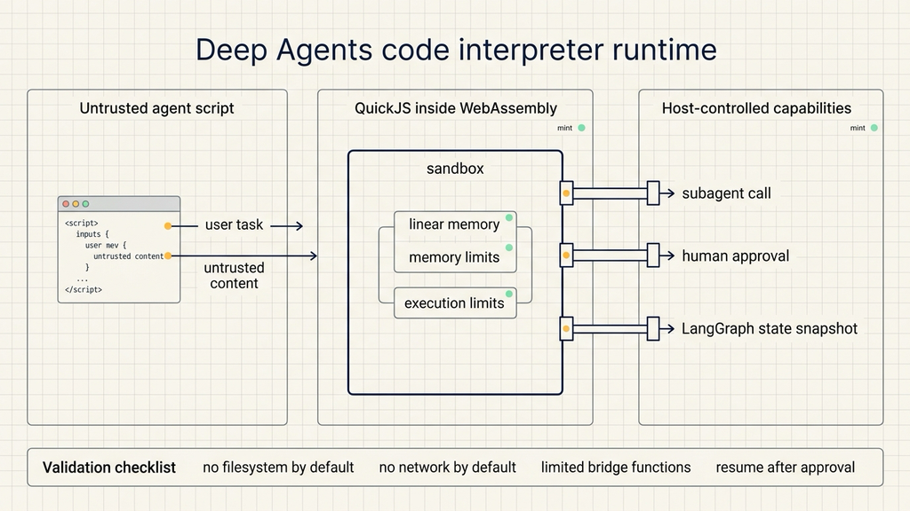
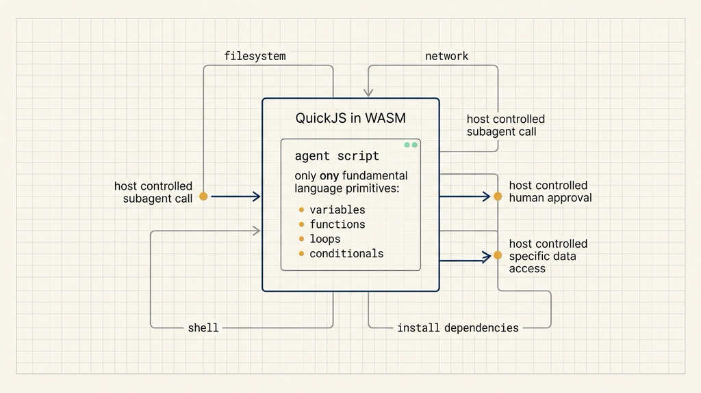
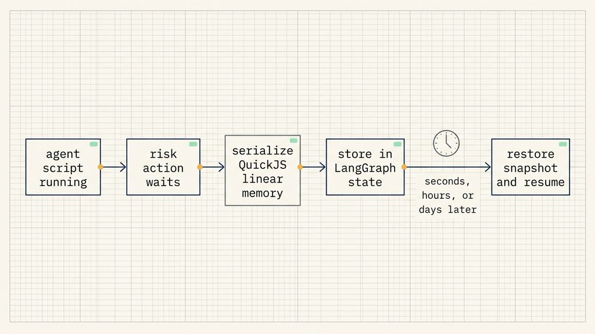

# How Deep Agents run untrusted code

## Source

- Source: LangChain Blog
- URL: https://www.langchain.com/blog/running-untrusted-agent-code-without-a-sandbox
- Published: June 30, 2026
- Topic: Deep Agents code interpreters, WebAssembly, QuickJS, capability isolation, and durable human approval

Letting an agent write a small script to coordinate several subagents is a natural next step for agent workflows. It reduces the back-and-forth of one tool call at a time. It also gives the agent a compact way to express loops, conditionals, branching, and parallel subagent calls.

The harder problem is the runtime. The script is written by an agent, and the agent may have read web pages, emails, chat messages, tickets, or other untrusted content before writing it. As long as prompt injection remains unsolved, the runtime has to assume that agent-written code may eventually try to do something outside its intended authority.

LangChain's answer in this post is to start from that assumption. Treat the code as untrusted, then split what it can do into separate control layers. Deep Agents' code interpreter is built around three design requirements: execution isolation with WebAssembly, capability isolation through host-controlled bridge functions, and durable pauses by snapshotting QuickJS memory into LangGraph state.



This is not a replacement for a full coding sandbox. It is a smaller runtime for orchestration. The target workflow is a short agent-authored program that calls subagents, waits for human approval, and resumes later. That makes it relevant for teams building agent workflows, tool permissions, approval gates, and safe subagent orchestration.

## Shrinking the runtime to a code interpreter

Deep Agents recently introduced dynamic subagents. Instead of dispatching one subagent tool call at a time, the agent can write a short script that coordinates several subagents. That script runs in a code interpreter.

The pattern is useful because many agent tasks are small orchestration problems. A task may need to read a prompt, split the work into three tracks, call three subagents, compare their answers, then merge the result. A short script is a better shape for that than a long sequence of individual tool calls.

The risk changes once the script can run. Untrusted code is already difficult to execute safely. Agent-written untrusted code adds another layer because the code can be shaped by untrusted input and then combine several individually reasonable actions inside one autonomous loop.

LangChain separates two runtime shapes.

LangSmith Sandboxes give an agent a full remote container. The agent gets something close to a local coding-agent environment, including files, dependencies, and shell access, but isolated on another machine.

Deep Agents Code Interpreters take the opposite path. They provide a smaller execution environment. The agent can write and run programs, but the program has no filesystem, no network access, and no dependency installation by default. Every external action has to be deliberately bridged in by the harness.

That tradeoff fits orchestration workflows. A small orchestration script usually needs variables, functions, objects, loops, conditionals, and narrow calls into the host system. It does not always need a whole computer.

## Execution isolation with WebAssembly

The first requirement is execution isolation. Agent-written code has to run, but it must not read or corrupt the host process.

LangChain uses WebAssembly, or WASM, for that boundary. WASM is a compact binary format that runs inside an in-process sandboxed virtual machine. It has its own linear memory and can interact with the outside world only through capabilities provided by the host.

Linear memory is the mechanism that matters here. Code running inside WASM cannot dereference arbitrary pointers into the host process. It cannot directly read or modify memory that was not passed into the runtime. WASM runtimes also make memory and execution limits easier to enforce.

There is a practical engineering reason for this choice. The interpreter can run near the host harness without spinning up a separate machine for every short orchestration script. The harness can instrument, meter, and control the program while still keeping the untrusted code behind a memory boundary.

The source post points out that AWS, Shopify, and Figma all use WASM for running untrusted code on their platforms. Tools such as WebContainers and wasmtime rely on a similar isolation model. Deep Agents borrows that general pattern: keep untrusted code inside a runtime that can be measured, limited, and restored.

## QuickJS inside WASM

WASM supplies the sandbox, but the system still needs a language engine. LangChain uses QuickJS.

QuickJS is a small, fast, ECMAScript-compliant JavaScript engine written in C. It compiles cleanly to WASM, which means the JavaScript engine itself sits inside the isolation boundary.

That matters because runtime size affects the trusted surface. A smaller engine is easier to reason about than a large runtime with many default capabilities. JavaScript is also a good fit for these short programs. It has the core language features an agent needs for orchestration without a build step: variables, functions, objects, loops, conditionals, and simple data transformations.

The mental model is a controlled room. WASM is the wall. QuickJS is the interpreter inside the room. The agent-authored JavaScript runs there. The room has no default doors to the filesystem, network, shell, or package installation. Every door has to be opened by the host harness.

## Capability isolation starts from nothing

Execution isolation answers whether the program can compromise the host. It does not answer what the program is allowed to do.

The danger of an agent depends on the capabilities it receives. The LangChain post uses a wedding-planning agent as the example. To be useful, it may need to read sensitive data from contracts, RSVPs, and family chats. It may also need to email vendors or approve a deposit. Each capability can be reasonable on its own. Combined in one autonomous loop, a malicious RSVP could cause the agent to read a private budget and send an "approved" change to a vendor.

Meta's rule of two captures that combination risk. Until prompt injection is solved, an agent should have no more than two of the following three powers at once:

- access sensitive data;
- be exposed to untrusted content;
- change state or communicate externally.

The point is the combination. If an agent can read sensitive data and consume untrusted content, adding external communication makes the blast radius larger. If it can communicate externally and read untrusted content, adding sensitive data creates another risky combination.

Traditional sandboxes usually begin computer-shaped. They start with a filesystem, dependencies, and a shell, then security work removes or restricts capabilities. A code interpreter starts lower. Out of the box, it cannot read files, make network requests, install dependencies, or run a shell. It only has the language.

External capabilities are bridged in by the host harness. Calling subagents from code is the clearest example. The script does not receive a process manager or a network stack. It receives a function with a narrow contract. The harness owns the implementation behind that function and can limit how many subagents run at once or how many can be spawned by a single call.



That puts permission control at the bridge layer. If the script should call subagents, give it a limited function. If it should wait for human approval, give it a limited approval call. If it should access a specific data object, pass that object instead of mounting a whole filesystem.

## Durable pauses keep long-running workflows alive

Production agents often need to wait for people. A workflow may prepare an email, approve a cost, change a configuration, or submit a patch. Before the risky action happens, the system should pause for human approval.

The approval may come back in seconds, hours, or days. The original process may have been evicted long before the answer arrives. The runtime therefore has to answer a specific question: how does a half-finished program resume from exactly where it was waiting?

Deep Agents pauses the interpreter itself. Because QuickJS runs inside WASM, the harness can serialize the interpreter's linear memory into LangGraph state. On resume, it restores that memory snapshot and feeds the approval result back into the call that was waiting.

From the script's perspective, it just made an async call that took a while to return. The script does not need to know that the process was gone. It does not need to reconstruct its own local state from external fields.



This matters for agent workflows that combine planning, approval, and continuation. Without durable pauses, the system has to rerun earlier steps or split state into many external records. With interpreter snapshots, the orchestration program can remain continuous.

## Trying the experimental packages

Two packages behind this system are public and experimental:

- `quickjs-rs`: the runtime and Python bindings for running QuickJS through WASM.
- `langchain-quickjs`: a Deep Agents middleware built on `quickjs-rs`.

The install path is short:

```bash
uv add deepagents langchain-quickjs
```

The smallest integration looks like this:

```python
from deepagents import create_deep_agent
from langchain_quickjs import CodeInterpreterMiddleware

agent = create_deep_agent(
    model="baseten:zai-org/GLM-5.2",
    middleware=[CodeInterpreterMiddleware()]
)
```

That code creates a Deep Agent and adds `CodeInterpreterMiddleware`. After that, agent-authored orchestration scripts run through the QuickJS + WASM interpreter runtime, while external capabilities remain controlled by the harness.

A first test should be small. Ask the agent to split a task into three parts, call three subagents, and merge the answers. Then check four things:

- the script uses only functions provided by the host harness;
- subagent concurrency is limited;
- the script cannot reach filesystem or network access by default;
- a human approval call can pause and resume from the same point.

If those four checks are observable, the test is exercising the runtime pattern from the post rather than ordinary agent tool calling.

## A concrete practice scenario

A good practice scenario is code review. The agent reads a specific diff, splits the review into security, performance, and maintainability, then uses a script to call three subagents. Each subagent can return advice, but none can modify the repository.

This maps directly to capability isolation. The main agent can coordinate subagents, but it receives a limited bridge function. Shell access, filesystem access, and network access remain outside the interpreter. If the workflow needs to submit a patch, it pauses for human approval. After approval returns, the script resumes and merges the review result.

For an NSSA-style internal exercise, start with a read-only code review task. The agent can read only the provided diff. It cannot access other repository paths and cannot commit changes. After that works, the team can decide whether to add patch generation. Approval, logging, and rollback should exist before expanding permissions.

## When not to copy this design directly

This interpreter design fits short orchestration scripts. If the task requires a full operating system, complex dependency installation, local toolchains, real file trees, and shell commands, it is closer to the LangSmith Sandbox model.

It also depends on clear tool permissions. The interpreter starts with no external capability. The actual safety properties come from the bridge functions the harness exposes, the data each function can touch, and the logs or approvals around each call.

Workflows that combine sensitive data, untrusted content, and external communication need extra care. Under the rule of two, those three powers should be separated. One workflow can let an agent read data and draft a proposal for human approval. Another can allow external communication while withholding sensitive data.

## The useful judgment

Deep Agents' code interpreter gives orchestration agents a smaller runtime surface. WASM handles execution isolation. QuickJS runs the agent-authored script. Bridge functions control external capabilities. LangGraph state lets the program pause for human approval and resume later.

The practical starting point is narrow: one bridge function, a small number of subagents, read-only or draft-only actions, visible logs, and a real approval path. Add more capabilities only after those controls are working. Agent-written code is manageable when the runtime treats it as untrusted from the beginning.
