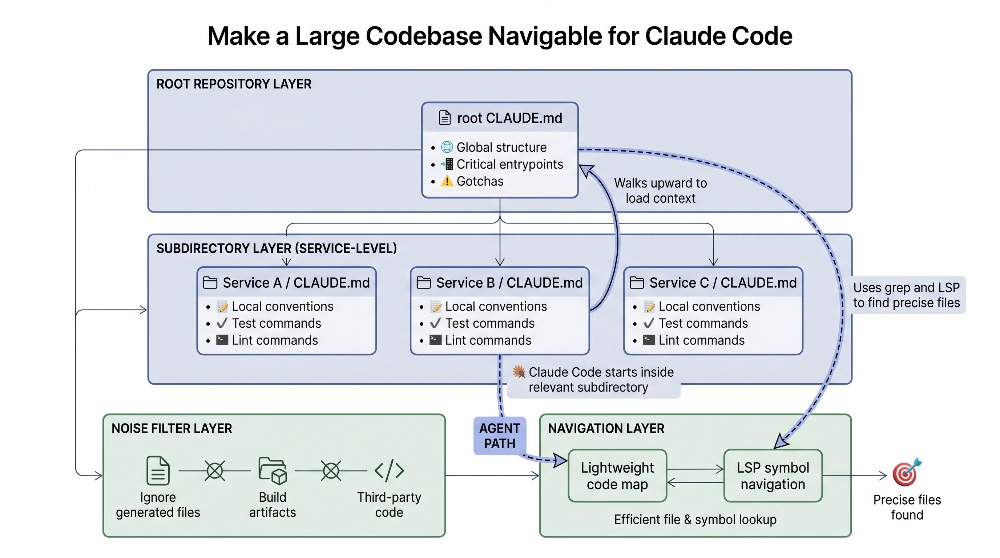
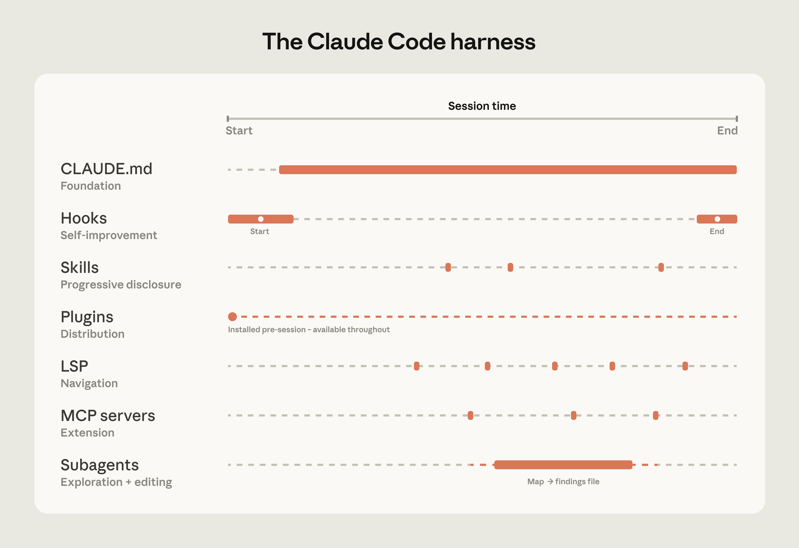
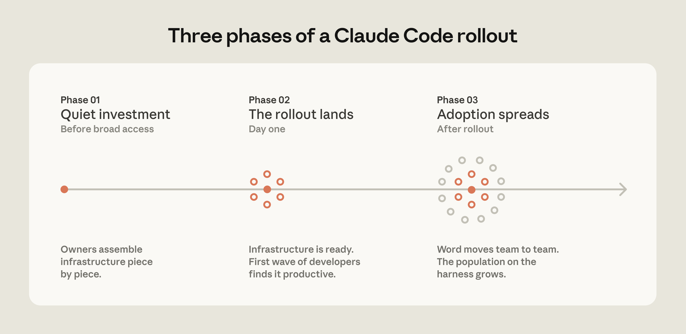
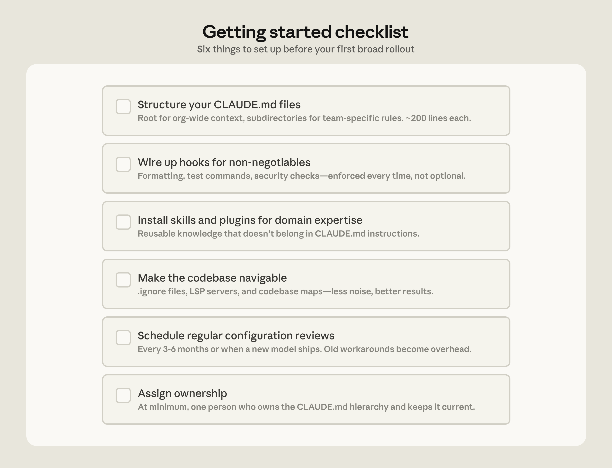
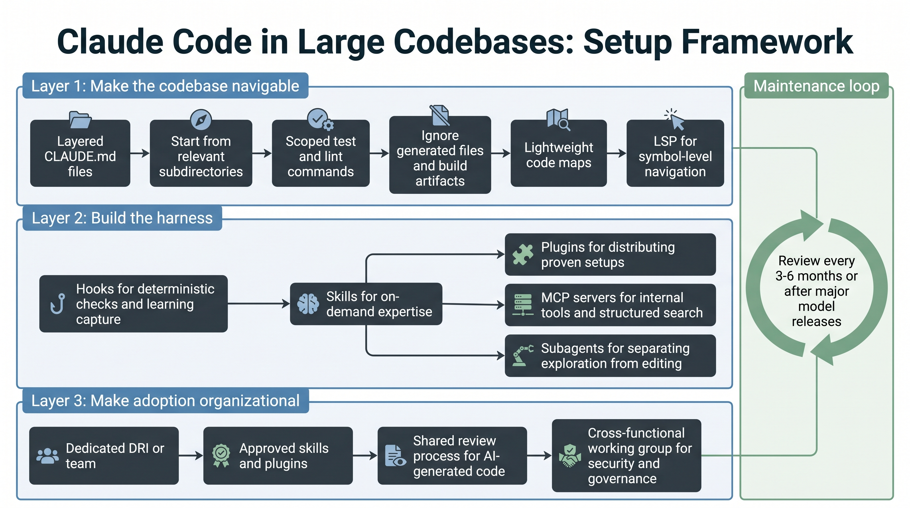

# How to Set Up Claude Code for Large Codebases

Anthropic's article on Claude Code in large codebases is best read as an operating guide, not as a product announcement. It explains how teams make Claude Code useful in multi-million-line monorepos, legacy systems, distributed services, and older language stacks such as C, C++, C#, Java, and PHP.

The central lesson is simple: Claude Code's performance depends on the model, but it also depends on the harness around the model. Large repositories need enough structure for Claude to find the right context, run the right commands, and avoid wasting its context window on irrelevant files.

## The Core Navigation Model

Claude Code navigates code the way an engineer would. It traverses the file system, reads files, uses grep, and follows references. It works from the live local codebase instead of relying on a precomputed code index.

That avoids a common failure mode in RAG-style code retrieval: stale indexes. In active engineering organizations, code changes faster than embedding pipelines can reliably capture. A search result may point to a function that was renamed or a module that no longer exists.

Agentic search avoids that, but it needs a good starting point. A vague request across a huge repository can exhaust context before useful work begins.

## The Harness Components

The article breaks the Claude Code harness into several components:

- `CLAUDE.md` files provide project and directory context that loads automatically.
- Hooks run at specific events and are useful for deterministic checks and continuous improvement.
- Skills keep specialized workflows available on demand without loading every instruction into every session.
- Plugins package skills, hooks, and MCP configurations so good setups can be distributed across an organization.
- LSP integrations give Claude symbol-level navigation through language servers.
- MCP servers connect Claude to internal tools, documentation, ticketing systems, analytics platforms, and structured search.
- Subagents split exploration from editing by giving separate tasks their own context windows.

The important pattern is not to build everything at once. Teams should start with context and navigation, then add deterministic checks, reusable expertise, organizational distribution, and internal tool access.

## Setup Patterns That Matter

The first setup pattern is making the repository navigable. Keep `CLAUDE.md` files layered and lean. Start Claude Code from the relevant subdirectory rather than always from the repository root. Document test and lint commands per subdirectory. Exclude generated files, build artifacts, and third-party code. Add lightweight code maps when the folder structure is not self-explanatory. Use LSP when symbol-level navigation matters.

The second pattern is maintenance. Instructions written for one model generation can become unnecessary or even harmful when the model improves. Teams should review Claude Code configuration every three to six months, after major model releases, or whenever performance seems to plateau.

The third pattern is ownership. Successful deployments usually have a developer experience, developer productivity, agent manager, or DRI function responsible for configuration, permissions, plugins, marketplaces, and review standards.

## Practical Checklist

- Create a root `CLAUDE.md` with only global structure, important entrypoints, and critical gotchas.
- Add local `CLAUDE.md` files for service-specific conventions and commands.
- Start Claude Code from the subdirectory relevant to the task.
- Scope test, lint, and build commands so Claude does not run the whole monorepo unnecessarily.
- Exclude generated files and build artifacts through version-controlled settings.
- Add lightweight code maps when directory names are not enough.
- Install code intelligence plugins and language servers where LSP navigation is important.
- Use hooks for deterministic checks and session learning.
- Move reusable task knowledge into skills.
- Package proven setups into plugins.
- Add MCP servers after the basics are working.
- Use subagents to separate read-only exploration from editing.
- Assign ownership for configuration, governance, and regular review.

## Boundaries

The article assumes a conventional software engineering environment: engineers are the main code contributors, the repository uses Git, and the directory structure is reasonably standard.

Non-traditional environments need extra work. The article specifically calls out game engines with large binary assets, unconventional version control, and codebases where non-engineers contribute.

It also notes edge cases where even hierarchical `CLAUDE.md` files can break down, such as repositories with hundreds of thousands of folders, millions of files, or legacy non-Git version control.

The takeaway is that Claude Code adoption in large codebases is an engineering system. The model matters, but navigation, executable rules, reusable expertise, distribution, and ownership decide whether the tool becomes reliable at scale.

