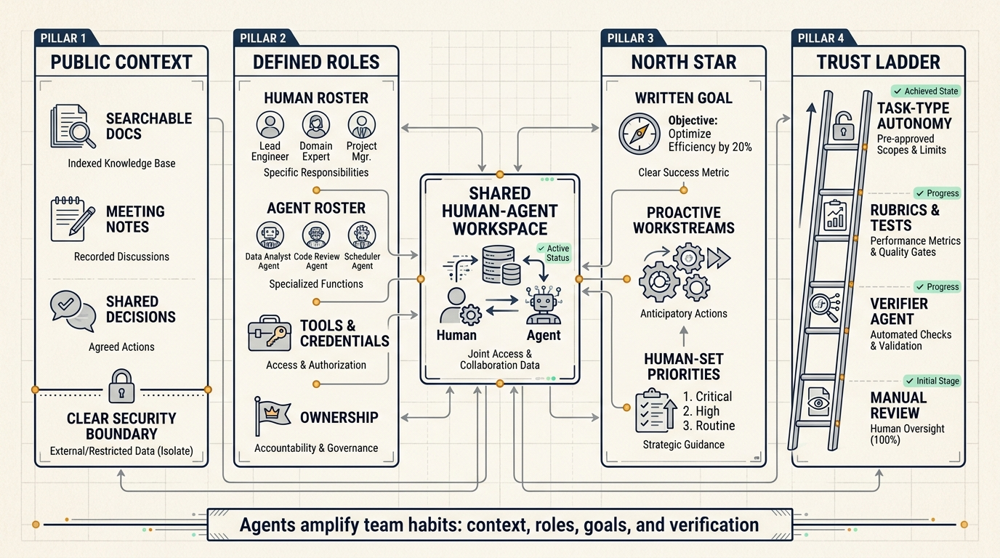
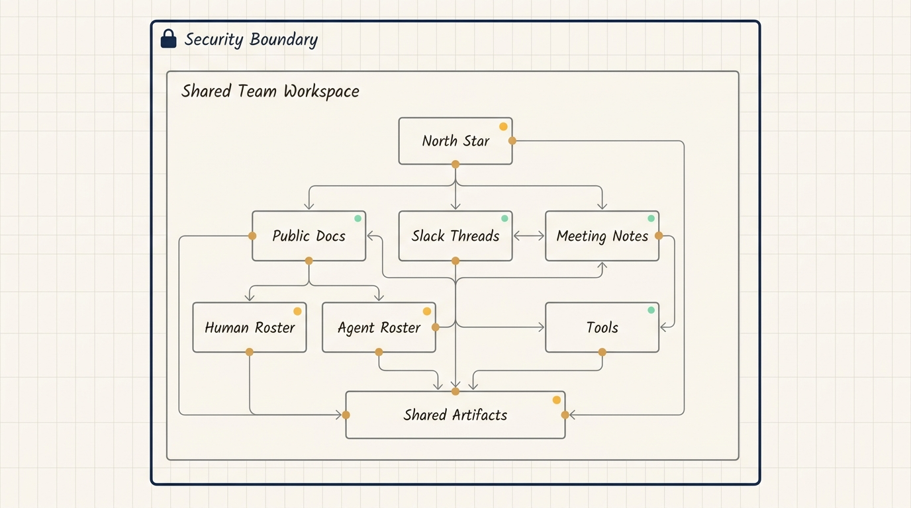
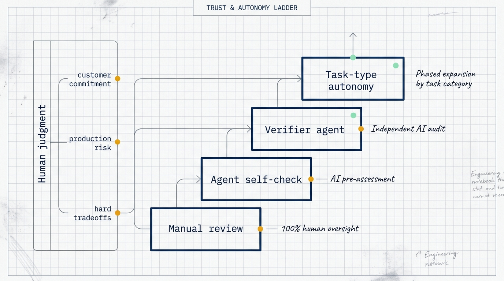

# Human-Agent Teams Need Management Systems, Not More Chat Windows

Working with AI used to mean one person talking to one assistant. The next shift is different: multiple humans and multiple agents working in the same workspace toward shared goals.

Anthropic's Claude Blog article "Building effective human-agent teams" describes this shift through Claude Tag and internal Anthropic practice. The core lesson is practical: once agents enter team workflows, management basics become part of the AI system. Documentation, permissions, roles, shared goals, verification, and review capacity all determine how much work agents can safely do.

## The shift happens inside the workspace

Single-player AI is mostly about one human guiding one model. The user writes a prompt, provides context, checks the result, and iterates.

Multiplayer agents change the operating model. Agents live where work happens: team channels, shared documents, codebases, issue trackers, and project rooms. They need memory, skills, credentials, tools, and access to the context that humans use to coordinate.

This creates a different set of questions:

- Can agents see the decisions that shaped the project?
- Are team documents searchable and current?
- Does each agent have a defined role?
- Which tools and credentials belong to each role?
- Which decisions require human judgment?
- How is output verified before autonomy expands?

The article's strongest point is that agent performance depends on the team's operating system, not only on model quality.

## Public context is the first requirement

Anthropic's first lesson is to work in public and give agents broad context.

Agents build understanding from searchable text: Slack threads, code, docs, meeting notes, decisions, specs, and artifacts. Private conversations, hallway decisions, and restricted documents do not naturally become agent context. For an agent, information that is not written down and accessible does not exist.

Anthropic uses clearly defined security boundaries that apply to entire workspaces, meeting transcripts, and document libraries. Within the boundary, context flows to every teammate, human or AI. This reduces day-to-day permission confusion.

The alternative is per-item sharing: should this channel be public, can this doc be shared, can this agent see that thread? Soft sharing boundaries make collaboration hard for both humans and agents.

For a normal team, the first step can be small. Write project decisions, meeting outcomes, requirement changes, and key assumptions into searchable team spaces. The goal is not to expose everything. The goal is to make the facts needed for work visible inside the right security boundary.

## Roles prevent fragmented AI work

The second lesson is that every human and agent needs a defined role and the right tools.

Anthropic describes human-agent teams as sharing one roster, one set of artifacts, and one working space. Different agents can hold different roles: one handles data analysis, another enforces design standards, another runs research synthesis, another manages release work.

The role determines the tools. A data analysis agent may need BigQuery. A QA agent may need Playwright MCP. A design-standard agent may need access to specs and review rubrics.

Without role clarity, teams drift into fragmented personal AI usage. Each person runs their own assistant on the side, context splits, duplicated work appears, and teams argue over which output is authoritative.

A multiplayer agent can turn that into shared capability. One metrics agent computes the numbers once. One design-standard agent applies the same rubric. One triage agent routes backlog work using one visible process.

Useful role definitions should include:

- what the agent owns
- what tools it can use
- what credentials it has
- where output is written
- when human review is required
- which decisions remain human-owned

Anthropic teams use rosters and skill files to make these roles concrete. That lets the human mental model scale as the number of agents grows.

## A north star makes agent proactivity useful

The third lesson is to set a north star.

Some agents only complete assigned tasks. More valuable agents can suggest new projects and workstreams. That proactivity needs direction. Without a written goal, an agent can produce many ideas that look useful but do not move the team forward.

Anthropic defines north stars as ambitious goals that help teams decide which tasks and workstreams matter. Humans set the north star and ground it in the business mission. Then they share it with the agents and explicitly decide which agents are allowed to proactively recommend new workstreams.

The article gives an example: an internal tools team had a north star to make product onboarding more helpful. An agent recommended copy revisions to onboarding error messages, and onboarding success measurably increased the following week.

The takeaway is that proactive agents need written goals and measurable feedback. "Find something useful to do" is weak direction. "Improve onboarding success while keeping product guidance clear" gives the agent a target.

## Trust should expand by task type

The fourth lesson is to build trust over time.

Anthropic reports that engineers have dispatched agents to handle 500 bug fixes independently, but that autonomy came after feedback cycles. New human teammates also need time to learn routines and externalize tacit information. Agents need the same process.

Teams need to test what an agent can do, how goals should be described, what skill files it needs, which prompts work, and which guardrails still make sense as models improve.

The best long-running agents verify their own work before a human reviews it. Code has tests. Technical docs can use rubrics and style guides. One agent can do the work while another verifier agent checks it. Anthropic links this to the Doer-Verifier agent harness.

Trust should grow by task type. An agent may be reliable for low-complexity bug fixes but not for architecture decisions. It may be good at meeting summaries but not customer commitments. It may draft analysis but still need human review for business interpretation.

A team should track where each agent has earned autonomy and where human review remains mandatory.

## Human attention becomes the bottleneck

As agents become more active, human review capacity becomes scarce.

Anthropic describes an engineering leader who used agents to process a backlog. One group of agents read backlog items, checked ownership, and scored unowned work by complexity. Another group took medium and low complexity items and created code changes. At first, humans reviewed every decision and marked which choices required human input. Later, agents learned to surface difficult tradeoffs directly to humans.

The team also asked agents to compile weekly reports with "lessons & missteps" so agents could track mistakes and avoid repeating them.

As agents became more independent, the leader coached them to treat human attention as scarce: batch questions, repeat key context, and limit how many items each human sees at once.

This is an important operating constraint. The goal is not maximum agent output. The goal is sustainable human review and high-quality delegation.

## Practical starting point

Start with one low-risk shared workflow.

For an engineering team, backlog triage is a good candidate. Let agents read issues, recent commits, owners, and related docs. They can classify items, estimate complexity, and suggest routing. Humans confirm decisions at first, then gradually loosen review for categories where the agent is consistently accurate.

For operations, activity retrospectives are a good candidate. Agents read plans, data, assets, and notes, then draft findings and follow-up questions. Humans decide which conclusions are valid.

For customer support, knowledge base updates are a good candidate. Agents detect repeated questions and suggest article changes, while humans approve final wording.

These workflows share the same structure: written context, defined roles, controlled tools, review checkpoints, and measurable output.

## NSSA practice scenario

NSSA could start with engineering backlog collaboration.

Create a project workspace where requirements, meeting decisions, issues, PRs, tests, and release plans live inside one security boundary. Define three agents:

- a triage agent that classifies backlog items
- a code agent that handles low-complexity fixes
- a verifier agent that checks tests, style, and review rules

Humans set the north star: reduce low-complexity defect backlog without weakening release stability. Agents can suggest weekly work candidates, but architecture decisions, customer commitments, and production changes stay human-owned.

Validation should track classification accuracy, fix pass rate, verifier findings, and human review time. After several stable weeks, the team can expand autonomy by task type.

## Source

- Title: Building effective human-agent teams
- Source: Claude Blog
- Link: https://claude.com/blog/building-effective-human-agent-teams
- Published: June 24, 2026

## Checklist

1. Make the needed context searchable inside a clear security boundary.
2. Write the human and agent roster.
3. Give each agent role-matched tools and credentials.
4. Define rubrics, tests, or checklists for verification.
5. Expand autonomy only after repeated success in a specific task type.
