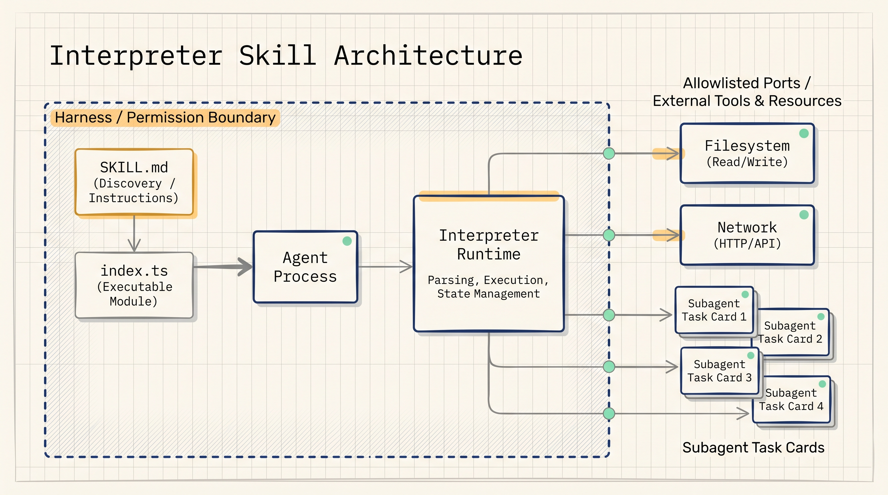
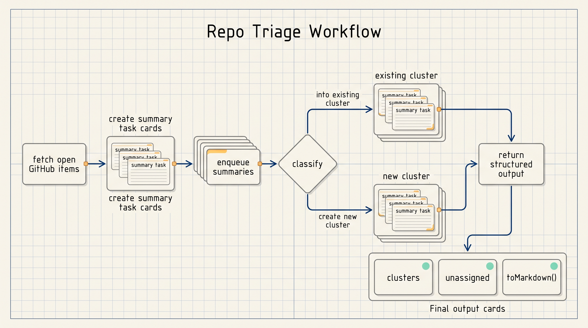
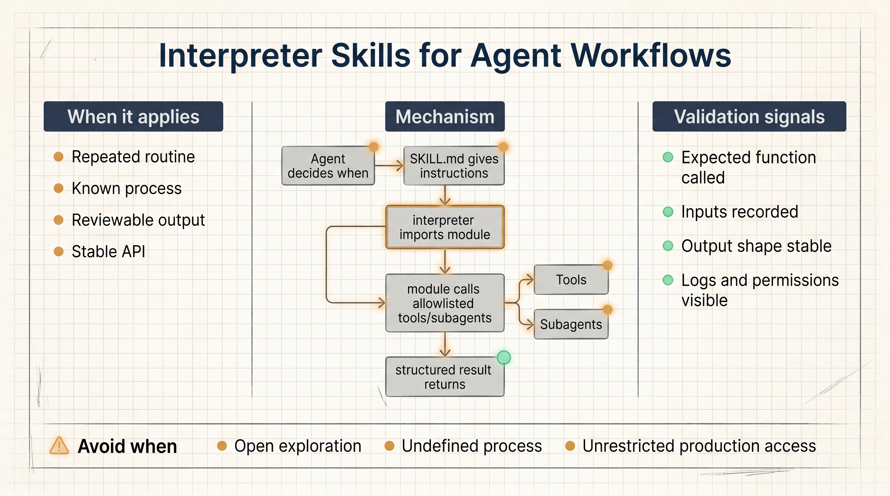

# Interpreter Skills Turn Agent Workflows Into Reviewable Code Paths

Interpreter skills are an attempt to solve a common agent engineering problem: prompts can describe a procedure, but they do not guarantee the agent will run the same procedure every time.

LangChain's proposal keeps model discretion on the outside and moves the deterministic part of the routine into code. A `SKILL.md` file still tells the agent when a behavior is relevant. A TypeScript module gives the interpreter an executable API to call when that behavior applies.

In a normal skill, the agent reads instructions and tries to carry them out. In an interpreter skill, the agent can import a module such as `@/skills/github-triage` and call a known function:

```ts
const { triage } = await import("@/skills/github-triage");
const result = await triage("langchain-ai/deepagents", {
  issues: true,
  prs: true,
  discussions: true,
});
```

The agent still decides whether the skill applies, what inputs to pass, and how to use the result. The module defines the procedure that should run.



The repo triage example makes the idea concrete. The workflow can fetch open GitHub items, spawn a subagent for each item to create a condensed description, enqueue those responses, classify each item into an existing cluster or a new cluster, and return a structured result.

That result is part of the API:

```ts
result.clusters;
result.unassigned;
result.toMarkdown();
```

This matters because triage is not one decision. It is many small decisions chained together. If the model must carry every partial state in its working context, it can compress the process too aggressively or take shortcuts. With an interpreter skill, code can maintain the queue, collect subagent outputs, and return a compact object to the model.



The same pattern applies to data work. A CSV skill could expose functions such as `parseCsv`, `joinTables`, `validateRows`, `groupBy`, `summarize`, and `toCsv`. The agent decides which files to read and how to compose those functions. The skill author owns what each operation means.

The core validation change is important. With prompt-only procedures, teams ask fuzzy questions: did the agent generally follow the instructions, and does the final answer look plausible? With interpreter skills, part of the check becomes concrete: did the agent call the expected function, pass the expected inputs, and receive the expected output shape?



This is not the right pattern for every agent task. Open-ended research, strategy exploration, and creative generation still benefit from model flexibility. Interpreter skills are most useful when a team already knows the routine it wants to preserve: repo triage, invoice submission, CSV validation, migration checks, security evidence collection, or other processes where the steps and outputs must be stable.

The practical takeaway is simple: if the outer task needs judgment but the inner routine needs repeatability, put the inner routine into a tested skill module and let the agent decide when to call it.

Source: LangChain Blog, "Interpreter Skills: Building Workflows for Agents", May 30, 2026.  
Original link: https://www.langchain.com/blog/interpreter-skills
