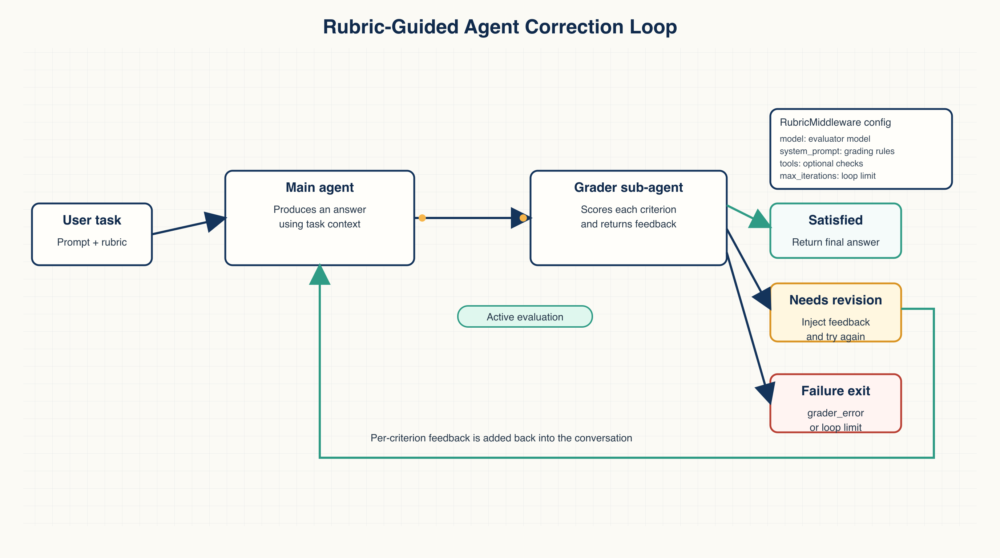
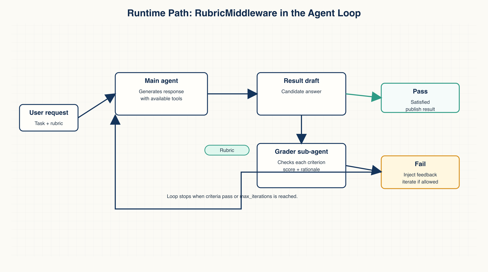
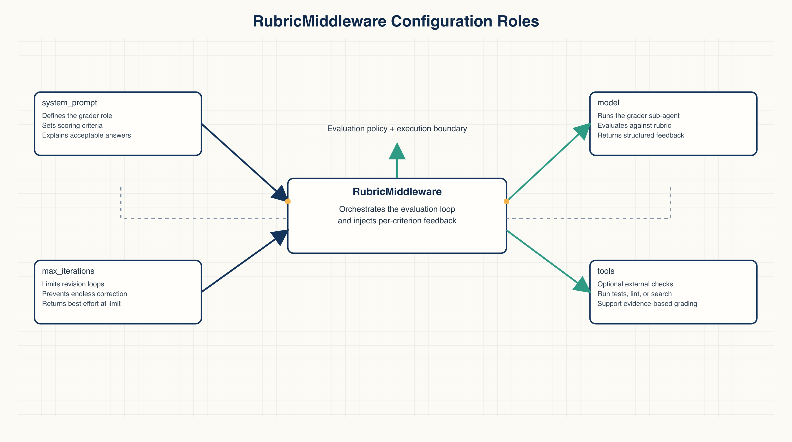

# Introducing Rubrics: Build Agents that Evaluate and Correct Their Work

Agent failures are easy to spot when the task is simple. The code does not run. A command exits with an error. The output file is missing.

Complex tasks fail in quieter ways. A refactor looks complete, but one edge-case test still fails. A research memo has the right shape, but misses a required section. A data-cleaning task produces a file, but the fields do not match the requested schema. The human reviewer still has to inspect the result, identify what is missing, and feed the correction back into the agent.

LangChain's `RubricMiddleware` for Deep Agents addresses that exact gap. It turns "what counts as done" into an explicit rubric, asks a separate grader sub-agent to evaluate the output, and feeds per-criterion feedback back into the conversation when the result falls short.

This is a useful pattern for understanding agent self-correction. It connects four things that often stay separate in agent workflows: completion criteria, independent evaluation, tool-backed evidence, and a bounded retry loop.



## Start by making "done" checkable

Many agent tasks already have a definition of done.

A code refactor is done when the test suite passes. A report is done when every required section is covered. A data task is done when the fields, formats, row counts, and exception handling match the requirement.

The problem is that developers often put the goal into the prompt, but leave the acceptance criteria implicit. As the context gets longer, vague instructions, tool misuse, and non-deterministic errors pile up. The first agent output often lands just short of the real finish line.

A rubric turns that missing finish line into specific checks. Each criterion can be judged as satisfied, not satisfied, or needing more evidence.

A minimal code-generation rubric might look like this:

```text
- All tests pass in run_test_suite
- The function is named `find_duplicates` and accepts a single list argument
```

These criteria have two important properties.

First, they are not abstract opinions. `All tests pass` can be verified through a tool. The function name and argument shape can be inspected directly.

Second, they can produce useful feedback for the next iteration. If a test fails, the grader can return the failing case. If the function signature is wrong, the correction points to a concrete place.

## Let a grader sub-agent evaluate the result

`RubricMiddleware` adds a grader loop on top of the base agent.

The main agent still does the task. Before the run finishes, a grader sub-agent checks the output against the rubric. If every criterion passes, the task ends. If one or more criteria fail, the grader returns feedback for each criterion and injects it back into the conversation. The main agent then gets another attempt.

The loop terminates in one of four states:

- `satisfied`: the rubric is satisfied.
- `max_iterations_reached`: the configured retry limit has been reached.
- `failed`: the run failed.
- `grader_error`: the grader itself failed.

That retry limit matters. Self-correction without a cap can turn a small issue into an open-ended loop that burns tokens and time. `max_iterations` makes the reliability boundary explicit. Past that boundary, the system should hand the result back to a human.



## The minimal setup

LangChain's minimal path has three steps: define the middleware, attach it to a deep agent, and pass a rubric at invocation time.

First, define `RubricMiddleware`:

```python
from deepagents import RubricMiddleware

rubric_middleware = RubricMiddleware(
    model="anthropic:claude-haiku-4-5",
    system_prompt="You are a code reviewer grading generated code against a rubric.",
    tools=[run_test_suite],
    max_iterations=5,
)
```

There are four configuration points here.

`model` is the model used by the grader. It can often be smaller or cheaper than the main agent model because the grader is checking against criteria, not solving the entire task from scratch.

`system_prompt` defines the grader's role. In the example, the grader acts as a code reviewer and evaluates generated code against the rubric.

`tools` are the tools available to the grader. For code tasks, that can be `run_test_suite`. The grader should use evidence, not just read the output and guess.

`max_iterations` limits the "fix, grade again" loop.



Second, attach the middleware to a deep agent:

```python
from deepagents import create_deep_agent

agent = create_deep_agent(
    model="anthropic:claude-sonnet-4-6",
    system_prompt=(
        "You are a careful Python engineer. Write correct, readable code. "
        "Follow the user's instructions exactly."
    ),
    middleware=[rubric_middleware],
)
```

The main agent and the grader have separate jobs.

The main agent's system prompt explains how to work: write correct, readable Python code and follow the user's instructions. The rubric explains how the grader should evaluate the result: which conditions must be satisfied and which checks should be run.

Third, pass the user message and rubric at invocation time:

```python
from langchain.messages import HumanMessage

result = agent.invoke(
    {
        "messages": [
            HumanMessage(
                content=(
                    "Write a Python function `find_duplicates(lst)` that returns a list of "
                    "all elements that appear more than once in the input list, in the order "
                    "they first appear."
                )
            )
        ],
        "rubric": (
            "- All tests pass in run_test_suite\n"
            "- The function is named `find_duplicates` and accepts a single list argument\n"
        ),
    },
    config={"configurable": {"thread_id": "code-generation-session"}},
)
```

If no `rubric` is passed, the middleware does nothing. The same deep agent can therefore run in two modes: ordinary execution, or execution with an explicit grading loop.

## Tool-backed grading is the important part

The strongest design choice is that the grader can call tools.

In the LangChain example, the grader does not merely read the generated code and decide whether it "looks correct." It can call `run_test_suite`, read the failure, and turn that evidence into feedback.

The first agent attempt in the example failed a test involving unhashable inputs. The grader returned targeted feedback:

> One test fails: test_unhashable. The function crashes with TypeError when encountering unhashable types like lists within the input list.

That feedback gives the main agent three concrete signals:

- which test failed;
- what error occurred;
- what input shape triggered the failure.

That is very different from generic feedback such as "make the code more robust." The second iteration can fix the actual issue.

When writing rubrics, a good first question is: can this criterion be verified by a tool?

For code, use tests, lint, type checks, or static analysis. For reports, use required-section checks, citation checks, or format checks. For data tasks, use schema validation, row-count checks, and statistical sanity checks. When tools cannot answer the entire question, the grader can still use them as evidence and then reason over the conversation.

## When rubrics help, and when they do not

Rubrics are best for tasks where the completion criteria are clear but the first output is unreliable.

Code generation and refactoring are the obvious cases. Tests, function signatures, edge cases, and style rules can all become rubric criteria.

Reports and documentation can also fit. A grader can check whether required sections exist, whether key data sources are covered, whether limitations are stated, and whether a specific conclusion is present.

More complex agent workflows can fit too. An incident analysis might require log review, a root-cause hypothesis, evidence links, a mitigation plan, and a rollback plan. A grader can check those items one by one.

Rubrics are weaker when the completion standard is vague. "Make it more insightful" or "make it sound more expert" does not give the grader a stable target. They are also weaker when the grader has no tools, no evidence, or incomplete context. In those cases, the system becomes one model judging another model from text alone.

Cost also matters. Every retry consumes time and tokens. For expensive workflows, `max_iterations` should be set deliberately, not treated as a default.

## A practical first exercise

The safest first exercise is a small code-generation task.

Ask the agent to write one function. Write a rubric that specifies the function name, argument shape, return value, test pass condition, and one edge case. Give the grader a test tool. Then inspect three things:

1. When the first attempt fails, does the grader identify the specific failed criterion?
2. After feedback is injected, does the main agent make the right correction?
3. When `max_iterations` is reached, does the system stop and hand control back to a human?

This exercise helps separate two failure modes: the main agent cannot solve the task, or the acceptance criteria were not written clearly enough.

## A useful enterprise starting point

For a team adopting this pattern, a good starting point is read-only code review.

The agent's task is to read a pull request and produce review comments. It should not directly edit or merge code. The rubric can require:

- file and line references;
- separation between bugs, risks, and suggestions;
- references to test or lint results;
- avoidance of generic comments;
- reproducible steps where relevant.

The grader can use read-only tools: changed-file lists, test results, lint reports, and existing CI output. It does not need write permissions. Human review remains the final gate.

That is the main value of the pattern: it improves the agent's ability to check its own work without pretending that the human approval boundary has disappeared.

Source: LangChain Blog, "Introducing Rubrics: Build Agents that Evaluate and Correct Their Work", June 2, 2026.
