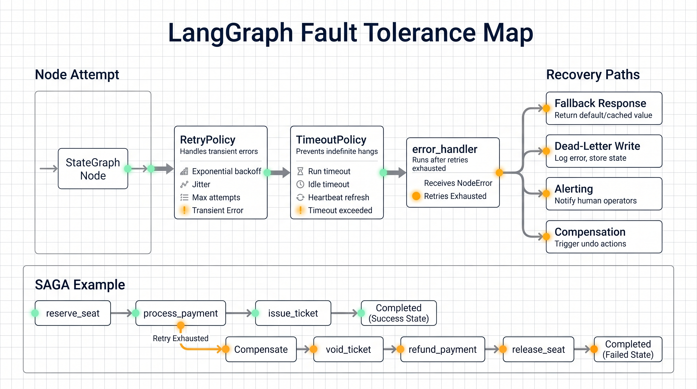
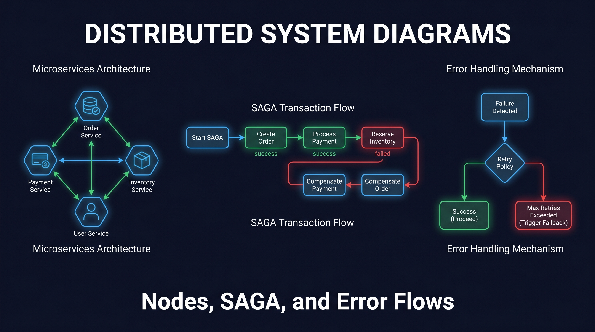
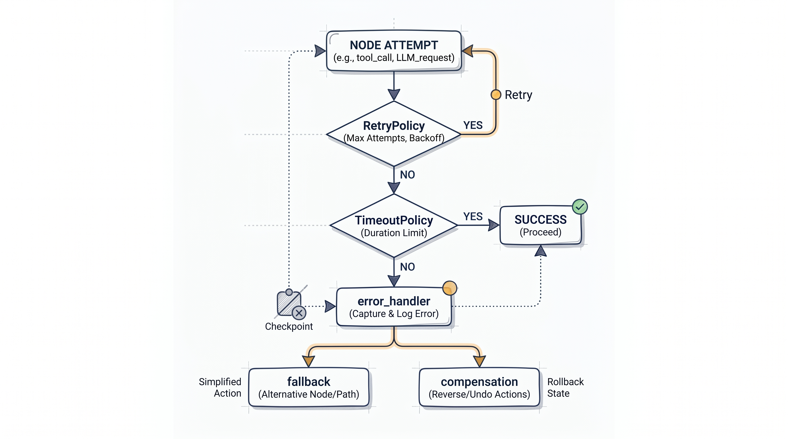

# LangGraph Fault Tolerance: Retries, Timeouts, and Compensation

Production agents fail in places prototypes rarely cover: network calls, tool execution, LLM rate limits, frozen subprocesses, and external systems that only partially complete an action.

LangGraph's fault-tolerance primitives are useful because they live at the workflow node level:

- `RetryPolicy` for transient failures.
- `TimeoutPolicy` for stuck or idle attempts.
- `error_handler` for recovery after retry exhaustion.

## Treat Agents as Workflow Nodes

LangGraph models an agent as a graph of discrete nodes. A typical agent has a model-call node, a tool-execution node, and deterministic logic around that loop. Because LangGraph controls execution, it can also control what happens when any node fails.

That means the failure policy can sit next to the node it protects:

```python
StateGraph(State).add_node(
    "call_llm",
    call_llm,
    retry_policy=RetryPolicy(max_attempts=4, backoff_factor=2.0),
    timeout=TimeoutPolicy(run_timeout=30, idle_timeout=5),
    error_handler=handle_model_failure,
)
```



## RetryPolicy Handles Transient Failure

Retries are for failures that may recover: provider 5xx responses, connection resets, temporary downstream outages, and timeout-like errors.

LangGraph's default retry behavior is deliberately conservative. It retries connection errors and common transient categories. It does not retry programming errors such as `ValueError`, `TypeError`, or `RuntimeError`.

## TimeoutPolicy Stops Hung Attempts

`run_timeout` caps total wall-clock time for one attempt. `idle_timeout` resets on progress signals such as streamed chunks, channel writes, child task events, or callbacks.

That lets long-running work continue when it is still making progress, while silent stalled work is cancelled.

## error_handler Enters the Recovery Branch

Retries do not decide what to do after retry exhaustion. That is the job of `error_handler`.

An error handler can mark a run as failed, write a dead-letter event, alert an operator, route to a fallback model, or start compensation logic. It receives failure context through `NodeError`, including the failed node and the underlying exception.

The transition is checkpointed. If the host process crashes during handler execution, the resumed run schedules the handler again instead of rerunning the original failed node.

## The SAGA Example



The article's flight booking example has three side-effecting steps:

1. Reserve a seat.
2. Process payment.
3. Issue a ticket.

Retrying the entire workflow can duplicate side effects. If the seat reservation succeeded and payment failed, the system needs to undo only what actually happened.

The workflow records completed steps in state. When a node exhausts retries, the error handler routes to `compensate`. The compensation node checks completed state and runs only the required undo actions: void ticket, refund payment, or release seat.



That is the SAGA pattern applied to an agent workflow.

## Practical Checklist

- Split side-effecting work into separate nodes.
- Retry only transient failures.
- Set both runtime and idle timeouts where needed.
- Store completed steps in durable state.
- Route retry exhaustion to an explicit fallback or compensation node.
- Test failure at every step, not only the happy path.

Source: LangChain Blog, "Fault Tolerance in LangGraph: Retries, Timeouts and Error Handlers", published June 4, 2026.
