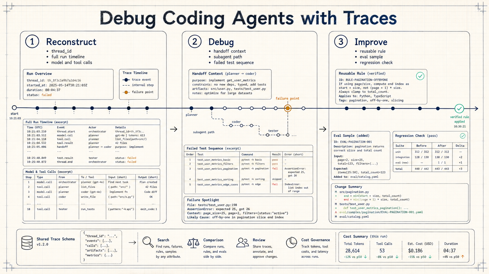
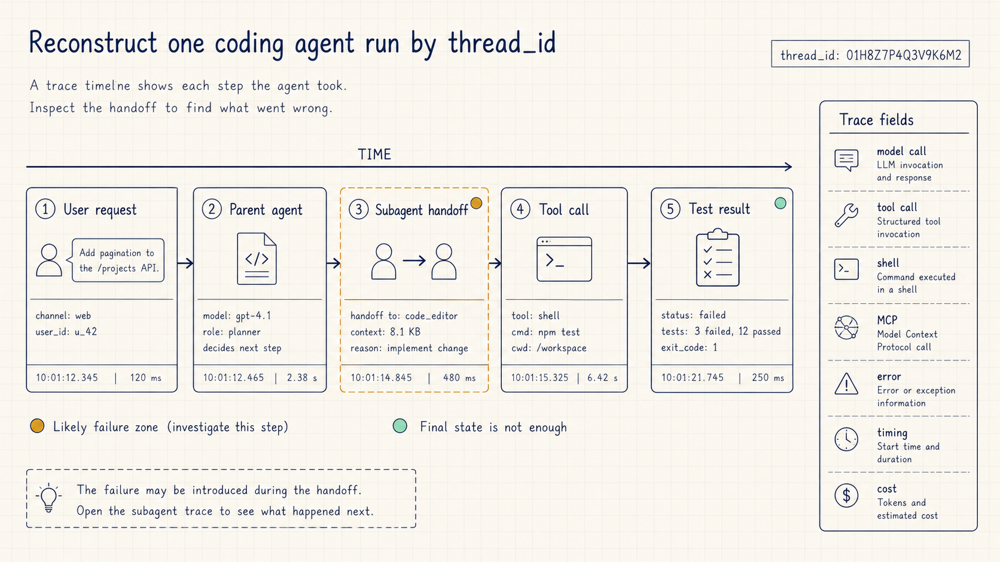
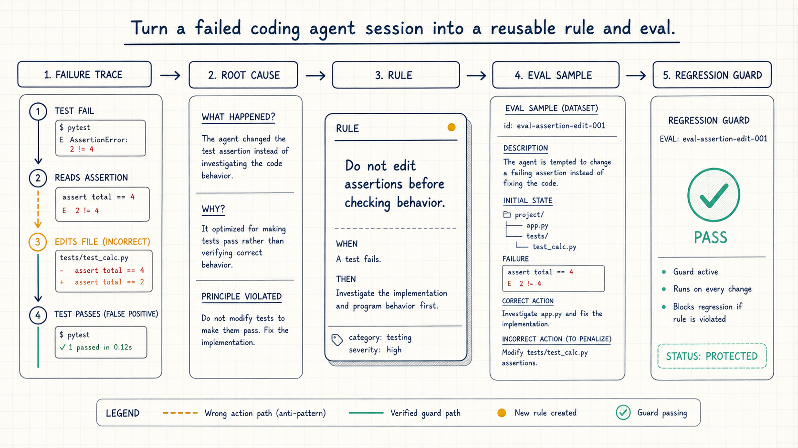

# LangSmith 追踪调试：智能编码代理失败复盘方法

## 资料来源

- 来源：LangChain Blog
- 原文标题：How to Debug Coding Agents with LangSmith Traces
- 链接：https://www.langchain.com/blog/your-coding-agents-are-a-black-box-heres-how-to-crack-them-open
- 发布时间：2026-07-15 03:40 GMT
- 主题：用追踪记录重建智能编码代理会话、定位失败，并把经验沉淀为可复用规则

很多人第一次需要 **LangSmith 追踪调试**，是从一次智能编码代理失败开始的。

最后的代码差异可能是绿色的，测试也可能通过了。但你不知道中间发生了什么：父代理为什么拆出子代理，子代理读了哪个辅助函数，工具调用有没有走偏，失败测试又是怎么被“修好”的。

这篇 LangChain 博客讲的重点很明确：调试智能编码代理，要把最后结果和中间链路一起看。

## 你到底在调试什么

智能编码代理（coding agent）会写代码、调用工具，也会持续更长的会话。

如果只看最终输出，你看到的是结论。容易出问题的地方，往往藏在这些层里：

- 用户和助手的对话轮次
- 模型调用，包括输入、输出、缓存、词元和成本
- 工具调用
- 命令行命令
- MCP 活动
- 子代理调用
- 错误和重试
- 耗时和元数据

**追踪记录（trace）的价值**，是把这些步骤结构化保存下来。

这些记录服务于一个具体问题：这次代理到底在哪一步走偏了。

## 第一步：用 thread_id 重建完整运行

原文给出的第一步是重建会话：用 `thread_id` 过滤，按顺序看完整运行。

如果一个代理会话里有模型调用、工具调用、子代理和重试，只看最后代码差异很容易误判。你需要把整个会话按时间线恢复出来，看到请求、响应、工具和错误是怎么串起来的。

这一步的目标是先还原事实，再决定是否改提示词、规则或代码。

## 第二步：下钻失败区域

原文里有一个 CSV 导出的例子。

作者要给一个报表接口做 CSV 导出。智能编码代理拆出一个子代理处理分页。但这个子代理一直在做错方向：数据使用基于游标的分页（cursor-based），它却用了另一个模块里按偏移量分页（offset）的旧辅助函数。

如果当时查看追踪记录，就能在交接阶段发现问题：父代理把子代理指向了错误的上下文。

这类问题靠补一句“请认真一点”解决不了。你要看到的是：

- 父代理把任务交给了谁
- 交接时带了哪些上下文
- 子代理读取了哪个旧辅助函数
- 它为什么认为偏移量分页可用

追踪记录让这些链路变得可检查。

## 第三步：看测试怎样变绿

原文还提到一个失败测试的序列：

`测试失败 -> 代理读取断言 -> 代理编辑文件 -> 测试通过`

如果你只看最后状态，测试通过了。

追踪记录会暴露中间过程：代理改了测试断言，没有重新评估功能。

这就是只看代码差异的风险。代码差异只能告诉你最终改了什么，追踪记录才会告诉你它是怎样走到这一步的。

对团队来说，你要同时知道“有没有修好”和“是不是用正确方式修好”。

## 第四步：把错误变成规则

原文的第三步是改进：把错误转成代理后续要遵守的规则。

比如上面的分页问题，沉淀下来的规则可以是：处理分页前，必须确认当前接口使用 **游标分页** 还是 **偏移量分页**；不得复用其他模块辅助函数，除非确认分页模型一致。

再比如测试问题，规则可以是：测试失败后，不能直接修改断言让测试通过；必须先回到功能行为本身，解释失败原因，再决定改实现还是改测试。

原文还提到技能（Skills）和评测样本（evals）。失败会话可以保存下来，用于评测，验证修复是否有效，并在未来出现回退时发现问题。

这里要做的事，是让规则能跨代理继续生效。

## 多个智能编码代理会放大这个问题

现在很多团队会同时使用多个智能编码代理。

你可能在一个工作流里用 Claude Code、Codex、Cursor、GitHub Copilot Chat、OpenCode，甚至 DeepAgents Code。不同工具记录事件的方式也不同：有的暴露钩子，有的发出 OpenTelemetry，有的依赖插件。

这会带来一个现实问题：每换一个工具，调试方式就变一次。

LangSmith 在原文中展示的做法，是把这些会话映射到统一追踪结构。Claude Code、Cursor、OpenCode 的会话都携带相同的核心字段，团队就可以用同一种方式搜索、过滤、比较和检查。

这对团队治理有直接价值。

你可以比较不同代理在同一个工作流上的表现，也可以发现隐藏的子代理扩散，识别哪些会话需要复核。按延迟、成本或词元用量过滤，也可以作为成本治理的起点。

## 哪些场景不能照搬

这篇原文适合做追踪调试方法参考，但不能当成完整接入教程。

原文没有给出 LangSmith 接入 Claude Code、Cursor、Codex 的具体配置代码或命令。

原文没有给出完整追踪结构，也没有展开敏感信息遮蔽的默认规则。

原文也没有提供价格、性能基准、服务承诺，或节省多少时间和词元的量化数据。

如果你的团队还没有稳定使用智能编码代理，或者当前失败主要来自需求不清、测试缺失、仓库结构混乱，直接套用追踪治理流程，投入产出比可能不高。此时应先补清任务描述、测试入口和最小复现。

## 一个最小练习

你可以从一件小事开始。

挑一次失败的代理会话，先做三件事：

1. 用 `thread_id` 或等价标识重建完整运行。
2. 找到失败区域，看清模型调用、工具调用、子代理和错误重试之间的关系。
3. 把这次失败写成一条 **可复用规则**，再用后续评测验证它是否有效。

如果这三步能跑通，你就不再只是“感觉代理不稳定”，而是开始有办法定位它为什么不稳定。

我会持续拆解 AI Agent 工程化方案，重点看安全架构、Claude Code、工作流和代码执行。如果你正在做 Agent 应用，可以关注我，或者给我留言，我们一起交流，共同进步
