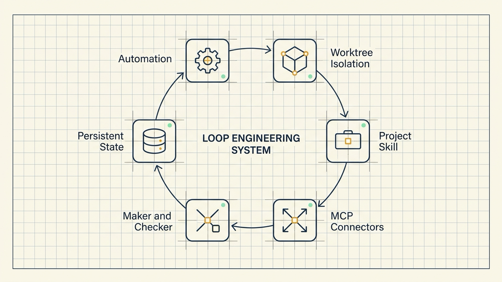
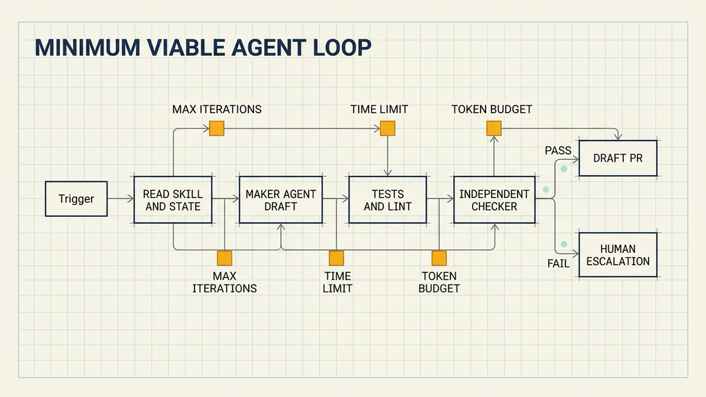
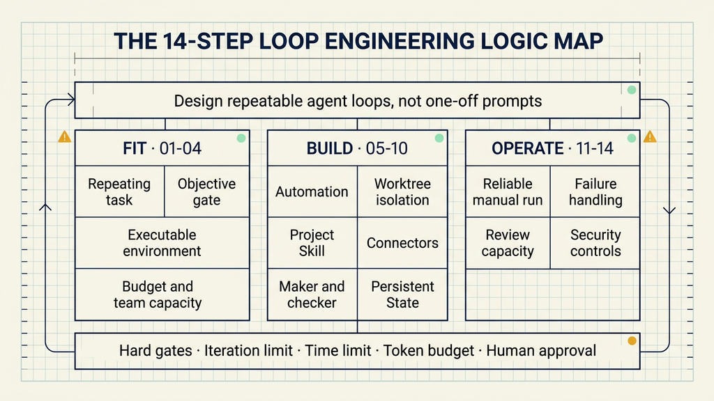

# Loop Engineering: The 14-Step Path from Prompt Engineer to Loop Designer

Many developers already use coding agents every day, but the operating pattern is still manual: describe a task, wait for a change, read the diff, and send the next instruction. For recurring work such as CI triage, dependency updates, lint fixes, and flaky-test reproduction, a person repeats the same prompting and checking sequence every week.

Loop engineering turns that sequence into a small running system. The system discovers work, assigns it to an agent, verifies the result, records state, and decides whether to continue, stop, or escalate to a human. The engineer still owns goal selection, verification design, risk decisions, and final approval.

A task is a good candidate for a loop when four conditions hold:

1. The task repeats often enough to repay setup cost.
2. A machine-readable signal can reject bad results.
3. The agent can run and observe the code it changes.
4. The token and tool budget can absorb exploration and retries.

When those conditions hold, the smallest useful implementation contains one automation, one Skill, one state file, and one hard gate.

The path forms a three-tier pyramid: establish task fit at the base, assemble six system components in the middle, then operate the loop with verification, stopping rules, review capacity, and security controls at the top.

## Tier 1: Decide Whether the Task Fits a Loop

Loops have setup cost, maintenance cost, and continuous model cost. A task that appears once every few months may change before the second run. A task whose result depends on taste or architecture judgment may never have a reliable stopping condition.

### 01 Confirm That the Task Repeats

Good early candidates include:

- daily or nightly CI failure triage,
- weekly dependency-update drafts,
- lint-and-fix passes,
- flaky-test reproduction,
- issue-to-draft-PR work in a well-tested codebase.

One-off migrations, exploratory debugging, and open-ended design work usually remain easier to handle in a direct agent session.

### 02 Require an Objective Gate

A loop needs evidence that can fail the work:

- a regression test for a bug fix,
- build and compatibility checks for a dependency update,
- a zero exit code from lint,
- a structured classification and evidence trail for CI triage.

"The code looks reasonable" is a soft condition. An agent can stop at partial completion or continue spending after the useful work is finished.

### 03 Give the Agent an Executable Environment

The agent needs logs, a reproduction environment, and the commands that exercise its change. File-write access without execution feedback creates blind iteration.

An early loop can stay inside a repository and a draft branch. Merge, deployment, and protected paths remain behind human approval.

### 04 Set Budget and Runtime Limits

Loops reread context, call tools, retry failed approaches, and sometimes finish without a shippable change. Every loop should define:

- a maximum iteration count,
- a maximum runtime,
- a maximum model-call or token budget.

When a limit is reached, the system records its current state and escalates. A failed run then becomes reviewable evidence instead of an open-ended bill.

## Tier 2: Assemble the Six System Components

Addy Osmani describes five building blocks plus one form of external memory: automation, worktrees, Skills, connectors, subagents, and persistent state.



### 05 Automation: Trigger and Cadence

Automation starts the loop on a schedule, an event, or a condition.

Examples include scanning overnight CI every morning, checking dependencies each week, or running a lint fixer when a pull request opens. Automation surfaces the work; later gates decide whether the work can progress.

Codex Automations can bind a project, prompt, cadence, and execution environment. Claude Code can compose scheduled tasks, session loops, and hooks into a similar operating pattern.

### 06 Worktrees: Isolate Parallel Changes

Two agents editing one working directory can overwrite files or contaminate each other's test results.

A Git worktree gives each task a separate directory and branch while sharing repository history. One agent can investigate an authentication test while another prepares a dependency update without sharing uncommitted files.

Worktrees remove mechanical collisions. Human review capacity still limits useful parallelism.

### 07 Skills: Store Project Rules

A Skill packages stable project knowledge in `SKILL.md`: build commands, directory responsibilities, classification rules, protected areas, and failure-handling instructions.

A CI-triage Skill can define:

- how to distinguish environment failures, flakes, real bugs, dependency failures, and infrastructure failures,
- which entry points to inspect first,
- which directories are read-only for the loop,
- which state file must be updated after each run.

Each run reloads the Skill, so project knowledge does not depend on the memory of one conversation.

### 08 Connectors: Reach Real Systems

MCP connectors let the loop read GitHub issues, update Linear or Jira, query an error tracker, and send results to Slack.

A CI loop normally starts with GitHub access: read failed jobs, create a worktree, push a draft branch, and open a Draft PR. Ticketing and notification systems can be added when the workflow has proved reliable.

Permissions should follow action impact. Reading an issue, opening a draft, merging to main, and deploying production deserve different authorization levels.

### 09 Subagents: Separate Maker and Checker

The maker investigates and prepares a change. The checker receives the goal, diff, tests, and project rules, then verifies the evidence.

The two roles use different instructions. The checker should not inherit the maker's private reasoning because that increases the chance of repeating the same assumptions.

A second model saying "the change looks good" is still subjective. Tests, builds, static analysis, and explicit output files remain the actual completion evidence.

### 10 Persistent State: Carry Progress Across Runs

A loop must remember what it tried, where it stopped, and which items need human judgment. Markdown, JSON, an issue tracker, or a database can hold that state.

```markdown
# CI Triage State

## Last run
2026-06-28 03:30 UTC
7 failures classified, 3 fix drafts, 4 escalations.

## In progress
- fix-auth-token-refresh: local tests pass, awaiting CI

## Human escalation
- src/billing/refund.ts: three failure modes, root cause unconfirmed

## Run notes
- E2E checkout requires a webhook secret; classify as environment when absent
```

The state file answers "where are we now?" A standing `VISION.md` or `AGENTS.md` answers "where are we going?" Reloading both at the start of every run reduces long-session goal drift.

## Tier 3: Operate the Loop Safely

### 11 Build the Minimum Loop in the Right Order

The minimum loop contains:

1. one automation,
2. one Skill,
3. one state file,
4. one hard gate.

The implementation sequence matters:

1. Complete one run manually and record every action and decision.
2. Put stable instructions into a Skill.
3. Run the Skill once with an agent.
4. Add persistent state and an objective gate.
5. Add scheduling after the manual path is reliable.

Scheduling amplifies every flaw in the workflow. A manual process that still loses context will lose context more frequently when it runs every hour.

#### A First Exercise: CI Failure Triage

CI triage repeats, produces machine-readable output, and leaves a clear evidence trail.

##### Limit the Initial Scope

The first version can handle one class of failure, such as unit-test failures. Environment failures, infrastructure timeouts, and changes in protected payment code are recorded and escalated.

The agent can receive permission to:

- read the repository and CI logs,
- create an isolated worktree and draft branch,
- modify an approved module,
- run unit tests and lint,
- open a Draft PR.

Production deployment, merging to main, and secret access remain human-controlled.

##### Write a Small Triage Skill

```markdown
---
name: ci-triage
description: Analyze unit-test failures and prepare low-risk fix drafts.
---

## Classification
- env: missing environment variable or dependency service
- flake: passes on retry without a code change
- bug: recent change causes a stable reproduction
- infra: timeout, OOM, or runner failure

## Handling
- bug: prepare a fix in an isolated worktree and run the target tests
- flake: retry once and record reproduction evidence
- env / infra: record evidence and escalate

## Limits
- payment, authorization policy, and CI configuration are analysis-only
- every output remains a Draft PR
- update STATE.md after each run
```

##### Define Completion With Evidence

```text
The original failure reproduces reliably.
The target test passes after the change.
Related module tests and lint pass.
The Draft PR contains the root cause, change summary, and test evidence.
```

If any condition is missing, the run updates `STATE.md` and waits for the next run or human escalation.

##### Add Hard Stops

An initial policy can allow:

- no more than two modification attempts,
- no more than 30 minutes,
- one failure per run,
- immediate escalation for protected paths.

The team can observe cost and failure modes before expanding task scope.

##### Measure Accepted Work

Raw call count and generated lines of code do not show whether the loop helps. Better measures include:

- Draft PR acceptance rate,
- model cost per accepted change,
- human review time per PR,
- false classifications between environment failures and bugs,
- reasons a test-passing change was rejected by a reviewer.

The source thread offers a useful operating signal: below a 50% acceptance rate, review and rework may erase the time saved by automation.



### 12 Handle Three Common Failure Points

#### Soft Completion Conditions

An agent can emit a completion message after only part of the task. Completion should resolve to tests, build artifacts, exit codes, or required files.

Tasks that cannot express an observable completion condition should remain human-led.

#### Goal Drift

Repeated context compaction can remove early constraints. Reloading `AGENTS.md`, `VISION.md`, the Skill, and the state file at the start of each run restores the operating frame.

State should remain factual: what was attempted, what happened, and what comes next.

#### Self-Approval

An independent checker with a clean goal and evidence set reduces self-preference. High-impact changes add a human approval step.

The responsibilities remain distinct:

- maker: prepare the change,
- checker: verify specification and machine evidence,
- human: judge risk, business impact, and merge readiness.

### 13 Include Review and Comprehension in the Cost

Anthropic reported that its typical engineer merged roughly eight times as many lines of code per day in Q2 2026 as in 2024, and that more than 80% of merged code was authored by Claude.

Anthropic also states that lines of code measure quantity rather than quality, so the eight-times figure almost certainly overstates the true productivity gain. The organization is already seeing pressure on shared infrastructure and human code review.

The broader lesson is operational: as generation accelerates, verification capacity, repository understanding, and direction-setting become the limiting resources.

Two forms of debt deserve explicit tracking:

- **Comprehension debt:** repository growth outruns the team's ability to read and understand it.
- **Cognitive surrender:** people accept loop output without forming an independent judgment.

The controls are straightforward: read diffs, spot-check whether tests catch the intended failure, keep loops on small machine-checkable changes, and pair-design high-impact workflows.

### 14 Add Security Controls for Unattended Loops

Loops touch repositories, credentials, logs, tickets, and execution environments. Longer runtime and broader permissions increase the impact of a compromised instruction or careless log statement.

A 2026 empirical study examined 17,022 Agent Skills and found 520 affected Skills containing 1,708 credential-leakage issues. Debug output through `print` and `console.log` was one of the dominant exposure paths.



Production controls can include:

- reviewed and version-pinned Skill sources,
- log redaction for tokens, cookies, API keys, and personal data,
- separate permissions for read, write, merge, and deploy,
- SAST, dependency audit, and secret scanning as hard gates,
- time-limited temporary access,
- human approval for merge, deploy, dependency changes, and protected paths.

The state record should include which permissions were used, which external services were contacted, and which actions received human approval.

## Conclusion: Start With One Small Task

Choose one weekly task with existing tests and a small impact radius. Run it manually once, write the stable procedure into a Skill, add a state file and a test gate, then allow at most two modification attempts or 30 minutes before escalation.

During the first week, track acceptance rate and reviewer time. Expand task types or cadence only when the loop consistently removes repetitive work. When acceptance remains low, fix the Skill, tests, or task scope before adding more agents.

Loop engineering places a coding agent inside a system that is verifiable, stoppable, and traceable. The system handles repetition. Engineers continue to own goals, verification design, and final decisions.

## Sources

- Codez, "Loop engineering: the 14-step roadmap from prompter to loop designer"  
  https://x.com/0xCodez/status/2064374643729773029
- Addy Osmani, "Loop Engineering," June 7, 2026  
  https://addyosmani.com/blog/loop-engineering/
- Anthropic, "When AI builds itself," 2026  
  https://www.anthropic.com/institute/recursive-self-improvement
- "Credential Leakage in LLM Agent Skills: A Large-Scale Empirical Study," 2026  
  https://arxiv.org/abs/2604.03070
