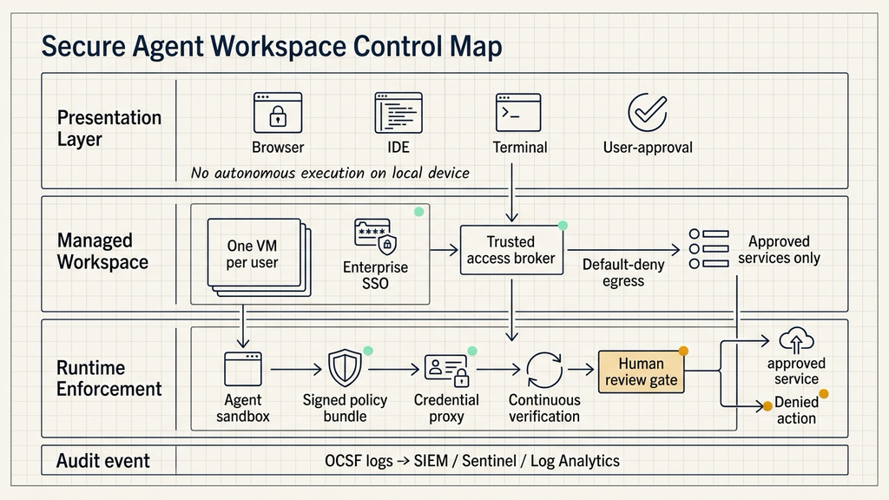
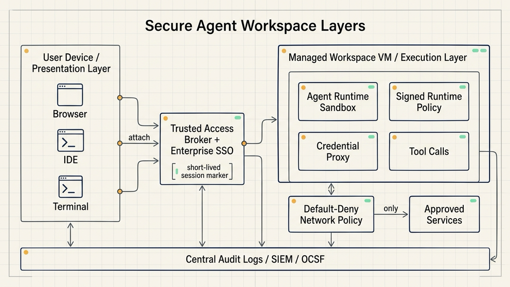
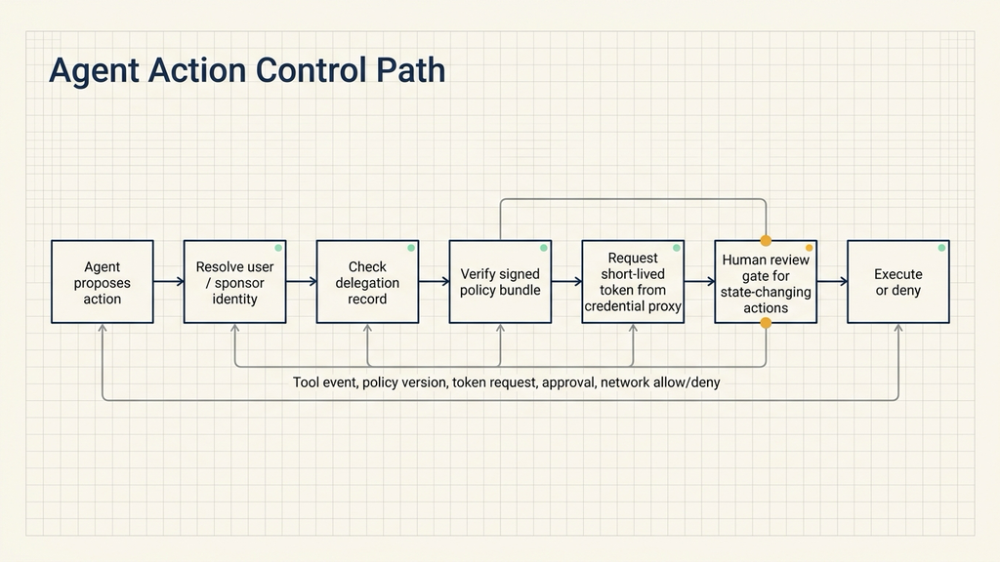

# NVIDIA's AI Agent Security Architecture for Enterprise Workspaces

When enterprises connect agents to real systems, the problem shifts from answer quality to execution control.

A chatbot can give a wrong answer. An enterprise agent can read code, run tests, inspect knowledge bases, update tickets, prepare pull requests, and work for hours on behalf of a user. That moves the agent into the enterprise execution path. The risk comes from tool calls, credentials, network access, and system writes.

NVIDIA's June 29, 2026 Technical Blog post, "How to Govern Autonomous Agents in Enterprise AI Factories," publishes the Secure Agent Workspace Reference Design. The core idea is to make the user's device a presentation layer and move agent execution into a managed enterprise workspace. The author bio also notes that NVIDIA's internal IT-managed AI factory serves inference and agentic applications to 40,000 employees.

The design is an execution architecture for agents that need to be managed, audited, revoked, and rebuilt.

## The User Device Is the Presentation Layer

The first architectural split is between presentation and execution.

The presentation layer is the employee laptop, browser, IDE, or terminal. The user starts tasks, reviews output, and approves actions from familiar tools. The execution layer is a company-managed virtual machine workspace where the agent code, tools, network access, and runtime policy operate.

This split improves accountability. Employee laptops contain plugins, browser state, personal configuration, old credentials, local scripts, and temporary files. If the agent runs there, security teams have a hard time reconstructing which files it read, which services it reached, which credentials it used, and which commands it executed.

A managed VM narrows the execution environment. Each user gets a dedicated workspace. Access goes through enterprise single sign-on. Sessions are auditable. Network egress starts from default-deny. Only approved internal and external services are reachable. Agent actions, service paths, and write permissions can be governed through one control surface.

## Phase One Makes Agent Activity Visible and Revocable

NVIDIA splits implementation into phases. The first phase controls the perimeter around the workspace: who can enter, how they enter, which workspace they receive, and which services that workspace can reach.

Enterprises first identify workflow owners and stakeholders. That determines resource requirements and access policy. A code review agent may need repository access, CI logs, test results, and ticket systems. It usually does not need access to customer databases, finance systems, or arbitrary internet destinations.

The perimeter pattern has several controls.

Each user receives a company-managed VM. That VM is the isolation unit and can be rebuilt or revoked when tasks end, employees leave, policies change, or suspicious activity appears.

Access goes through enterprise SSO. Sessions should be short-lived and auditable.

Network egress starts from default-deny. The workspace can only connect to approved services. This limits the agent's ability to discover or reach unknown targets during long-running work.

State-changing actions need human approval. Merging code, updating tickets, changing configuration, triggering deployment, and writing business records should require review.

Logs flow to a central security or platform logging path. Workspace lifecycle events, broker sessions, network allow and deny events, policy releases, and tool calls should be available for investigation. NVIDIA also references the Open Cybersecurity Schema Framework, or OCSF, for audit-ready log output.

## Phase Two Controls the Tool-Call Point

The second phase moves control inside the VM, closer to where the agent actually acts.

NVIDIA describes four runtime mechanisms: active sandboxing, signed policy bundles, credential protection, and continuous verification.

Active sandboxing runs the agent in a dedicated runtime such as NVIDIA OpenShell. The runtime observes commands, file access, and tool calls in real time. This gives policy enforcement a view of actual agent behavior, not only login and network state.

Signed policy bundles define what the agent can do. A central system specifies permitted files, commands, services, and tool behavior, then distributes those rules as signed bundles. Signing helps ensure that the workspace cannot silently rewrite its own permissions.

Credential protection keeps raw secrets out of the agent process. The agent should work through a credential proxy and receive short-lived capability tokens instead of long-lived API keys or passwords.

Continuous verification checks that policy is active before each action. Long-running agents need this because identity, policy, network, and credential state can change while work is in progress.

These controls address the agent's real impact surface. A bad answer creates judgment risk. A bad tool call can read sensitive files, reach the wrong service, execute an unsafe command, or use credentials that should never have been exposed.

## Blueprints Turn Permissions into Repeatable Workflows

NVIDIA also introduces agent blueprints above the workspace. A blueprint is a repeatable workflow template that defines the goal, required tools, allowed services, data scope, write permissions, review gates, and logging expectations.

This matters because enterprises will not deploy one agent. Code maintenance, IT ticket handling, internal search, data analysis, compliance review, and developer assistance all have different tools and risk profiles.

A useful blueprint needs at least four things.

First, the agent identity should trace back to a user or sponsor through SSO and delegation records.

Second, secrets should be handled through a credential proxy. The agent should use short-lived tokens rather than raw credentials.

Third, model calls should pass through an inference gateway. The gateway can manage quotas, role-based access control, and dynamic rate limits.

Fourth, state-changing actions should have review gates. Code merges, ticket status changes, configuration changes, and business-system writes need clear approval rules and audit records.

Blueprints make governance repeatable. They let enterprises define what a class of agents can do, then narrow behavior by team or use case.

## The Same Control Model Works On-Prem and in Cloud

NVIDIA maps the design to Red Hat OpenShift Virtualization for on-premises environments and Microsoft Azure for cloud deployments. The tools differ, but the control model is the same.

Each user receives a dedicated VM. The local endpoint only attaches to it. Agent execution remains inside the managed workspace. Central policy controls access, and logs enter a unified audit path.

On OpenShift, teams can use NetworkPolicy, EgressFirewall, routes, and approved ingress paths. On Azure, NVIDIA points to Azure Firewall Premium, disabled BGP route propagation, denied corporate CIDR access, no public inbound path, managed identities, Key Vault over Private Endpoints, and Azure Monitor or Sentinel for observability.

GitOps is used to manage policy intent. VM profiles, network rules, policy metadata, and release information live in Git. The platform reconciles desired state, while signed runtime policies move through a controlled release channel. During audit, teams can see both what the agent did and what the platform intended to allow.

## When This Architecture Is Worth the Cost

This architecture is most relevant when agents already touch internal systems.

For agents that only answer general questions in a web interface, a complete managed workspace may be too heavy. Once agents can access repositories, CI, tickets, internal knowledge bases, configuration systems, or deployment systems, the execution environment should be tightened early.

Engineering platform teams can start with code agents: where they run, which repositories they can read, whether they can merge, whether they use personal long-lived credentials, and whether CI or ticket writes require approval.

Security teams can inspect the logging path: whether a single agent task can reconstruct user identity, session data, tool calls, policy versions, network decisions, and human approvals.

IT and data platform teams can inspect credentials: whether agents can see raw API keys, database passwords, or cloud secrets, and whether proxy-issued short-lived tokens can replace them.

There is also a clear non-fit scenario. If managed VMs, SSO, network policy, image governance, logging, secret management, and revocation are immature, rolling out always-on agents will add another system to maintain. A more realistic path is to choose one high-value workflow, move execution into a managed workspace, and expand from there.

## A Minimal Review Action

Teams already using enterprise agents can review one real workflow, such as code changes, ticket handling, or internal knowledge search.

Trace one task and answer eight questions: where did the agent execute; which user or delegated identity did it use; which systems did it access; was network egress default-allow or default-deny; could it see raw secrets; which actions changed system state; which actions required approval; and could logs reconstruct policy versions and tool calls.

If those questions are hard to answer, the issue is usually not model capability. It is the lack of a unified execution plane.

NVIDIA's Secure Agent Workspace design moves agents out of employee laptops and temporary scripts, into an environment the enterprise can manage, audit, revoke, and rebuild. The closer agents get to production systems, the more their execution environment becomes infrastructure.
