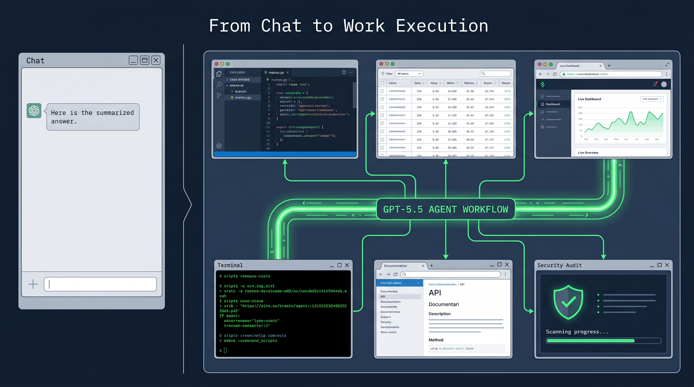
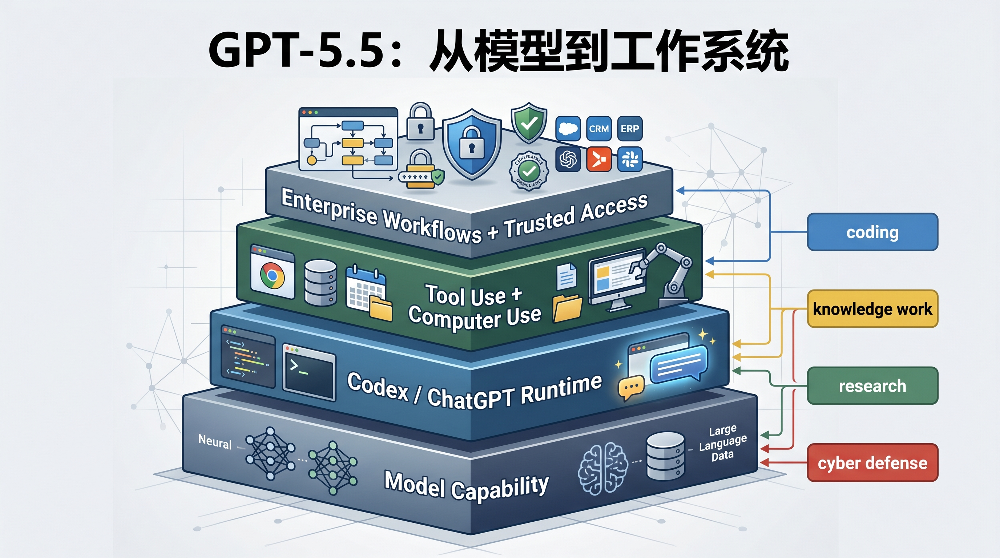
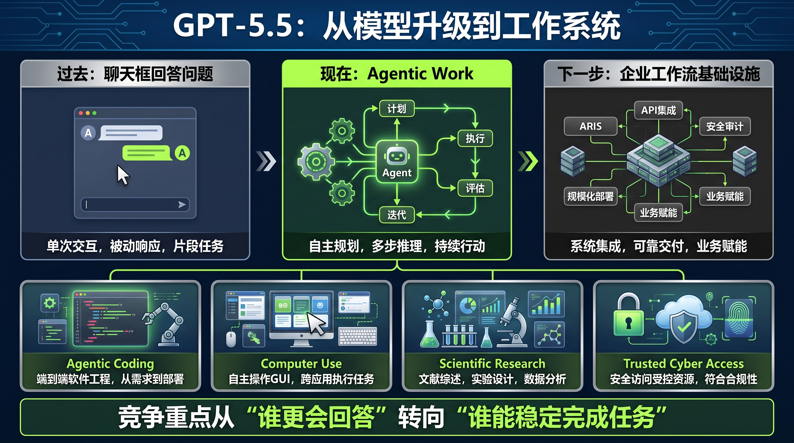

# GPT-5.5 发布：OpenAI 要卖的不是更聪明的聊天框，而是能持续干活的系统

OpenAI 这次发布 GPT-5.5，表面上还是一次模型升级。

但如果只看“更聪明、更会写代码、更会做研究”，就会漏掉真正重要的变化：OpenAI 正在把模型竞争，从单次回答能力，推到“长时间执行复杂任务”的系统竞争。

GPT-5.5 的关键词不是 chat，而是 agentic work。

官方稿里反复强调的不是模型能回答什么问题，而是它能不能在一个真实任务里持续推进：写代码、调试、查资料、分析数据、生成文档和表格、操作软件、跨工具移动，直到任务完成。

这意味着 OpenAI 对下一阶段 AI 产品的判断已经很清楚：企业和专业用户不会只为“答案”付费，他们会为“把事情推进到可交付状态”付费。

## 这不是一次单纯的模型参数升级

GPT-5.5 最值得看的，不是某一个 benchmark 刷了多高，而是 OpenAI 把它放进了哪些工作场景。

在 coding 方向，OpenAI 强调 GPT-5.5 是目前最强的 agentic coding model。它在 Terminal-Bench 2.0、SWE-Bench Pro、Expert-SWE 等评测里表现提升，同时在 Codex 任务中使用更少 token。

这个信息比“分数更高”更关键。

因为 coding agent 的真实成本，不只在模型单价，还在它要反复试错多少轮、读多少上下文、调用多少工具、需要人类补多少次指令。一个模型如果能少走弯路、少消耗 token、少让人接管，它在真实生产环境里的价值就会被放大。

OpenAI 这次其实是在说：GPT-5.5 不只是会写代码，而是更像一个能理解系统形状的工程助手。它需要知道 bug 可能在哪里，改动会影响哪些模块，测试应该怎么补，什么时候应该停下来验证假设。

这比“生成一段代码”更接近真实工程。

## OpenAI 正在把 Codex 变成工作入口

这次发布还有一个非常明显的信号：GPT-5.5 被放在 ChatGPT 和 Codex 里优先分发，API 反而没有同步开放。

这不是一个小细节。

如果 OpenAI 只是想卖模型调用，它完全可以第一时间把 API 放出来，让开发者自己接。但官方稿说得很明确：API 部署需要不同的安全措施，OpenAI 还在和合作伙伴、客户处理大规模服务时的安全与保障要求。

换句话说，GPT-5.5 的能力已经强到 OpenAI 不愿意把“裸模型能力”直接等同于“可随便调用的 API 商品”。

它更愿意先放在 ChatGPT 和 Codex 这些自家受控环境里。这里有账号体系、有产品边界、有工具调用框架、有风控策略，也有更强的使用监测能力。

这背后的战略判断是：Agent 时代，模型本身只是底层发动机。真正有商业价值的，是围绕模型组织起来的运行环境。

Codex 正在承担这个角色。

官方稿提到，OpenAI 内部已经有超过 85% 员工每周使用 Codex，覆盖工程、财务、沟通、市场、数据科学和产品管理。这个细节很重要，因为它说明 Codex 不再只是程序员写代码的工具，而是 OpenAI 自己内部的通用工作台。

在 Comms 团队，它被用来分析六个月的演讲请求数据，建立评分和风险框架，并验证自动 Slack agent。财务团队用它处理两万多份 K-1 税表。Go-to-Market 团队用它自动生成周报。

这些案例的共同点不是“生成文本”，而是“把一组杂乱输入变成可运行流程”。

这才是 OpenAI 想证明的东西。

## GPT-5.5 的真正定位：长任务执行模型

过去两年，大模型竞争经常被简化成两个问题：谁更聪明，谁更便宜。

但 GPT-5.5 这篇官方稿把评价口径往前推了一步：模型能不能在更长周期里完成任务。

OpenAI 提到 GDPval、OSWorld-Verified、Tau2-bench Telecom、FinanceAgent、OfficeQA Pro 等评测，覆盖知识工作、真实电脑环境操作、复杂客服流程、金融建模和办公任务。

这些评测背后对应的是同一个方向：AI 不再只是在聊天窗口里给建议，而是要进入工作流，操作工具，处理文件，验证结果，完成交付。

这也是为什么 OpenAI 会强调 computer use。

当 GPT-5.5 和 Codex 的 computer use skills 结合后，它更接近“可以和你一起使用电脑”的模型：看到屏幕上的东西，点击，输入，切换工具，读上下文，再继续行动。

这一步不只是产品体验升级，而是商业模式升级。

因为一旦 AI 可以稳定完成跨工具任务，它争夺的就不只是模型 API 预算，而是企业软件、办公自动化、研发工具、数据分析和运营流程里的预算。

## 科学研究是另一个试验场

官方稿里另一个值得注意的部分，是 OpenAI 花了相当篇幅讲科学研究。

GPT-5.5 在 GeneBench、BixBench 等生物与基因数据分析任务上表现提升，还提到内部版本配合 custom harness 发现了 Ramsey 数相关的新证明，并在 Lean 中得到验证。

这些案例有宣传成分，但它们透露的产品方向很明确：OpenAI 不满足于把模型定位成“知识问答助手”，而是在测试它能不能成为研究流程里的执行者。

真正的研究工作不是问一个问题、得到一个答案，而是探索假设、查找证据、处理数据、写代码、分析异常、再决定下一步。

这和工程里的 agentic coding 本质相同：都是长链路、多步骤、高不确定性的任务。

所以 GPT-5.5 的主线不是 coding，也不是办公，也不是科研，而是更抽象的一件事：让模型在长任务里维持目标感。

## 安全策略其实也在服务商业化

GPT-5.5 这次还有一个不该忽略的部分：网络安全能力。

OpenAI 明确说，GPT-5.5 的生物/化学和网络安全能力在 Preparedness Framework 下被视为 High，但没有达到 Critical。它还强调为更高风险的 cyber 请求部署更严格分类器，并通过 Trusted Access for Cyber 给经过验证的防守方更少限制的访问。

这段看起来像安全声明，其实也是商业化设计。

越强的 agentic model，越不能只靠“公开 API + 通用政策”来管理。它必须区分用户身份、任务意图、使用场景和风险等级。

这意味着 OpenAI 的下一阶段产品不只是模型服务，而是“模型能力 + 身份体系 + 风险分级 + 使用监测 + 特定行业授权”的组合。

API 为什么没有同步开放，也能放在这个逻辑里理解。

GPT-5.5 的能力越接近真实执行，OpenAI 越需要先把运行环境和安全边界做厚。否则模型能力越强，平台风险也越高。

## 价格更高，但 OpenAI 在卖“少走弯路”

GPT-5.5 的 API 定价也很值得看：标准 GPT-5.5 将是每百万输入 token 5 美元、输出 token 30 美元；GPT-5.5 Pro 更高，输入 30 美元、输出 180 美元。

这明显比 GPT-5.4 贵。

但 OpenAI 的叙事不是“我们更贵，因为我们更强”，而是“虽然单价更高，但在 Codex 里更省 token，结果更好，重试更少”。

这是 agentic workload 的典型定价逻辑。

在传统聊天场景里，用户很容易盯着 token 单价。但在长任务执行里，真正的成本是总任务成本：模型跑了多少轮，有没有走偏，需不需要人类反复纠正，最终结果能不能直接进入下一步。

如果 GPT-5.5 能减少重试、减少人工接管、减少上下文浪费，那么更高 token 单价就未必等于更高任务成本。

OpenAI 要用户接受的，正是这个新账本。

## 这次发布的核心判断

GPT-5.5 不是一次普通的“模型更聪明了”。

它更像 OpenAI 对下一阶段竞争方式的公开表态：模型公司不能只卖推理能力，还要卖执行能力；不能只回答问题，还要接管工作流；不能只开放 API，还要建设受控运行环境。

这也是为什么 GPT-5.5 同时出现在 Codex、ChatGPT、scientific workflow、computer use、cyber safeguards 和 enterprise cases 里。

这些看似分散的场景，其实都在指向同一件事：OpenAI 想让 GPT-5.5 成为“长任务执行”的基础模型。

如果说过去的大模型竞争，是谁能在聊天框里给出更好的答案；那么接下来的竞争，就是谁能把模型嵌进真实工作系统，并让它稳定、可控、可计费地完成任务。

这才是 GPT-5.5 这次发布真正值得关注的地方。

一句话总结：

**GPT-5.5 的意义，不在于 OpenAI 又发布了一个更强模型，而在于它把模型竞争推进到了“谁能承包复杂工作流”的阶段。**
