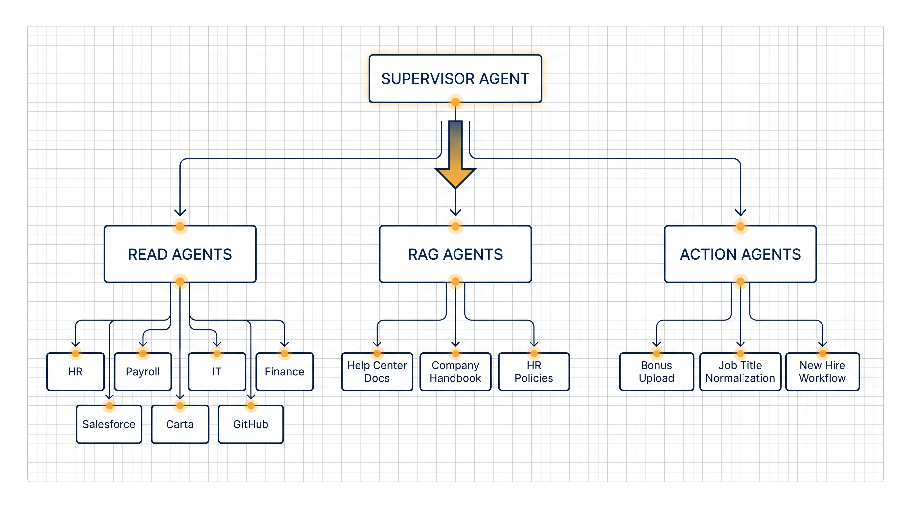
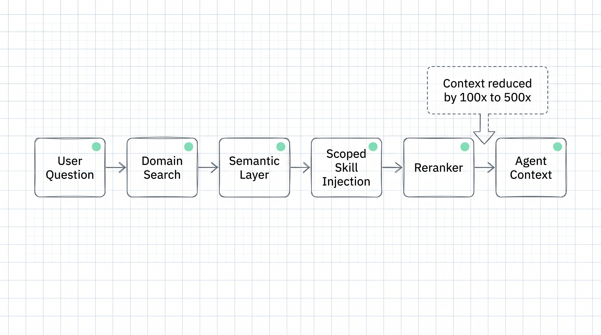
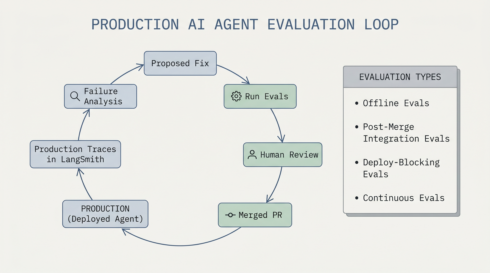
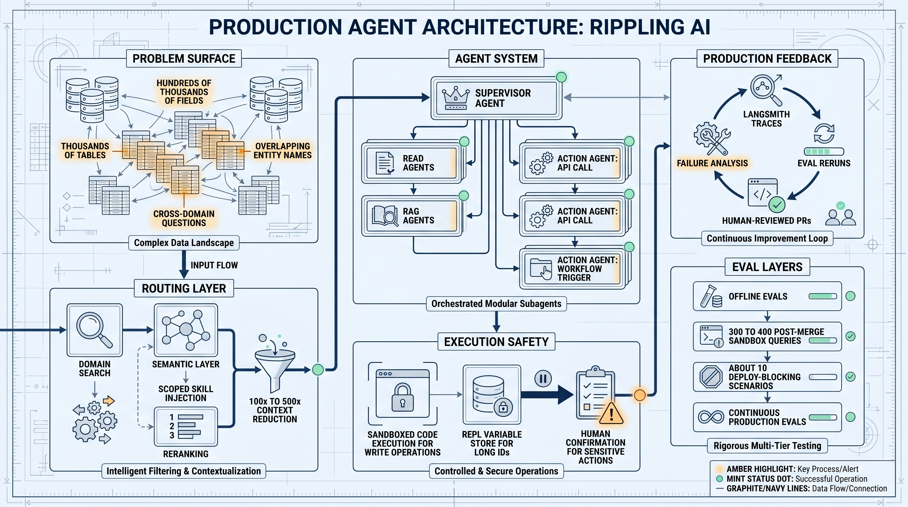

# Production AI Agent Architecture: What Rippling Learned From Shipping Deep Agents

Rippling's production AI system is a useful case study because the hard part is not the chat interface. The hard part is running an agent across HR, IT, payroll, finance, global operations, and connected systems without drowning the model in ambiguous schema.

Rippling AI is now used by more than one million users globally. According to LangChain, the team shipped it in roughly six months using Deep Agents and LangSmith.

## The real problem: cross-domain ambiguity

In Rippling, a question like "What's my balance?" can refer to a health savings account, a credit card, a contractor payment account, or a time-off policy. A manager might move from headcount to spend analysis to device provisioning in one conversation.

Passing schema chunks to an LLM does not scale when the system contains thousands of tables, hundreds of thousands of fields, and overlapping concepts across business domains.

The architectural lesson is simple: a production enterprise agent needs domain routing before it needs more context.

## Supervisor plus specialized subagents

Rippling uses a supervisor agent coordinating 5 to 7 specialized subagents. LangSmith handles tracing, evaluations, and production monitoring.

The system has three major agent types:

- Read agents query structured data across HR, payroll, IT, finance, and connected systems such as Salesforce, Carta, and GitHub.
- RAG agents retrieve from help center docs, company handbooks, and HR policy documents.
- Action agents execute write operations, such as bonus uploads, job title normalization, or new hire workflows.

The supervisor agent owns the primary reasoning loop and decides which specialist, or combination of specialists, should handle each query.

## Context engineering: scoped skills, not unlimited context

Rippling uses Deep Agents middleware for dynamic skill injection. A search step first identifies the relevant domain through Rippling's semantic layer, then injects a skill scoped to that domain, such as payroll, devices, ATS, or spend.

Rerankers prune aggressively. LangChain says this reduces context size by 100x to 500x.

This is the core production pattern: do not give the model every schema and every policy. Route first, then load only the scoped context needed for the task.

## Safer write operations

For write operations, Rippling does not ask the LLM to manipulate data directly. Action agents use sandboxed code execution to normalize inputs, such as CSV files, into the format Rippling's internal tools expect.

This separates LLM reasoning from deterministic formatting. The model decides what needs to happen. Code handles the exact data transformation.

Rippling also uses a REPL-backed variable store to avoid hallucinations when long alphanumeric IDs are passed across multiple agent steps. The agent refers to named variables instead of repeatedly copying raw entity strings.

## LangSmith as the feedback layer

LangSmith gives the team a shared, queryable trace store. Rippling uses it to pull and analyze production conversations at scale.

The team also built a semi-automated self-healing eval loop:

1. Pull failing production traces from LangSmith.
2. Have an agent analyze the failures.
3. Propose fixes.
4. Rerun evals to confirm improvement.
5. Iterate until regressions close.
6. Let a human review and merge the resulting PRs.

The human review step matters. The loop is semi-automated, not fully autonomous.

## Eval layers

Rippling runs a layered eval system:

- Offline evals with prerecorded mocks and fixtures on every commit.
- Post-merge online integration evals with 300 to 400 queries against a full Rippling sandbox.
- Deploy-blocking evals with about 10 critical scenarios against real systems.
- Continuous online evals against production data multiple times daily.

The useful takeaway is that agent evals should not be one big score. They need layers with different speed, cost, and risk coverage.

## Practical takeaway

If you are building an enterprise agent, start with a small cross-domain workflow. Route the question by domain, split read, retrieval, and action work into separate agents, keep write operations behind deterministic code, store long IDs as variables, and trace every step.

Do not open write access before the domain model, permissions, trace review, and deploy-blocking evals are in place.

Source: LangChain Blog, "How Rippling built production AI in 6 months with Deep Agents and LangSmith", published June 1, 2026.

