# DeerFlow 中的 Agent 体系：Lead Agent、自建 Agent 与 Subagent

这篇文章试图回答一个在理解 DeerFlow 时几乎绕不过去的问题：  
**Lead Agent、你在系统里创建的自建 Agent，以及运行时里的 Subagent，到底是什么关系？它们谁负责控制，谁负责表达角色，谁负责执行子任务？**

基于当前仓库实现，一个比较准确的结论是：

**DeerFlow 不是"多个平级 agent 互相对话"的架构，而是"一个主控 Lead Agent \+ 若干角色化自建 Agent 配置 \+ 若干被调度的内置 Subagent 执行体"的架构。**

换句话说，当前系统里真正的高层 orchestrator 只有一个，那就是 `Lead Agent`。  
自建 Agent 不是另一个独立引擎，而是 `Lead Agent` 的一种**角色化运行模式**。  
而 Subagent 则是 `Lead Agent` 为了拆解复杂任务而拉起的**子执行单元**。

---

## 一、先看全貌：三者的总体关系

下面这张图先给出 DeerFlow 当前 Agent 体系的总轮廓。

这张图表达的是：

- 用户请求进入系统后，真正接住请求的是 **Lead Agent**  
- 自建 Agent 不直接接管运行时，而是以 **Profile / Config** 的形式作用于 Lead Agent  
- 当任务足够复杂，Lead Agent 会把部分任务分发给 **Subagents**  
- 最终结果仍然由 Lead Agent 汇总后返回用户

所以，如果你把它想象成一个组织结构，更像：

- Lead Agent 是总负责人  
- Custom Agent 是不同岗位的工作手册和角色模板  
- Subagent 是被临时派出去执行子任务的专项小组

---

## 二、Lead Agent：系统里真正的"总控代理"

DeerFlow 的主控入口在：

- `backend/packages/harness/deerflow/agents/lead_agent/agent.py`  
- 入口函数：`make_lead_agent(config)`。

这意味着，系统里真正被创建出来并运行的主 LangGraph agent，就是这一个。

### 1\. Lead Agent 到底做什么

Lead Agent 做的不是某一个具体业务动作，而是**装配整个运行时**。它会：

- 解析本次运行配置  
- 决定使用哪个模型  
- 决定是否开启思考模式  
- 决定是否启用 subagent  
- 根据 `agent_name` 加载自建 Agent 配置  
- 组装工具集合  
- 构建中间件链  
- 生成系统提示词  
- 最终创建 LangGraph Agent。

如果用流程图来看，它大致是这样：

### 2\. 为什么说它是最高层 orchestrator

因为在当前代码实现里，并没有另一个"更高一级 agent"去统一管理多个 agent。  
真正负责协调、拆解、汇总和最终输出的，始终是 `Lead Agent` 本身。

它不是其中一个角色，而是**整个系统的运行控制点**。

---

## 三、自建 Agent：不是另一个引擎，而是 Lead Agent 的"角色配置"

很多人第一次看 DeerFlow，会把"创建 agent"理解成"创建了一个新的独立代理实例"。  
但从当前实现看，这种理解并不准确。

DeerFlow 里的自建 Agent，本质上是：

**通过 `agent_name` 指定某个 agent 目录，然后读取该目录下的 `config.yaml` 和 `SOUL.md`，把这些信息注入到 Lead Agent 的创建过程里。**

相关配置加载逻辑在：

- `backend/packages/harness/deerflow/config/agents_config.py`。

### 1\. 自建 Agent 的核心配置来源

一个自建 Agent 目录通常会包含：

- `config.yaml`  
- `SOUL.md`

它们分别承担不同职责：

- `config.yaml`：决定这个角色用什么模型、哪些工具组、哪些技能  
- `SOUL.md`：定义这个角色的性格、价值观、行为边界。

可以画成这样：

### 2\. 自建 Agent 能控制什么

根据 `AgentConfig`，它至少可以决定：

- `name`  
- `description`  
- `model`  
- `tool_groups`  
- `skills`。

其中 `skills` 的语义很重要：

- `None`：加载所有已启用 skills  
- `[]`：禁用全部 skills  
- `["skill-a", "skill-b"]`：只加载指定技能。

这说明你创建的 agent，本质是在定义一个"工作身份"：

- 它更像"分析师"  
- 还是"代码审查员"  
- 还是"RAG 查询角色"  
- 还是"运维助手"

### 3\. 自建 Agent 不是独立 orchestrator

这一点最关键。

自建 Agent 虽然有自己的：

- 模型偏好  
- 工具组边界  
- 技能范围  
- SOUL  
- 记忆作用域

但它并不是平级于 Lead Agent 的另一个总控节点。  
它本质上只是让 Lead Agent 以某种身份运行。

更准确地说：

**自建 Agent \= Lead Agent 的角色模板，而不是 Lead Agent 的替代品。**

所以它和 Lead Agent 的关系应该这样理解：

---

## 四、Subagent：被 Lead Agent 调度出来执行子任务的"小代理"

如果说自建 Agent 解决的是"我希望这个主代理以什么角色工作"，  
那么 Subagent 解决的是另一个问题：

**当任务很复杂时，谁去并行地执行被拆分出来的子任务？**

答案就是 Subagent。

相关实现主要在：

- `backend/packages/harness/deerflow/subagents/builtins/__init__.py`  
- `backend/packages/harness/deerflow/subagents/executor.py`。

### 1\. 当前系统里的 Subagent 是哪些

从当前注册表看，内置 Subagent 主要有两个：

- `general-purpose`  
- `bash`。

这说明当前可被调度的 subagent，是系统内置的执行单元，而不是"任意自建 agent 自动成为 subagent"。

### 2\. Subagent 是怎么被调度出来的

Lead Agent 在需要时会通过 `task` 工具，把一个子任务交给 `SubagentExecutor`。  
然后由执行器在后台线程池中运行，并最终把结果带回。

执行链路可以简化成这样：

### 3\. Subagent 的功能定位

Subagent 的工作不是"代表系统回答用户"，而是：

- 执行一个被拆出来的子任务  
- 在受控工具范围里工作  
- 把结果交回给父级 Lead Agent

它更像一个临时派出的专项执行小组。

---

## 五、Subagent 与 Subagent 之间会不会相互通信？

从当前实现看，**不会直接通信**。

在 `SubagentExecutor` 里，subagent 的初始状态非常轻量：

- 它接收一个 `HumanMessage(content=task)`  
- 可透传部分共享环境信息，例如 `sandbox_state` 和 `thread_data`  
- 执行完后返回：  
  - `result`  
  - `status`  
  - `ai_messages`。

这意味着：

- Subagent 不是在一个共享大上下文里自由交流  
- 它们更像互相隔离的执行体  
- 最终由 Lead Agent 做统一综合

所以它们之间的关系不是横向互联，而是星型回流：

注意这里没有：

- `A --> B`  
- `B --> C`

因为当前并没有 Subagent 之间的点对点通信机制。

---

## 六、自建 Agent 与 Subagent 不是一回事

这是很多人在 DeerFlow 里最容易混淆的点。

### 自建 Agent 解决的是"角色问题"

例如：

- 用什么模型  
- 开哪些技能  
- 允许哪些工具组  
- 用什么人格与行为边界  
- 用哪份 agent 级记忆

它回答的是：

"Lead Agent 应该以什么身份工作？"

### Subagent 解决的是"执行问题"

例如：

- 把复杂任务拆成多个子任务  
- 并行运行这些子任务  
- 再把结果统一带回主代理

它回答的是：

"复杂任务拆出来之后，谁去执行这些子任务？"

所以二者是完全不同的层：

---

## 七、那多个自建 Agent 能不能相互协作？

如果你的问题是：

DeerFlow 内部有没有一个原生机制，让 custom agent A 直接调用 custom agent B，再让 custom agent C 汇总？

那么当前答案是：**没有。**

系统里没有看到这些能力：

- 自建 Agent 之间显式消息总线  
- 自建 Agent A 直接调用自建 Agent B  
- 多个自建 Agent 构成原生工作流图  
- 高于 Lead Agent 的多 custom-agent orchestrator

当前系统真正存在的是：

- `Lead Agent` 编排  
- `Custom Agent` 提供角色配置  
- `Subagent` 做子任务执行

因此 DeerFlow 当前更像：

而不是：

---

## 八、如果想让多个自建 Agent 协作，现实可行的办法是什么？

虽然 DeerFlow 目前不提供"原生多自建-agent 编排框架"，但你仍然可以做**间接协作**。

### 方案一：由外部系统做流程编排

你可以在外部应用里控制：

1. 先用 `agent_name = rag-analyst`  
2. 再用 `agent_name = code-reviewer`  
3. 再用 `agent_name = writer`

这种方式里，DeerFlow 每次运行仍然只有一个 Lead Agent，只是外层 orchestrator 在切换角色。

### 方案二：通过共享文件实现角色交接

同一个线程下有共享的：

- workspace  
- uploads  
- outputs

于是你可以让：

- Agent A 先把中间结果写到文件  
- Agent B 再读取这个文件继续加工  
- Agent C 最后输出产物

这本质上是 **file-based handoff**，不是 agent-to-agent direct messaging。

### 方案三：直接用 Lead Agent \+ Subagent

如果你真正的需求是"把大任务拆开并行做"，那更贴近 DeerFlow 当前原生设计的方法，通常不是堆多个自建 agent，而是让 Lead Agent 去调度内置 Subagent。

---

## 九、应该怎样用一句话记住这套结构

我建议你记成下面这句话：

**Lead Agent 是总控，Custom Agent 是角色模板，Subagent 是执行单元。**

再展开一点：

- **Lead Agent** 决定整个系统怎么运行  
- **Custom Agent** 决定 Lead Agent 以什么风格、边界和能力组合来工作  
- **Subagent** 决定复杂任务怎么被拆开执行

---

## 十、最后的总结

如果只保留一个最关键的判断，那就是：

**DeerFlow 当前并不是一个"多个自建 agent 原生互相通信与编排"的系统。它更像一个以 Lead Agent 为中心的单核控制架构：Lead Agent 是主控 orchestrator，自建 Agent 是它的角色化配置，而 Subagent 是它调度出来的子任务执行体。**

用最后一张图收尾会最清晰：

---

## 参考依据

本文判断主要依据以下实现：

- `lead_agent` 的创建与 `agent_name` 注入逻辑。  
- 自建 Agent 的 `config.yaml` / `SOUL.md` 加载逻辑。  
- 当前内置 Subagent 注册表仅包含 `general-purpose` 与 `bash`。  
- Subagent 的创建、上下文构建、后台执行与结果回传机制。

