## 目录

1. [项目概述](#项目概述)  
2. [系统架构总览](#系统架构总览)  
3. [核心模块详解](#核心模块详解)  
4. [组件功能详解](#组件功能详解)  
5. [开发指南](#开发指南)  
6. [最佳实践](#最佳实践)  
7. [常见问题](#常见问题)  
8. [参考资源](#参考资源)

---

# 项目概述

DeerFlow（Deep Exploration and Efficient Research Flow）是一个开源的**超级 Agent 框架**，通过编排**子 Agent**、**记忆系统**和**沙箱环境**来实现复杂任务，基于**可扩展技能系统**驱动。

## 核心特性

- **子 Agent 系统**：支持创建和管理子 Agent，实现任务分解和并行处理  
- **记忆系统**：长期记忆存储与检索，支持上下文关联  
- **沙箱环境**：Docker 容器隔离，安全的代码执行环境  
- **技能扩展**：通过 SKILL.md 文件定义和加载技能  
- **MCP 集成**：支持 Model Context Protocol，可接入外部工具  
- **多模型支持**：兼容 OpenAI、Claude、DeepSeek 等多种模型

---

# 系统架构总览

## 1\. 系统总览架构图


---

## 2\. 整体架构图（简化版）


---

## 3\. 后端内核分层图

---

## 4\. 标准运行模式详细图


---

## 5\. Gateway Mode（实验模式）图

页面对应的开发说明里还提到 **Gateway mode**：此时 Agent Runtime 嵌入 Gateway，不再单独启 LangGraph 进程。


---

## 6\. Lead Agent 执行链路图


---

## 7\. Middleware 详细顺序图

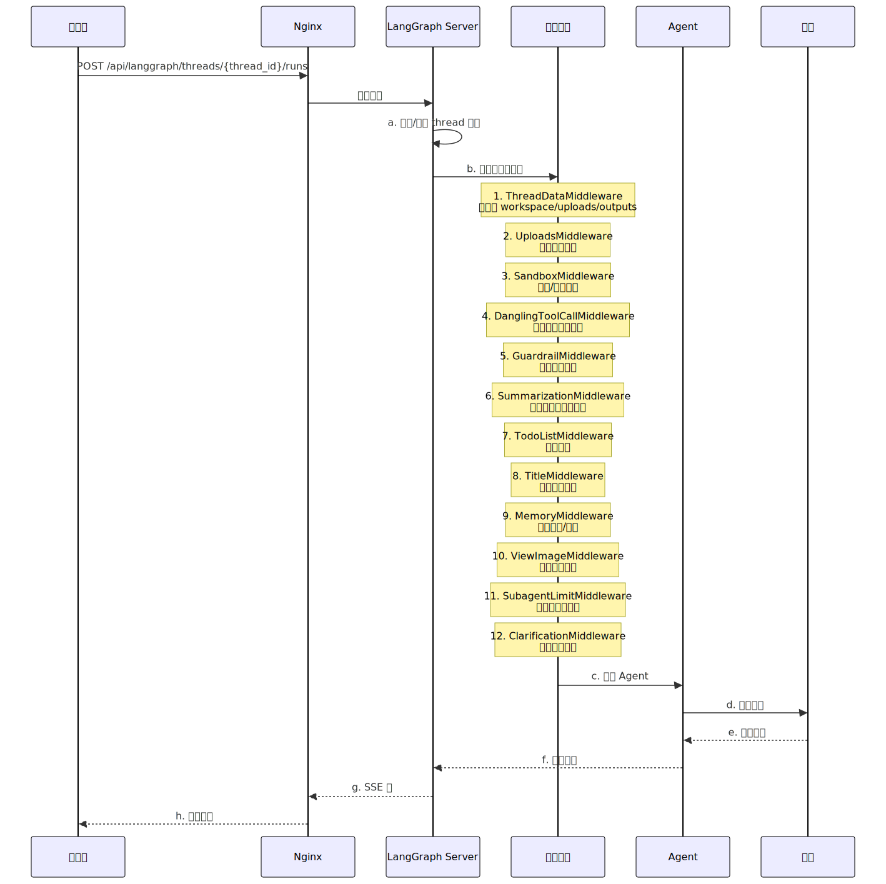

---

## 8\. Tool System 架构图


---

## 9\. Sandbox 体系图


---

## 10\. Subagent 架构图


---

## 11\. Memory System 架构图


---

## 12\. MCP 与 Skills 架构图


---

## 13\. Gateway API 路由图

---

## 14\. IM Channels 架构图


---

## 15\. 前端架构图


---

## 16\. 部署架构图


---

## 17\. 配置热更新流程图

---

# 核心模块详解

## 1\. Agent 架构

### 1.1 Lead Agent（主 Agent）

**入口**: `lead_agent/agent.py:make_lead_agent(config)`

**核心职责**:

- Agent 创建和配置  
- Thread 状态管理  
- 中间件链执行  
- 工具调用编排  
- SSE 流式响应

**代码示例**:

def make\_lead\_agent(config: dict) \-\> CompiledGraph:

    """创建 Lead Agent"""

    \# 1\. 创建模型

    model \= create\_chat\_model(config)

    

    \# 2\. 获取工具

    tools \= get\_available\_tools(config)

    

    \# 3\. 构建系统提示

    system\_prompt \= build\_system\_prompt(config)

    

    \# 4\. 创建 Agent

    agent \= create\_react\_agent(

        model=model,

        tools=tools,

        state\_modifier=system\_prompt

    )

    

    return agent

### 1.2 中间件链

执行顺序：

| 序号 | 中间件 | 功能 |
| :---: | :---- | :---- |
| 1 | ThreadDataMiddleware | 初始化 workspace/uploads/outputs 路径 |
| 2 | UploadsMiddleware | 处理上传的文件 |
| 3 | SandboxMiddleware | 获取沙箱环境 |
| 4 | DanglingToolCallMiddleware | 处理悬空工具调用 |
| 5 | GuardrailMiddleware | 安全护栏检查 |
| 6 | SummarizationMiddleware | 上下文压缩（可选） |
| 7 | TodoListMiddleware | 任务跟踪（plan\_mode 模式） |
| 8 | TitleMiddleware | 自动生成对话标题 |
| 9 | MemoryMiddleware | 记忆注入与更新 |
| 10 | ViewImageMiddleware | 视觉模型支持 |
| 11 | SubagentLimitMiddleware | 子代理并发限制 |
| 12 | ClarificationMiddleware | 处理澄清请求 |

### 1.3 Thread State（线程状态）

class ThreadState(AgentState):

    \# AgentState 核心状态

    messages: list\[BaseMessage\]

    

    \# DeerFlow 扩展

    sandbox: dict             \# 沙箱环境信息

    artifacts: list\[str\]      \# 生成的文件路径

    thread\_data: dict         \# {workspace, uploads, outputs} 路径

    title: str | None         \# 自动生成的对话标题

    todos: list\[dict\]         \# 任务跟踪（plan mode）

    viewed\_images: dict       \# 视觉模型图像数据

    uploaded\_files: list      \# 上传的文件列表

---

## 2\. 沙箱系统

### 2.1 架构设计

### 2.2 虚拟路径映射

| 虚拟路径 | 物理路径 |
| :---- | :---- |
| `/mnt/user-data/workspace` | `backend/.deer-flow/threads/{thread_id}/user-data/workspace` |
| `/mnt/user-data/uploads` | `backend/.deer-flow/threads/{thread_id}/user-data/uploads` |
| `/mnt/user-data/outputs` | `backend/.deer-flow/threads/{thread_id}/user-data/outputs` |
| `/mnt/skills` | `deer-flow/skills/` |

### 2.3 Sandbox 抽象接口

class Sandbox(ABC):

    @abstractmethod

    async def execute\_command(

        self, 

        command: str, 

        cwd: str | None \= None

    ) \-\> CommandResult:

        """执行命令"""

        pass

    @abstractmethod

    async def read\_file(self, path: str) \-\> str:

        """读取文件"""

        pass

    @abstractmethod

    async def write\_file(self, path: str, content: str) \-\> None:

        """写入文件"""

        pass

    @abstractmethod

    async def list\_dir(self, path: str) \-\> list\[str\]:

        """列出目录"""

        pass

---

## 3\. 工具系统

### 3.1 工具来源

### 3.2 工具配置示例

tools:

  built\_in:

    \- present\_file

    \- ask\_clarification

    \- view\_image

  

  sandbox:

    \- bash

    \- read\_file

    \- write\_file

    \- str\_replace

    \- ls

  

  community:

    tavily:

      enabled: true

      api\_key: $TAVILY\_API\_KEY

    jina\_ai:

      enabled: true

      api\_key: $JINA\_API\_KEY

### 3.3 工具装配流程

def get\_available\_tools(config: dict) \-\> list\[BaseTool\]:

    """获取所有可用工具"""

    tools \= \[\]

    

    \# 1\. 内置工具

    tools.extend(get\_builtin\_tools())

    

    \# 2\. 沙箱工具

    tools.extend(get\_sandbox\_tools(config))

    

    \# 3\. 社区工具

    tools.extend(get\_community\_tools(config))

    

    \# 4\. MCP 工具

    tools.extend(get\_mcp\_tools(config))

    

    \# 5\. 子代理工具

    tools.append(get\_subagent\_tool(config))

    

    return tools

---

## 4\. 模型工厂

### 4.1 配置示例

models:

  \- name: gpt-4

    display\_name: GPT-4

    use: langchain\_openai:ChatOpenAI

    model: gpt-4

    api\_key: $OPENAI\_API\_KEY

    max\_tokens: 4096

    supports\_thinking: false

    supports\_vision: true

  

  \- name: claude-3-opus

    display\_name: Claude 3 Opus

    use: langchain\_anthropic:ChatAnthropic

    model: claude-3-opus-20240229

    api\_key: $ANTHROPIC\_API\_KEY

    max\_tokens: 4096

    supports\_thinking: true

    supports\_vision: true

  

  \- name: deepseek-v3

    display\_name: DeepSeek V3

    use: langchain\_deepseek:ChatDeepSeek

    model: deepseek-chat

    api\_key: $DEEPSEEK\_API\_KEY

    max\_tokens: 4096

    supports\_thinking: false

    supports\_vision: false

### 4.2 支持的 Provider

| Provider | 类路径 | 特性 |
| :---- | :---- | :---- |
| OpenAI | `langchain_openai:ChatOpenAI` | Vision, Responses API |
| Anthropic | `langchain_anthropic:ChatAnthropic` | Thinking, Vision |
| DeepSeek | `langchain_deepseek:ChatDeepSeek` | Thinking |
| 自定义 | 自定义类路径 | 可扩展 |

### 4.3 模型工厂代码

def create\_chat\_model(config: dict) \-\> BaseChatModel:

    """创建聊天模型"""

    model\_config \= config\["model"\]

    

    \# 1\. 解析类

    model\_class \= resolve\_class(model\_config\["use"\])

    

    \# 2\. 解析变量

    api\_key \= resolve\_variable(model\_config\["api\_key"\])

    

    \# 3\. 创建实例

    model \= model\_class(

        model=model\_config\["model"\],

        api\_key=api\_key,

        max\_tokens=model\_config.get("max\_tokens", 4096\)

    )

    

    return model

---

## 5\. MCP 集成

### 5.1 配置示例

{

  "mcpServers": {

    "github": {

      "enabled": true,

      "type": "stdio",

      "command": "npx",

      "args": \["-y", "@modelcontextprotocol/server-github"\],

      "env": {"GITHUB\_TOKEN": "$GITHUB\_TOKEN"}

    },

    "filesystem": {

      "enabled": true,

      "type": "stdio",

      "command": "npx",

      "args": \["-y", "@modelcontextprotocol/server-filesystem", "/path/to/dir"\]

    },

    "postgres": {

      "enabled": true,

      "type": "stdio",

      "command": "npx",

      "args": \["-y", "@modelcontextprotocol/server-postgres"\],

      "env": {"DATABASE\_URL": "$DATABASE\_URL"}

    },

    "brave-search": {

      "enabled": true,

      "type": "stdio",

      "command": "npx",

      "args": \["-y", "@modelcontextprotocol/server-brave-search"\],

      "env": {"BRAVE\_API\_KEY": "$BRAVE\_API\_KEY"}

    },

    "puppeteer": {

      "enabled": true,

      "type": "stdio",

      "command": "npx",

      "args": \["-y", "@modelcontextprotocol/server-puppeteer"\]

    }

  }

}

### 5.2 传输协议

| 协议 | 描述 | 使用场景 |
| :---- | :---- | :---- |
| stdio | 标准输入输出 | 本地进程通信 |
| SSE | Server-Sent Events | HTTP 长连接 |
| HTTP | HTTP 请求 | REST API |

### 5.3 MCP 客户端架构

class MultiServerMCPClient:

    """多服务器 MCP 客户端"""

    

    def \_\_init\_\_(self, config: dict):

        self.servers: dict\[str, MCPServer\] \= {}

        self.tools: dict\[str, list\[Tool\]\] \= {}

        self.\_cache: dict\[str, Any\] \= {}

    

    async def connect(self, server\_name: str) \-\> None:

        """连接到 MCP 服务器"""

        server\_config \= self.config\["mcpServers"\]\[server\_name\]

        

        if server\_config\["type"\] \== "stdio":

            server \= StdioMCPServer(server\_config)

        elif server\_config\["type"\] \== "sse":

            server \= SSEMCPServer(server\_config)

        elif server\_config\["type"\] \== "http":

            server \= HTTPMCPServer(server\_config)

        

        self.servers\[server\_name\] \= server

        self.tools\[server\_name\] \= await server.list\_tools()

    

    async def call\_tool(

        self, 

        server\_name: str, 

        tool\_name: str, 

        arguments: dict

    ) \-\> Any:

        """调用 MCP 工具"""

        server \= self.servers\[server\_name\]

        return await server.call\_tool(tool\_name, arguments)

---

## 6\. 技能系统

### 6.1 SKILL.md 格式

\---

name: code-review

description: 代码审查技能

version: 1.0.0

author: developer

tags: \[code, review, quality\]

tools: \[read\_file, bash\]

\---

\# Code Review Skill

你是一个专业的代码审查助手。

\#\# 审查流程

1\. 读取代码文件

2\. 分析代码质量

3\. 提供改进建议

\#\# 关注点

\- 代码风格

\- 潜在 bug

\- 性能问题

\- 安全隐患

### 6.2 技能加载流程


### 6.3 技能配置

skills:

  directories:

    \- skills/public

    \- skills/custom

  

  enabled:

    \- code-review

    \- documentation

    \- testing

  

  disabled:

    \- deprecated-skill

---

## 7\. 记忆系统

### 7.1 架构设计


### 7.2 记忆数据结构

{

  "user\_context": {

    "preferences": \["使用 Python", "偏好简洁代码"\],

    "facts": \["项目使用 FastAPI", "团队有 5 人"\],

    "history\_summary": "用户正在进行 API 开发"

  },

  "last\_updated": "2026-04-05T12:00:00Z"

}

### 7.3 记忆更新流程

class MemoryUpdater:

    """记忆更新器"""

    

    def \_\_init\_\_(self, llm: BaseChatModel):

        self.llm \= llm

        self.queue \= DebouncedQueue(delay=5.0)

    

    async def update(self, messages: list\[BaseMessage\]) \-\> None:

        """更新记忆"""

        \# 1\. 加入队列（防抖）

        await self.queue.put(messages)

        

        \# 2\. LLM 抽取信息

        extracted \= await self.\_extract\_info(messages)

        

        \# 3\. 合并到现有记忆

        memory \= await self.\_load\_memory()

        memory \= self.\_merge(memory, extracted)

        

        \# 4\. 保存

        await self.\_save\_memory(memory)

    

    async def \_extract\_info(self, messages: list\[BaseMessage\]) \-\> dict:

        """使用 LLM 抽取信息"""

        prompt \= f"""

        从以下对话中抽取用户偏好、事实和上下文信息：

        

        {messages}

        

        以 JSON 格式返回结果。

        """

        response \= await self.llm.ainvoke(prompt)

        return json.loads(response.content)

---

## 8\. 子代理系统

### 8.1 架构设计

### 8.2 配置示例

subagents:

  max\_concurrent: 3

  default\_timeout: 900  \# 15分钟

  

  built\_in:

    \- name: general-purpose

      description: 通用任务处理

    \- name: bash

      description: 命令行任务

  

  custom:

    \- name: code-analyzer

      description: 代码分析专家

      model: gpt-4

      system\_prompt: |

        你是一个代码分析专家...

### 8.3 子代理调用流程

async def task(

    instruction: str,

    subagent\_type: str \= "general-purpose",

    timeout: int \= 900

) \-\> str:

    """调用子代理执行任务"""

    

    \# 1\. 创建子代理

    subagent \= await create\_subagent(subagent\_type)

    

    \# 2\. 执行任务

    try:

        result \= await asyncio.wait\_for(

            subagent.run(instruction),

            timeout=timeout

        )

        return result

    except asyncio.TimeoutError:

        raise TimeoutError(f"Subagent timed out after {timeout}s")

---

## 9\. 前端架构

### 9.1 技术栈

| 技术 | 版本 | 用途 |
| :---- | :---: | :---- |
| Next.js | 15 | 框架 |
| React | 19 | UI 库 |
| TypeScript | 5.x | 类型安全 |
| Tailwind CSS | 3.x | 样式 |
| Vercel AI SDK | 4.x | AI 集成 |

### 9.2 核心组件

// 聊天组件

export function ChatUI() {

  const { messages, input, handleSubmit } \= useChat({

    api: '/api/langgraph/threads/${threadId}/runs',

  })

  return (

    \

      \<MessageList messages={messages} /\>

      \<ChatInput 

        value={input} 

        onSubmit={handleSubmit} 

      /\>

    \</div\>

  )

}

// 线程列表组件

export function ThreadList() {

  const { threads, isLoading } \= useThreads()

  

  return (

    \

      {threads.map(thread \=\> (

        \<ThreadItem key={thread.id} thread={thread} /\>

      ))}

    \</div\>

  )

}

// 产物查看器

export function ArtifactViewer({ artifact }: { artifact: Artifact }) {

  const content \= useArtifact(artifact.path)

  

  return (

    \

      {artifact.type \=== 'image' && (

        \

      )}

      {artifact.type \=== 'code' && (

        \<CodeBlock code={content} language={artifact.language} /\>

      )}

    \</div\>

  )

}

### 9.3 状态管理

// 线程状态

interface ThreadState {

  id: string

  title: string

  messages: Message\[\]

  artifacts: Artifact\[\]

  status: 'idle' | 'running' | 'error'

}

// 消息状态

interface MessageState {

  role: 'user' | 'assistant' | 'system'

  content: string

  timestamp: Date

  toolCalls?: ToolCall\[\]

}

// 产物状态

interface ArtifactState {

  id: string

  name: string

  type: 'image' | 'code' | 'file'

  path: string

  createdAt: Date

}

---

## 10\. 部署架构

### 10.1 Docker Compose 配置

version: '3.8'

services:

  nginx:

    image: nginx:alpine

    ports:

      \- "2026:2026"

    volumes:

      \- ./nginx.conf:/etc/nginx/nginx.conf

    depends\_on:

      \- frontend

      \- langgraph

      \- gateway

  frontend:

    build: ./frontend

    ports:

      \- "3000:3000"

    environment:

      \- NEXT\_PUBLIC\_API\_URL=http://nginx:2026

  langgraph:

    build: ./backend

    ports:

      \- "2024:2024"

    environment:

      \- CONFIG\_PATH=/app/config.yaml

    volumes:

      \- ./config.yaml:/app/config.yaml

      \- deerflow-data:/app/.deer-flow

  gateway:

    build: ./backend

    ports:

      \- "8001:8001"

    environment:

      \- CONFIG\_PATH=/app/config.yaml

    volumes:

      \- ./config.yaml:/app/config.yaml

      \- deerflow-data:/app/.deer-flow

volumes:

  deerflow-data:

### 10.2 Nginx 配置

upstream frontend {

    server frontend:3000;

}

upstream langgraph {

    server langgraph:2024;

}

upstream gateway {

    server gateway:8001;

}

server {

    listen 2026;

    \# Frontend

    location / {

        proxy\_pass http://frontend;

        proxy\_set\_header Host $host;

    }

    \# LangGraph API

    location /api/langgraph/ {

        proxy\_pass http://langgraph/;

        proxy\_set\_header Host $host;

        proxy\_buffering off;

        proxy\_cache off;

    }

    \# Gateway API

    location /api/ {

        proxy\_pass http://gateway/;

        proxy\_set\_header Host $host;

    }

}

---

# 组件功能详解

## 14.1 外围接入层

### 1\) Client / Browser

**功能**:

- 发起 Web 端交互  
- 接收流式响应  
- 发起线程操作、上传、配置管理等请求

### 2\) Frontend（Next.js / React UI）

**功能**:

- DeerFlow 的 Web UI  
- 聊天界面、线程管理、文件展示、产物下载  
- 对接 `/api/langgraph/*` 与 Gateway API

### 3\) IM Channels（Feishu / Slack / Telegram）

**功能**:

- 把 DeerFlow 接入外部消息平台  
- 负责消息收发、线程映射、命令处理、平台适配  
- Feishu 支持流式更新卡片，Slack/Telegram 以最终响应为主

**平台差异**:

| 平台 | 流式支持 | 特殊功能 |
| :---- | :---: | :---- |
| Feishu/Lark | ✅ 支持流式卡片 | 富文本卡片 |
| Slack | ❌ 最终响应 | Block Kit |
| Telegram | ❌ 最终响应 | Markdown |

---

## 14.2 接入与调度层

### 5\) Nginx

**功能**:

- 统一入口  
- 反向代理到 Frontend、LangGraph、Gateway  
- 在 Gateway mode 下，还会把 `/api/langgraph/*` 改为代理到 Gateway 内嵌运行时

**路由规则**:

| 路径 | 目标 |
| :---- | :---- |
| `/*` | Frontend :3000 |
| `/api/langgraph/*` | LangGraph :2024 |
| `/api/*` | Gateway :8001 |

### 6\) LangGraph Server

**功能**:

- 标准模式下的核心 Agent Runtime  
- 负责线程管理、状态持久化、工具编排、SSE 流式输出  
- 入口为 `make_lead_agent(config)`

**核心能力**:

- Thread 管理（创建、加载、持久化）  
- Checkpointing（状态快照）  
- SSE 流式响应  
- 工具调用编排

### 7\) Gateway API

**功能**:

- 非 Agent 推理类能力的管理平面  
- 提供 Models / MCP / Skills / Memory / Uploads / Artifacts / Threads / Suggestions 等 REST API  
- 也是 IM Channels 的辅助服务入口

**API 列表**:

| 路径 | 功能 |
| :---- | :---- |
| `/api/models` | 模型列表 / 详情 |
| `/api/mcp` | MCP 配置读取 / 更新 |
| `/api/skills` | 技能列表 / 启停 / 安装 |
| `/api/memory` | 记忆数据 / 配置 / 状态 / reload |
| `/api/threads/{id}/uploads` | 文件上传 / 列表 / 删除 |
| `/api/threads/{id}` | 本地线程数据清理 |
| `/api/threads/{id}/artifacts` | 产物下载 / 服务 |
| `/api/threads/{id}/suggestions` | 跟进建议生成 |

---

## 14.3 配置与状态层

### 9\) `config.yaml`

**功能**:

- DeerFlow 主配置文件  
- 定义模型、工具、沙盒、skills、memory、subagents、summarization、channels 等核心参数  
- 被 LangGraph 与 Gateway 共享读取

**配置结构**:

\# 模型配置

models:

  \- name: gpt-4

    display\_name: GPT-4

    use: langchain\_openai:ChatOpenAI

    model: gpt-4

    api\_key: $OPENAI\_API\_KEY

\# 工具配置

tools:

  built\_in: \[present\_file, ask\_clarification, view\_image\]

  sandbox: \[bash, read\_file, write\_file, str\_replace, ls\]

  community:

    tavily:

      enabled: true

      api\_key: $TAVILY\_API\_KEY

\# 沙箱配置

sandbox:

  provider: aio

  docker\_image: deerflow-sandbox:latest

\# 技能配置

skills:

  directories: \[skills/public, skills/custom\]

\# 记忆配置

memory:

  enabled: true

  file: .deer-flow/memory.json

\# 子代理配置

subagents:

  max\_concurrent: 3

  default\_timeout: 900

\# 总结配置

summarization:

  enabled: true

  max\_tokens: 8000

  target\_tokens: 4000

\# 通道配置

channels:

  slack:

    enabled: true

    bot\_token: $SLACK\_BOT\_TOKEN

  telegram:

    enabled: true

    bot\_token: $TELEGRAM\_BOT\_TOKEN

### 10\) `extensions_config.json`

**功能**:

- 管理 MCP Servers 与 Skills 启用状态  
- 支持 Gateway API 动态修改  
- 通过 mtime 变化驱动运行时热更新

**结构**:

{

  "mcpServers": {

    "github": {

      "enabled": true,

      "type": "stdio",

      "command": "npx",

      "args": \["-y", "@modelcontextprotocol/server-github"\],

      "env": {"GITHUB\_TOKEN": "$GITHUB\_TOKEN"}

    }

  },

  "skills": {

    "code-review": {

      "enabled": true

    },

    "documentation": {

      "enabled": true

    }

  }

}

### 11\) ThreadState

**功能**:

- DeerFlow 对 LangGraph `AgentState` 的扩展  
- 保存消息、标题、沙箱信息、产物、待办、图像上下文、线程目录等  
- 是 DeerFlow 会话的状态载体

**字段说明**:

| 字段 | 类型 | 说明 |
| :---- | :---- | :---- |
| messages | list\[BaseMessage\] | 对话消息列表 |
| sandbox | dict | 沙箱环境信息 |
| artifacts | list\[str\] | 生成的文件路径 |
| thread\_data | dict | 线程目录路径 |
| title | str | None | 对话标题 |
| todos | list\[dict\] | 任务列表 |
| viewed\_images | dict | 视觉模型图像 |
| uploaded\_files | list | 上传文件列表 |

### 12\) 线程目录

**功能**:

- 为每个线程提供隔离的文件空间  
- 包括 `workspace`、`uploads`、`outputs`

**目录结构**:

backend/.deer-flow/threads/{thread\_id}/

├── user-data/

│   ├── workspace/    \# 工作目录

│   ├── uploads/      \# 上传文件

│   └── outputs/      \# 输出产物

├── checkpoints/      \# 状态快照

└── metadata.json     \# 线程元数据

---

## 14.4 Agent Runtime 内核层

### 13\) Lead Agent

**功能**:

- DeerFlow 的主控智能体  
- 负责综合模型、工具、skills、memory、subagents 执行任务  
- 是 LangGraph Runtime 的主要逻辑入口

**核心流程**:


### 14\) Middleware Chain

**功能**:

- 为 Agent 执行链路提供横切能力  
- 包括线程目录初始化、文件上传注入、沙箱获取、工具调用保护、上下文压缩、Todo 计划、自动标题、记忆更新、图片注入、子代理限制、澄清中断

**执行顺序**:

1. ThreadDataMiddleware \- 初始化目录  
2. UploadsMiddleware \- 处理上传  
3. SandboxMiddleware \- 获取沙箱  
4. DanglingToolCallMiddleware \- 处理悬空调用  
5. GuardrailMiddleware \- 安全检查  
6. SummarizationMiddleware \- 上下文压缩  
7. TodoListMiddleware \- 任务跟踪  
8. TitleMiddleware \- 生成标题  
9. MemoryMiddleware \- 记忆处理  
10. ViewImageMiddleware \- 图像处理  
11. SubagentLimitMiddleware \- 并发限制  
12. ClarificationMiddleware \- 澄清处理

### 15\) System Prompt Builder

**功能**:

- 把 skills、memory、subagent 指令、工作目录提示等统一注入系统提示词  
- 使 Agent 行为具备更强任务导向性

**提示词结构**:

\# 系统提示

\#\# 技能指令

{skill\_instructions}

\#\# 用户记忆

{memory\_context}

\#\# 子代理指令

{subagent\_instructions}

\#\# 工作目录

当前工作目录: /mnt/user-data/workspace

\#\# 可用工具

{tool\_descriptions}

### 16\) Model Factory

**功能**:

- 依据 `config.yaml` 动态装配不同模型提供方  
- 支持 thinking、vision、responses API、CLI-backed provider 等能力  
- 通过 `resolve_class()` 实现配置驱动实例化

**Reflection System**:

def resolve\_class(path: str) \-\> type:

    """解析类路径"""

    module\_path, class\_name \= path.rsplit(":", 1\)

    module \= importlib.import\_module(module\_path)

    return getattr(module, class\_name)

def resolve\_variable(value: str) \-\> str:

    """解析变量（支持环境变量）"""

    if value.startswith("$"):

        return os.environ.get(value\[1:\], value)

    return value

---

## 14.5 工具与执行层

### 17\) Tool Assembler

**功能**:

- 从多个来源收集工具并装配到 Agent  
- 处理工具冲突、依赖、优先级

**工具优先级**:

1. Built-in Tools（最高优先级）  
2. Sandbox Tools  
3. Config-defined Tools  
4. MCP Tools  
5. Subagent Tool（最低优先级）

### 18\) Sandbox System

**功能**:

- 提供隔离的代码执行环境  
- 支持本地（开发）和 Docker（生产）两种模式  
- 通过虚拟路径映射实现文件系统隔离

**Provider 选择**:

| 模式 | Provider | 使用场景 |
| :---- | :---- | :---- |
| 开发 | LocalSandboxProvider | 本地开发、调试 |
| 生产 | AioSandboxProvider | Docker 部署 |
| 集群 | Provisioner | Kubernetes |

### 19\) MCP Client

**功能**:

- 连接并管理多个 MCP Server  
- 提供 lazy init 与缓存失效机制  
- 支持 stdio、SSE、HTTP 三种传输协议

**缓存策略**:

class MCPCache:

    """MCP 工具缓存"""

    

    def \_\_init\_\_(self, ttl: int \= 300):

        self.\_cache: dict\[str, CachedTools\] \= {}

        self.\_ttl \= ttl

    

    async def get\_tools(self, server\_name: str) \-\> list\[Tool\]:

        """获取工具（带缓存）"""

        if self.\_should\_refresh(server\_name):

            tools \= await self.\_fetch\_tools(server\_name)

            self.\_cache\[server\_name\] \= CachedTools(

                tools=tools,

                timestamp=time.time()

            )

        return self.\_cache\[server\_name\].tools

    

    def \_should\_refresh(self, server\_name: str) \-\> bool:

        """检查是否需要刷新"""

        if server\_name not in self.\_cache:

            return True

        return time.time() \- self.\_cache\[server\_name\].timestamp \> self.\_ttl

### 20\) Community Tools

**功能**:

- 集成第三方工具服务  
- 支持 Tavily、Jina AI、Firecrawl、Image Search 等

**可用工具**:

| 工具 | 功能 | API Key |
| :---- | :---- | :---- |
| tavily | Web 搜索 | TAVILY\_API\_KEY |
| jina\_ai | Web 内容提取 | JINA\_API\_KEY |
| firecrawl | 网页爬取 | FIRECRAWL\_API\_KEY |
| image\_search | 图片搜索 | \- |

---

## 14.6 扩展与记忆层

### 21\) Skills Loader

**功能**:

- 扫描并解析 skills 目录下的 SKILL.md 文件  
- 验证 frontmatter 元数据  
- 注册启用的技能到 Agent

**加载流程**:


### 22\) Memory System

**功能**:

- 存储用户偏好、上下文、事实等长期记忆  
- 使用 LLM 从对话中自动抽取信息  
- 通过 Debounced Queue 实现高效更新

**更新策略**:

- 防抖延迟：5秒  
- 批量合并  
- 增量更新

### 23\) Extensions Config Watcher

**功能**:

- 监控 `extensions_config.json` 文件变化  
- 触发 MCP/Skills 热更新  
- 避免重启服务

**热更新流程**:


---

## 14.7 子代理层

### 24\) Subagent Executor

**功能**:

- 执行 Lead Agent 委派的任务  
- 管理并发与超时  
- 聚合结果返回

**并发控制**:

class SubagentScheduler:

    """子代理调度器"""

    

    def \_\_init\_\_(self, max\_concurrent: int \= 3):

        self.\_semaphore \= asyncio.Semaphore(max\_concurrent)

        self.\_active\_tasks: dict\[str, asyncio.Task\] \= {}

    

    async def execute(

        self, 

        task\_id: str, 

        instruction: str,

        timeout: int \= 900

    ) \-\> str:

        """执行子代理任务"""

        async with self.\_semaphore:

            try:

                result \= await asyncio.wait\_for(

                    self.\_run\_subagent(instruction),

                    timeout=timeout

                )

                return result

            except asyncio.TimeoutError:

                raise TimeoutError(f"Task {task\_id} timed out")

### 25\) Subagent Pool

**功能**:

- 维护子代理实例池  
- 支持预定义和自定义子代理类型  
- 提供负载均衡

**内置子代理**:

| 名称 | 功能 |
| :---- | :---- |
| general-purpose | 通用任务处理 |
| bash | 命令行任务 |

---

## 14.8 接入渠道层

### 26\) IM Channels

**功能**:

- 把 DeerFlow 接入外部消息平台  
- 负责消息收发、线程映射、命令处理、平台适配  
- Feishu 支持流式更新卡片，Slack/Telegram 以最终响应为主

**架构组件**:

| 组件 | 文件 | 功能 |
| :---- | :---- | :---- |
| Channel Base | `base.py` | 通道抽象基类 |
| Message Bus | `message_bus.py` | Inbound/Outbound pub-sub |
| Manager | `manager.py` | 线程创建、命令路由、run 调度 |
| Store | `store.py` | channel:chat\[:topic\] \-\> thread\_id 映射 |

**平台适配**:

| 平台 | 流式支持 | 特殊功能 |
| :---- | :---: | :---- |
| Feishu/Lark | ✅ 支持流式卡片 | 富文本卡片、命令订阅 |
| Slack | ❌ 最终响应 | Block Kit、Slash Commands |
| Telegram | ❌ 最终响应 | Markdown、Inline Keyboard |

### 27\) Embedded Python Client

**功能**:

- 提供 Python SDK 直接调用 DeerFlow  
- 无需通过 HTTP API  
- 适合集成到其他 Python 应用

**核心方法**:

class DeerFlowClient:

    """DeerFlow Python 客户端"""

    

    async def chat(

        self, 

        message: str, 

        thread\_id: str | None \= None

    ) \-\> str:

        """发送消息并获取响应"""

        pass

    

    async def stream(

        self, 

        message: str, 

        thread\_id: str | None \= None

    ) \-\> AsyncIterator\[str\]:

        """流式获取响应"""

        pass

    

    async def list\_models(self) \-\> list\[Model\]:

        """列出可用模型"""

        pass

    

    async def list\_skills(self) \-\> list\[Skill\]:

        """列出可用技能"""

        pass

    

    async def upload\_files(

        self, 

        files: list\[str\], 

        thread\_id: str

    ) \-\> list\[UploadedFile\]:

        """上传文件"""

        pass

---

## 14.9 Provisioner 层

### 28\) Provisioner

**功能**:

- 可选组件，端口 8002  
- 支持 Kubernetes / Provisioner 模式沙盒  
- 提供更强大的沙箱管理能力

**使用场景**:

- 大规模部署  
- 多租户隔离  
- 资源配额管理

---

# 开发指南

## 快速开始

### 1\. 环境准备

\# 克隆仓库

git clone https://github.com/bytedance/deer-flow.git

cd deer-flow

\# 安装依赖

pip install \-r requirements.txt

\# 配置环境变量

cp .env.example .env

\# 编辑 .env 填入 API Keys

### 2\. 配置文件

\# config.yaml

models:

  \- name: gpt-4

    display\_name: GPT-4

    use: langchain\_openai:ChatOpenAI

    model: gpt-4

    api\_key: $OPENAI\_API\_KEY

sandbox:

  provider: local  \# 开发环境使用 local

skills:

  directories:

    \- skills/public

    \- skills/custom

memory:

  enabled: true

  file: .deer-flow/memory.json

### 3\. 启动服务

\# 启动 LangGraph Server

python \-m deerflow.langgraph\_server

\# 启动 Gateway API

python \-m app.main

\# 启动 Frontend（另一个终端）

cd frontend

npm install

npm run dev

### 4\. Docker 部署

\# 使用 Docker Compose

docker-compose up \-d

\# 查看日志

docker-compose logs \-f

---

## 自定义开发

### 1\. 添加自定义技能

\<\!-- skills/custom/my-skill/SKILL.md \--\>

\---

name: my-custom-skill

description: 我的自定义技能

version: 1.0.0

author: me

tags: \[custom, example\]

tools: \[read\_file, write\_file, bash\]

\---

\# My Custom Skill

这是一个自定义技能的说明。

\#\# 使用场景

\- 场景1

\- 场景2

\#\# 执行流程

1\. 步骤1

2\. 步骤2

### 2\. 添加 MCP Server

// extensions\_config.json

{

  "mcpServers": {

    "my-mcp-server": {

      "enabled": true,

      "type": "stdio",

      "command": "python",

      "args": \["-m", "my\_mcp\_server"\],

      "env": {

        "API\_KEY": "$MY\_API\_KEY"

      }

    }

  }

}

### 3\. 添加自定义子代理

\# config.yaml

subagents:

  custom:

    \- name: my-expert

      description: 我的专家子代理

      model: gpt-4

      system\_prompt: |

        你是一个专门处理XX任务的专家...

      tools:

        \- read\_file

        \- bash

### 4\. 添加自定义中间件

\# packages/harness/deerflow/agents/middlewares/my\_middleware.py

from .base import Middleware

class MyCustomMiddleware(Middleware):

    """自定义中间件"""

    

    async def before\_agent(self, state: ThreadState) \-\> ThreadState:

        """Agent 执行前"""

        \# 自定义逻辑

        return state

    

    async def after\_agent(self, state: ThreadState) \-\> ThreadState:

        """Agent 执行后"""

        \# 自定义逻辑

        return state

---

## 调试技巧

### 1\. 启用调试日志

import logging

logging.basicConfig(level=logging.DEBUG)

logging.getLogger("deerflow").setLevel(logging.DEBUG)

### 2\. 查看中间件执行

\# 在中间件中添加日志

class DebugMiddleware(Middleware):

    async def before\_agent(self, state: ThreadState) \-\> ThreadState:

        print(f"\[DEBUG\] Before Agent: {state.keys()}")

        return state

### 3\. 检查工具调用

\# 在工具执行前后打印

async def debug\_tool\_call(tool\_name: str, args: dict):

    print(f"\[TOOL\] {tool\_name}({args})")

    result \= await tool.execute(args)

    print(f"\[RESULT\] {result}")

    return result

---

# 最佳实践

## 1\. 性能优化

### 1.1 上下文压缩

summarization:

  enabled: true

  max\_tokens: 8000

  target\_tokens: 4000

  trigger\_threshold: 0.8

### 1.2 记忆更新策略

memory:

  enabled: true

  update\_delay: 5.0  \# 防抖延迟

  max\_facts: 100     \# 最大事实数

### 1.3 子代理并发控制

subagents:

  max\_concurrent: 3

  default\_timeout: 900

  queue\_size: 10

---

## 2\. 安全建议

### 2.1 沙箱隔离

- 生产环境使用 AioSandboxProvider  
- 限制文件系统访问  
- 设置资源配额

### 2.2 API Key 管理

- 使用环境变量存储  
- 不要硬编码在配置文件  
- 定期轮换

### 2.3 工具权限

- 只启用必要的工具  
- 限制危险命令执行  
- 添加 Guardrail 检查

---

## 3\. 运维建议

### 3.1 日志管理

logging:

  level: INFO

  format: "%(asctime)s \- %(name)s \- %(levelname)s \- %(message)s"

  file: logs/deerflow.log

### 3.2 监控指标

- 响应时间  
- Token 使用量  
- 工具调用频率  
- 错误率

### 3.3 备份策略

- 定期备份 `memory.json`  
- 备份线程数据  
- 配置版本控制

---

# 常见问题

## Q1: 如何切换模型？

修改 `config.yaml` 中的模型配置，或通过 Gateway API 动态切换。

## Q2: 如何添加新的 MCP 工具？

在 `extensions_config.json` 中添加 MCP Server 配置，系统会自动加载。

## Q3: 记忆系统不生效？

检查：

1. `memory.enabled` 是否为 true  
2. 文件写入权限  
3. MemoryMiddleware 是否在中间件链中

## Q4: 子代理超时怎么办？

调整 `subagents.default_timeout` 配置，或检查任务复杂度。

## Q5: 如何调试工具调用？

启用 DEBUG 日志级别，查看工具执行详情。

---

# 参考资源

## 官方资源

- **GitHub**: [https://github.com/bytedance/deer-flow](https://github.com/bytedance/deer-flow)  
- **文档**: [https://deer-flow.readthedocs.io](https://deer-flow.readthedocs.io)  
- **Discord**: [https://discord.gg/deerflow](https://discord.gg/deerflow)

## 相关技术

- **LangGraph**: [https://github.com/langchain-ai/langgraph](https://github.com/langchain-ai/langgraph)  
- **LangChain**: [https://github.com/langchain-ai/langchain](https://github.com/langchain-ai/langchain)  
- **MCP**: [https://modelcontextprotocol.io](https://modelcontextprotocol.io)

## 社区资源

- **示例项目**: examples/  
- **技能仓库**: skills/public/  
- **插件市场**: [https://plugins.deer-flow.io](https://plugins.deer-flow.io)

---

# 附录

## A. 配置完整示例

\# config.yaml 完整示例

\# 模型配置

models:

  \- name: gpt-4

    display\_name: GPT-4

    use: langchain\_openai:ChatOpenAI

    model: gpt-4

    api\_key: $OPENAI\_API\_KEY

    max\_tokens: 4096

    supports\_thinking: false

    supports\_vision: true

  

  \- name: claude-3-opus

    display\_name: Claude 3 Opus

    use: langchain\_anthropic:ChatAnthropic

    model: claude-3-opus-20240229

    api\_key: $ANTHROPIC\_API\_KEY

    max\_tokens: 4096

    supports\_thinking: true

    supports\_vision: true

\# 工具配置

tools:

  built\_in:

    \- present\_file

    \- ask\_clarification

    \- view\_image

  

  sandbox:

    \- bash

    \- read\_file

    \- write\_file

    \- str\_replace

    \- ls

  

  community:

    tavily:

      enabled: true

      api\_key: $TAVILY\_API\_KEY

    jina\_ai:

      enabled: true

      api\_key: $JINA\_API\_KEY

\# 沙箱配置

sandbox:

  provider: aio

  docker\_image: deerflow-sandbox:latest

  timeout: 300

\# 技能配置

skills:

  directories:

    \- skills/public

    \- skills/custom

  auto\_reload: true

\# 记忆配置

memory:

  enabled: true

  file: .deer-flow/memory.json

  update\_delay: 5.0

  max\_facts: 100

\# 子代理配置

subagents:

  max\_concurrent: 3

  default\_timeout: 900

  

  built\_in:

    \- name: general-purpose

      description: 通用任务处理

    \- name: bash

      description: 命令行任务

  

  custom:

    \- name: code-analyzer

      description: 代码分析专家

      model: gpt-4

      system\_prompt: |

        你是一个代码分析专家...

\# 总结配置

summarization:

  enabled: true

  max\_tokens: 8000

  target\_tokens: 4000

  trigger\_threshold: 0.8

\# 通道配置

channels:

  slack:

    enabled: true

    bot\_token: $SLACK\_BOT\_TOKEN

    app\_token: $SLACK\_APP\_TOKEN

  

  telegram:

    enabled: true

    bot\_token: $TELEGRAM\_BOT\_TOKEN

  

  feishu:

    enabled: true

    app\_id: $FEISHU\_APP\_ID

    app\_secret: $FEISHU\_APP\_SECRET

## B. 环境变量说明

| 变量 | 说明 | 必需 |
| :---- | :---- | :---: |
| OPENAI\_API\_KEY | OpenAI API Key | 视模型 |
| ANTHROPIC\_API\_KEY | Anthropic API Key | 视模型 |
| DEEPSEEK\_API\_KEY | DeepSeek API Key | 视模型 |
| TAVILY\_API\_KEY | Tavily 搜索 API | 可选 |
| JINA\_API\_KEY | Jina AI API | 可选 |
| SLACK\_BOT\_TOKEN | Slack Bot Token | 可选 |
| TELEGRAM\_BOT\_TOKEN | Telegram Bot Token | 可选 |
| FEISHU\_APP\_ID | 飞书 App ID | 可选 |
| FEISHU\_APP\_SECRET | 飞书 App Secret | 可选 |

## C. 端口说明

| 端口 | 服务 | 说明 |
| :---: | :---- | :---- |
| 2026 | Nginx | 统一入口 |
| 3000 | Frontend | Web UI |
| 2024 | LangGraph Server | Agent Runtime |
| 8001 | Gateway API | 管理平面 |
| 8002 | Provisioner | 可选 |

