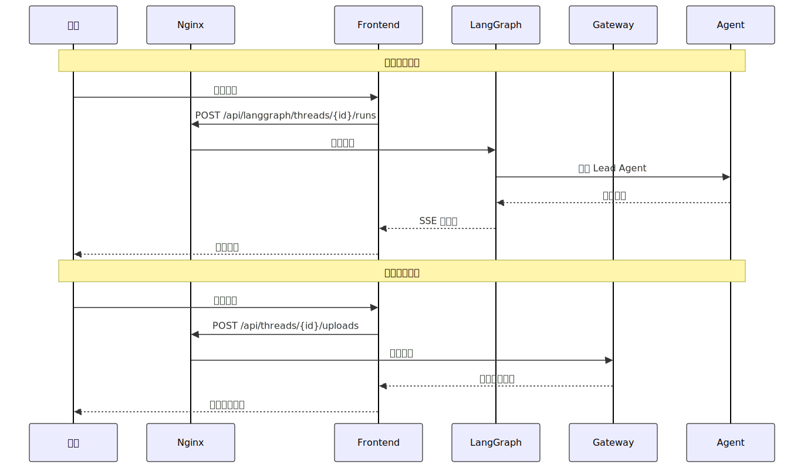

# DeerFlow 架构全景

## 1\. 核心架构一览（3秒看懂）

---

## 2\. 快速入口表（按需求导航）

| 我想... | 看这里 | 关键文件 |
| :---- | :---- | :---- |
| 理解整体设计 | \[\[\#3. 核心组件速查\]\] | \- |
| 知道请求怎么流转 | \[\[\#4. 请求链路详解\]\] | \- |
| 改 Agent 逻辑 | \[\[\#5. Lead Agent 内核\]\] | `agents/lead_agent/` |
| 加新工具 | \[\[\#6. 工具体系\]\] | `tools/`, `mcp/` |
| 理解沙箱执行 | \[\[\#7. Sandbox 沙箱\]\] | `sandbox/` |
| 接入飞书/Slack | \[\[\#8. IM 渠道集成\]\] | `channels/` |
| 配置技能 | \[\[\#9. Skills 技能系统\]\] | `skills/`, `extensions_config.json` |
| 部署上线 | \[\[\#10. 部署模式\]\] | `docker/`, `config.yaml` |

---

## 3\. 核心组件速查

### 组件职责表

| 组件 | 端口 | 职责 | 一句话描述 |
| :---- | :---- | :---- | :---- |
| **Nginx** | 2026 | 反向代理 | 总入口，路由分发 |
| **Frontend** | 3000 | Web UI | 用户界面 |
| **LangGraph** | 2024 | Agent 运行时 | 执行 Agent，SSE 流式响应 |
| **Gateway** | 8001 | 管理 API | 模型/技能/MCP/记忆管理 |

### 内核模块表

| 模块 | 路径 | 职责 |
| :---- | :---- | :---- |
| agents | `harness/deerflow/agents/` | Lead Agent、中间件、状态管理 |
| sandbox | `harness/deerflow/sandbox/` | Docker 隔离执行环境 |
| tools | `harness/deerflow/tools/` | 内置工具 \+ 工具装配 |
| mcp | `harness/deerflow/mcp/` | MCP 协议客户端 |
| memory | `harness/deerflow/memory/` | 长期记忆存储与检索 |
| subagents | `harness/deerflow/subagents/` | 子代理调度与执行 |

---

## 4\. 请求链路详解

### 标准请求流程

\[\!tip\] 关键区分

- **聊天/执行** → LangGraph（SSE 流式）  
- **配置/上传/管理** → Gateway（REST API）

\[\!note\]- 路由规则详情 | 路由前缀 | 目标服务 | 用途 | |:---|:---|:---| | `/api/langgraph/*` | LangGraph :2024 | 聊天、线程管理、SSE | | `/api/*` | Gateway :8001 | 模型、技能、MCP、记忆、上传 | | `/*` | Frontend :3000 | Web 页面 |

---

## 5\. Lead Agent 内核

### 执行流程

\[\!note\]- 中间件链详情 | 顺序 | 中间件 | 职责 | |:---|:---|:---| | 1 | ThreadDataMiddleware | 初始化 workspace/uploads/outputs | | 2 | ArtifactMiddleware | 处理产物生成 | | 3 | MemoryMiddleware | 注入记忆、保存对话 | | 4 | 其他中间件 | 按需扩展 |

\[\!note\]- ThreadState 结构

class ThreadState:

    messages: list\[Message\]      \# 对话历史

    sandbox: Sandbox             \# 沙箱实例

    artifacts: list\[Artifact\]    \# 生成的产物

    thread\_data: dict            \# 线程级数据

    title: str                   \# 会话标题

    todos: list\[str\]             \# 任务列表

    viewed\_images: list\[str\]     \# 已查看的图片

---

## 6\. 工具体系

### 工具来源

\[\!note\]- 内置工具列表 | 工具名 | 来源 | 用途 | |:---|:---|:---| | `bash` | Sandbox | 执行 shell 命令 | | `read_file` | Sandbox | 读取文件 | | `write_file` | Sandbox | 写入文件 | | `str_replace` | Sandbox | 字符串替换 | | `present_files` | Built-in | 展示文件给用户 | | `ask_clarification` | Built-in | 请求用户澄清 | | `view_image` | Built-in | 查看图片 | | `task` | Subagent | 调用子代理 | | `tavily` | Community | 网络搜索 | | `jina_ai` | Community | 网页抓取 |

---

## 7\. Sandbox 沙箱

### 沙箱类型

| 类型 | 类 | 适用场景 |
| :---- | :---- | :---- |
| **LocalSandbox** | `LocalSandboxProvider` | 本地开发，直接操作文件系统 |
| **AioSandbox** | `AioSandboxProvider` | Docker 容器隔离，生产环境 |
| **Provisioner** | \- | Kubernetes Pod，大规模部署 |

\[\!note\]- 沙箱架构图 

---

## 8\. IM 渠道集成

### 支持的渠道

| 渠道 | 实现路径 | 说明 |
| :---- | :---- | :---- |
| 飞书/Lark | `channels/feishu/` | 企业 IM |
| Slack | `channels/slack/` | 团队协作 |
| Telegram | `channels/telegram/` | 即时通讯 |

\[\!note\]- 渠道架构 

---

## 9\. Skills 技能系统

### 技能加载流程

\[\!note\]- SKILL.md 结构

\---

name: skill-name

description: 技能描述

enabled: true

\---

\# 技能说明

\#\# 最佳实践

\- 步骤1

\- 步骤2

\#\# 工具约束

\- 只使用 xxx 工具

\- 不使用 yyy 工具

---

## 10\. 部署模式

### 两种模式对比

| 模式 | 进程数 | 适用场景 |
| :---- | :---- | :---- |
| **标准模式** | 3（Frontend \+ LangGraph \+ Gateway） | 生产环境，可扩展 |
| **Gateway 模式** | 2（Frontend \+ Gateway 内嵌 Runtime） | 轻量部署，实验性 |

\[\!note\]- Gateway 模式架构 

---

\!\[\[drawing-1.png\]\]

## 11\. 常见问题速查

| 问题 | 答案 |
| :---- | :---- |
| LangGraph 和 Gateway 共享什么？ | `config.yaml` \+ `extensions_config.json` |
| SSE 用在哪？ | LangGraph 流式响应 |
| 如何加新工具？ | MCP 扩展 或 `tools/` 目录 |
| 记忆存在哪？ | `backend/.deer-flow/memory.json` |
| 如何切换模型？ | Gateway `/api/models` 接口 |

