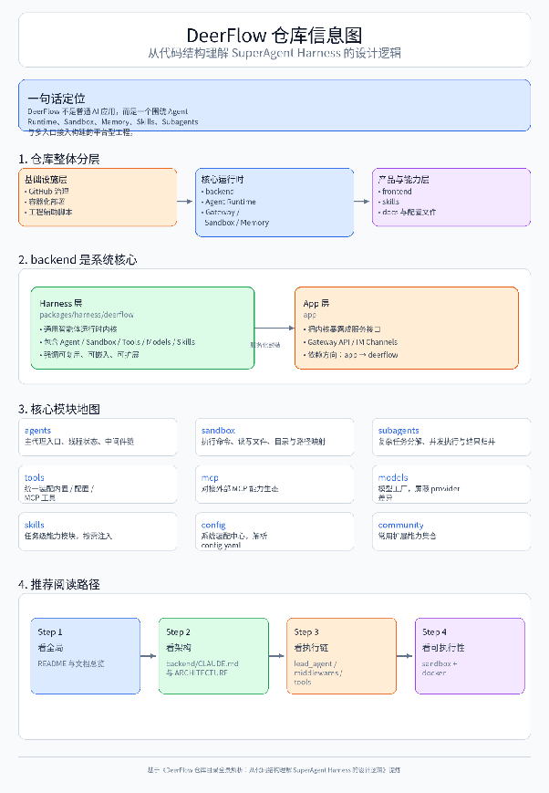

# **DeerFlow 仓库目录功能说明**

说明对象：`bytedance/deer-flow`  
 版本依据：仓库 `main` 分支在 2026-04-02 页面与仓库文档内容整理。  
 目标：帮助快速理解 DeerFlow 的目录职责、代码边界与扩展点。

---

## **1\. 仓库整体定位**

DeerFlow 是一个基于 **LangGraph \+ LangChain** 的开源 **SuperAgent Harness**。  
 它并不是单纯的聊天前端，而是一个完整的智能体运行系统，包含：

* Agent Runtime（LangGraph Server）  
* Gateway 管理 API（FastAPI）  
* Web 前端（Next.js）  
* Sandbox 执行环境  
* Skills / MCP / Subagent / Memory 等能力层

从架构上看，仓库有一个非常明确的分层：

* **Harness 层**：通用智能体运行内核，可复用  
* **App 层**：把内核暴露成 Web / API / IM 渠道的产品壳层

---

## **2\. 顶层目录说明**

### **`.github/`**

GitHub 平台相关配置目录。

主要作用：

* CI / Workflow 配置  
* PR / Issue 模板  
* 自动化检查与仓库治理配置

适合关注的人群：

* 维护者  
* 想了解仓库 CI 流程的人

---

### **`backend/`**

后端核心目录，是 DeerFlow 的主体代码区。

主要作用：

* Agent 运行时  
* Gateway API  
* Sandbox、Memory、Subagent、MCP、Skills 等核心能力  
* 后端测试与文档

这是最值得重点阅读的目录。

---

### **`docker/`**

Docker 相关部署与容器编排目录。

主要作用：

* 开发态 / 生产态容器配置  
* 容器启动脚本  
* Sandbox 镜像、服务编排支持  
* Provisioner / Kubernetes 模式相关支持

适合关注的人群：

* 需要部署 DeerFlow 的工程人员  
* 关注 Docker / K8s sandbox 运行方式的人

---

### **`docs/`**

项目级文档目录。

主要作用：

* 补充 README 中放不下的说明  
* 新增功能或集成功能的设计/使用文档  
* 运维、Tracing、配置等专题文档

---

### **`frontend/`**

前端目录，基于 Next.js。

主要作用：

* DeerFlow Web UI  
* 聊天交互界面  
* 文件上传、线程展示、结果展示  
* 调用 LangGraph / Gateway 后端接口

适合关注的人群：

* 想改 Web UI 的前端工程师  
* 想看聊天界面如何接 DeerFlow Runtime 的开发者

---

### **`scripts/`**

脚本目录。

主要作用：

* 环境检查  
* 启动辅助  
* 导出认证信息  
* 样例数据导入  
* 开发和运维相关辅助脚本

通常是“开发效率工具箱”。

---

### **`skills/`**

Skill 目录，是 DeerFlow 的“能力模块仓库”。

主要作用：

* 内置公开技能  
* 自定义技能  
* 通过 `SKILL.md` 定义任务流程、最佳实践、工具约束

DeerFlow 的很多“高层任务能力”不是硬编码在 Agent 里，而是通过 Skills 注入实现的。

---

## **3\. 顶层关键文件说明**

### **`README.md`**

项目总说明文档。

主要内容：

* DeerFlow 的产品定位  
* 快速启动方式  
* 配置说明  
* 核心能力介绍  
* Docker / Local Dev 启动方式

---

### **`README_zh.md / README_ja.md / README_fr.md / README_ru.md`**

多语言 README。

主要作用：

* 面向不同语言用户提供入口文档  
* 对社区传播、国际化有帮助

---

### **`Install.md`**

更偏“给编码代理/自动化 setup 使用”的安装说明。

主要作用：

* 为 Claude Code / Codex / Cursor / Windsurf 等代理提供更直接的初始化路径  
* 降低接入门槛

---

### **`config.example.yaml`**

主配置模板。

主要作用：

* 定义模型、工具、sandbox、memory、skills、subagents 等核心配置  
* 用户通过复制并修改它，形成自己的 `config.yaml`

---

### **`extensions_config.example.json`**

扩展配置模板。

主要作用：

* 配置 MCP Servers  
* 记录 Skills 的启用状态  
* 支持在 Gateway 中动态启停外部能力

---

### **`Makefile`**

项目级命令入口。

主要作用：

* 聚合安装、检查、开发启动、Docker 启停等常用命令  
* 统一本地开发体验

---

### **`.env.example`**

环境变量示例文件。

主要作用：

* 提供 API Key、Tracing、渠道集成等变量示例  
* 帮助开发者快速知道需要设置哪些环境变量

---

## **4\. `backend/` 目录详解**

`backend/` 是 DeerFlow 的系统核心。  
 从设计上看，它又被拆成两层：

* **Harness**：`packages/harness/deerflow/`  
* **App**：`app/`

这个拆分非常重要：

* `deerflow.*`：通用智能体能力内核  
* `app.*`：对外服务层（Gateway / Channels）

并且遵循严格依赖方向：

* `app` 可以依赖 `deerflow`  
* `deerflow` **不能反向依赖** `app`

这说明作者在做“可复用运行时内核”，而不是把所有逻辑揉进一个单体项目。

---

## **5\. `backend/` 顶层子目录说明**

### **`backend/packages/`**

后端 Python 包目录。

主要作用：

* 承载 DeerFlow 的通用运行时内核  
* 让核心能力以 package 方式组织，而不是全写在应用层里

其中最重要的是：`packages/harness/`

---

### **`backend/packages/harness/`**

DeerFlow Harness 的真正实现所在。

主要作用：

* 定义智能体的运行时、状态、中间件、工具系统、模型工厂等  
* 是 DeerFlow 的“平台内核”

---

### **`backend/packages/harness/deerflow/`**

DeerFlow Python 包根目录。

主要作用：

* 统一组织所有核心模块  
* 通过 `deerflow.*` 命名空间对外暴露内核能力

这是仓库后端最核心的一层。

---

### **`backend/app/`**

应用层目录。

主要作用：

* 把 `deerflow` 内核暴露为 HTTP Gateway 与 IM 通道服务  
* 处理产品化入口，而不是智能体内核本身

---

### **`backend/tests/`**

后端测试目录。

主要作用：

* 单元测试  
* 边界测试  
* 回归测试  
* 架构约束测试（例如 harness/app import boundary）

如果想看项目强调什么质量约束，这里很有价值。

---

### **`backend/docs/`**

后端专题文档目录。

主要作用：

* 详细介绍架构、配置、API、上传、路径、plan mode、memory review 等专题能力  
* 是理解系统设计的重要辅助资料

---

## **6\. `backend/packages/harness/deerflow/` 子目录说明**

### **`agents/`**

Agent 系统目录。

主要作用：

* 定义主代理（lead agent）  
* 组织 agent 的运行逻辑  
* 维护线程状态  
* 处理中间件链  
* 接入 memory 等上下文能力

这是“Agent 怎么跑起来”的主入口层。

---

### **`agents/lead_agent/`**

主代理目录。

主要作用：

* 定义 `make_lead_agent(config)` 入口  
* 组装模型、工具、系统提示词、中间件  
* 作为 LangGraph Server 的运行时入口

可以把它理解为 DeerFlow 的主控代理。

---

### **`agents/middlewares/`**

中间件目录。

主要作用：

* 在 Agent 执行链路中插入横切逻辑  
* 管理线程目录、上传文件、sandbox、summarization、memory、image、clarification 等能力

这是 DeerFlow 的架构骨架之一。

典型职责包括：

* ThreadDataMiddleware：初始化线程级目录  
* UploadsMiddleware：把上传文件注入上下文  
* SandboxMiddleware：获取执行环境  
* SummarizationMiddleware：上下文压缩  
* TodoListMiddleware：计划模式任务追踪  
* TitleMiddleware：自动标题  
* MemoryMiddleware：异步记忆更新  
* ViewImageMiddleware：视觉输入支持  
* ClarificationMiddleware：澄清中断机制

---

### **`agents/memory/`**

记忆系统目录。

主要作用：

* 从对话中抽取用户上下文、事实、偏好  
* 以结构化方式存入本地 memory  
* 在后续对话中回注到系统提示词中

这部分是 DeerFlow“跨会话记忆”的实现核心。

---

### **`agents/thread_state.py`**

线程状态定义文件。

主要作用：

* 扩展 LangGraph 的基础状态  
* 增加 sandbox、artifacts、todos、title、thread\_data、viewed\_images 等 DeerFlow 特有字段

本质上定义了“DeerFlow 会话到底存什么”。

---

### **`sandbox/`**

沙盒系统目录。

主要作用：

* 提供可执行环境抽象  
* 管理文件系统读写  
* 提供 bash / ls / read\_file / write\_file / str\_replace 等基础能力  
* 支持线程隔离路径映射

它决定 DeerFlow 能否“真正执行任务”。

---

### **`sandbox/local/`**

本地沙盒实现目录。

主要作用：

* 在本机文件系统上提供开发态执行能力  
* 适合本地调试  
* 安全隔离能力弱于容器模式

---

### **`subagents/`**

子代理系统目录。

主要作用：

* 支持 lead agent 把复杂任务分解出去  
* 管理子代理注册、调度、执行和结果回收  
* 支持并发执行

这是 DeerFlow 处理长任务、多步骤任务的重要机制。

---

### **`subagents/builtins/`**

内置子代理目录。

主要作用：

* 提供官方内置的子代理类型  
* 例如通用型子代理、bash 专长型子代理

---

### **`tools/`**

工具系统目录。

主要作用：

* 聚合内置工具、配置工具、MCP 工具、子代理工具  
* 对 Agent 暴露统一工具集合

它是 Agent “手脚”的统一入口层。

---

### **`tools/builtins/`**

内置工具目录。

主要作用：

* 放置 DeerFlow 自带的基础工具  
* 例如：  
  * `present_files`  
  * `ask_clarification`  
  * `view_image`

这些工具更多偏产品级辅助能力。

---

### **`mcp/`**

MCP 集成目录。

主要作用：

* 接入 Model Context Protocol 服务器  
* 管理 MCP client  
* 处理工具缓存、配置变更检测、OAuth 等逻辑

这部分负责把外部能力体系接进 DeerFlow。

---

### **`models/`**

模型工厂目录。

主要作用：

* 根据配置动态创建 LLM 实例  
* 支持 thinking / vision 等能力差异  
* 统一封装不同模型提供方

这是模型抽象层，而不是业务逻辑层。

---

### **`skills/`**

Skills 加载与解析目录。

主要作用：

* 搜索 `skills/public` 与 `skills/custom`  
* 解析 `SKILL.md`  
* 决定哪些 skill 注入到系统提示词  
* 支持 skill 安装与启用状态管理

这是 DeerFlow 任务级能力扩展的关键部分。

---

### **`config/`**

配置系统目录。

主要作用：

* 解析 `config.yaml`  
* 解析路径、模型、工具、memory、sandbox 等配置项  
* 提供缓存与热更新检测能力

---

### **`community/`**

社区扩展目录。

主要作用：

* 存放非最小内核能力但常用的工具/提供者  
* 如：  
  * Tavily  
  * Jina AI  
  * Firecrawl  
  * Image Search  
  * AioSandboxProvider

可以理解为“官方维护的扩展能力包”。

---

### **`reflection/`**

反射与动态加载目录。

主要作用：

* 根据字符串路径动态导入变量/类  
* 支持配置驱动的模型、工具、provider 装配

这使得 DeerFlow 能通过配置做到较高程度的可扩展。

---

### **`utils/`**

通用工具目录。

主要作用：

* 放置跨模块可复用的小工具方法  
* 如网络、可读性、辅助处理逻辑等

---

### **`client.py`**

嵌入式客户端实现。

主要作用：

* 让 DeerFlow 不通过 HTTP 服务也能在 Python 进程里直接调用  
* 提供与 Gateway 对齐的数据返回结构  
* 支持 `chat()`、`stream()`、`list_models()`、`upload_files()` 等能力

适合：

* 二次开发  
* 嵌入别的 Python 系统中使用

---

## **7\. `backend/app/` 子目录说明**

### **`gateway/`**

Gateway API 目录。

主要作用：

* 提供 FastAPI REST 接口  
* 服务前端和其他客户端  
* 管理 models / memory / uploads / skills / mcp / artifacts / threads 等非推理型能力

可理解为 DeerFlow 的“管理平面”。

---

### **`gateway/routers/`**

Gateway 路由目录。

主要作用：

* 按领域拆分 HTTP API  
* 通常包括：  
  * models  
  * mcp  
  * skills  
  * memory  
  * uploads  
  * threads  
  * artifacts  
  * suggestions  
  * agents / channels（视版本而定）

---

### **`channels/`**

IM 渠道集成目录。

主要作用：

* 把 DeerFlow 接入飞书 / Slack / Telegram 等消息渠道  
* 处理消息收发、线程映射、命令解析、流式输出

这是 DeerFlow 的“多入口接入层”。

---

## **8\. `frontend/` 目录功能概览**

虽然当前资料主要聚焦后端，但 `frontend/` 的职责比较明确：

* 基于 Next.js 的 Web 前端  
* 对接 `/api/langgraph/*` 进行智能体会话与流式结果展示  
* 对接 Gateway API 进行：  
  * 模型配置读取  
  * 技能管理  
  * 文件上传  
  * artifact 下载  
  * 线程相关操作

如果你要改产品形态、界面体验、上传交互，这里是重点。

---

## **9\. `skills/` 目录功能详解**

### **`skills/public/`**

公开技能目录。

主要作用：

* 存放仓库内置、提交到 Git 的标准技能  
* 例如：  
  * research  
  * report-generation  
  * slide-creation  
  * web-page  
  * image-generation  
  * claude-to-deerflow 等

这些 skills 是 DeerFlow “会做什么”的高层能力来源之一。

---

### **`skills/custom/`**

自定义技能目录。

主要作用：

* 存放用户本地安装或自定义开发的技能  
* 通常不纳入 Git 管理

适合：

* 私有工作流  
* 团队定制技能  
* 针对特定业务的 agent 扩展

---

### **`SKILL.md`**

每个 skill 的定义文件。

主要作用：

* 用 Markdown \+ Frontmatter 描述技能  
* 规定：  
  * 名称  
  * 描述  
  * 许可信息  
  * 允许调用的工具  
  * 任务执行说明 / 最佳实践

DeerFlow 会在运行时按需加载并注入这些信息。

---

## **10\. `docker/` 目录功能概览**

`docker/` 目录对应 DeerFlow 的容器化运行能力。

主要作用：

* 定义开发和生产环境的容器部署方式  
* 支持 Docker-based sandbox  
* 支持 Provisioner / Kubernetes 扩展模式  
* 辅助实现：  
  * 本地开发热更新  
  * 服务拆分部署  
  * 隔离执行环境

如果你要评估 DeerFlow 的部署复杂度，这个目录必须看。

---

## **11\. `docs/` 目录推荐阅读顺序**

建议优先看这些文档：

1. `backend/CLAUDE.md`

   * 最适合理解代码分层与开发约束  
2. `backend/docs/ARCHITECTURE.md`

   * 最适合理解系统组件关系和请求流  
3. `backend/docs/CONFIGURATION.md`

   * 最适合理解 `config.yaml` 能配置什么  
4. `backend/docs/MCP_SERVER.md`

   * 最适合理解 MCP 接入方式  
5. `backend/docs/FILE_UPLOAD.md`

   * 最适合理解上传与 artifact 流程

---

## **12\. 按职责总结：你该从哪里读起**

### **如果你想看“系统架构”**

优先看：

* `README.md`  
* `backend/CLAUDE.md`  
* `backend/docs/ARCHITECTURE.md`

### **如果你想看“主执行链路”**

优先看：

* `backend/packages/harness/deerflow/agents/lead_agent/`  
* `backend/packages/harness/deerflow/agents/middlewares/`  
* `backend/packages/harness/deerflow/tools/`

### **如果你想看“能不能真正执行文件/命令”**

优先看：

* `backend/packages/harness/deerflow/sandbox/`  
* `docker/`

### **如果你想看“怎么扩展能力”**

优先看：

* `backend/packages/harness/deerflow/mcp/`  
* `backend/packages/harness/deerflow/skills/`  
* `skills/public/`  
* `skills/custom/`

### **如果你想看“怎么接入业务系统”**

优先看：

* `backend/app/gateway/`  
* `backend/app/channels/`  
* `frontend/`

---

## **13\. 一句话总结**

DeerFlow 仓库的目录设计不是“前后端 \+ 一堆脚本”的普通项目结构，而是一个明显的平台化结构：

* **顶层**：产品壳、部署壳、文档壳  
* **backend/harness**：通用智能体运行内核  
* **backend/app**：对外 API 与消息入口  
* **skills / mcp / sandbox / subagents**：能力扩展层  
* **frontend**：Web 产品交互层

也就是说，它更像一个 **可扩展 Agent 平台工程**，而不是单纯的“AI 聊天应用”。

---

