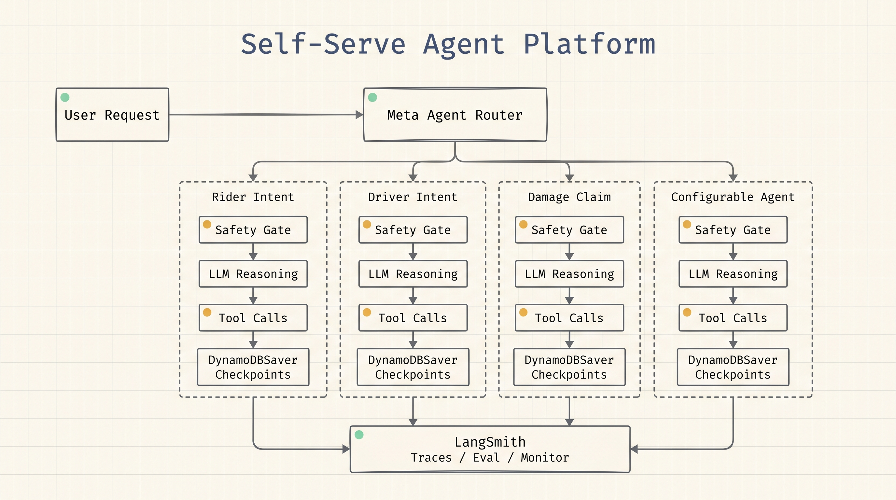
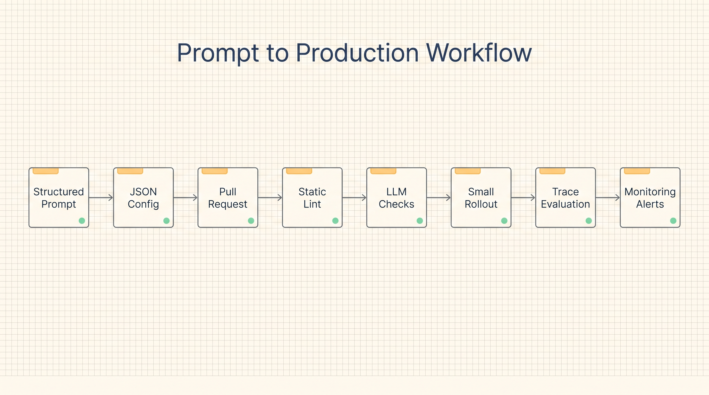
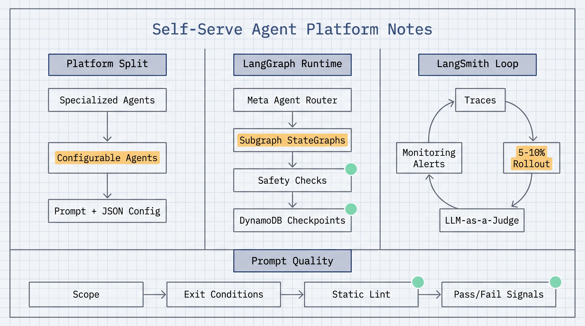

# The hard part of enterprise agent platforms is safe self-service

Lyft's LangChain guest post is useful because it focuses on a production problem: how to let non-technical domain experts build and iterate customer support agents without removing the safety, evaluation, monitoring, and debugging controls that engineering teams need.

The system separates agents into two categories. Specialized agents are still built by MLEs for complex or high-risk workflows such as damage claims, image processing, fraud detection, and multi-step classification. Configurable agents are the self-serve layer. They are initialized at runtime from JSON configuration, use prompts from LangSmith Prompt Hub, and rely on a shared platform class to handle graph construction, tool binding, safety gates, and state management.

The LangGraph architecture uses a meta agent as a stateful router. It classifies incoming support requests and dispatches them to specialized subagents with `Command(goto=...)`. Each subagent is a full `StateGraph` registered as a subgraph node. Lyft also runs separate router instances for riders and drivers, then lets intent agents hand control back to the parent graph when a more specialized agent is needed.

The important production detail is that safety checks run before LLM reasoning. Malicious intent detection and safety issue detection execute in parallel through LangGraph fan-out, so business-authored prompts cannot bypass the shared safety layer.

LangSmith provides the production feedback loop. Every agent invocation is traced across development, staging, and production. The trace captures graph execution, LLM inputs, tool calls, token usage, and latency. Lyft enriches traces with metadata such as user type, agent name, intent, and conversation ID, which makes failures easier to filter and debug.

Before an agent reaches full traffic, Lyft runs a staged evaluation process: small production rollout, sampled production traces, and LLM-as-a-Judge evaluators using shared prompt templates plus agent-specific metrics. Production dashboards track run volume, errors, p50/p95 latency, token usage, tool call success, and evaluation trends. PagerDuty alerts trigger when error rate exceeds 5% or p95 latency exceeds 10 seconds over a 15-minute window.

The strongest lesson is about prompts. Lyft found that infrastructure was not the hardest part. Prompt quality was. Domain experts knew the support policies, but their prompts often missed out-of-scope definitions, had ambiguous branching logic, or used vague content guidelines such as "be empathetic" without concrete behavior.

Their answer is to treat prompts like product specs. The structured prompt template requires identity, primary objective, scope, phased workflow, and concrete content guidelines. Lyft is also building Git-backed prompt linting: the builder UI opens a pull request, CI runs static checks and LLM-powered checks, and violations block the merge.

The reported results are concrete: new configurable agents went from roughly six months for the first driver agent to about two weeks, all production agents have automated LLM-as-a-Judge pipelines, hallucination and contradiction rates dropped by 20% with guardrails based on LangSmith evaluation metrics, and AI resolution rate increased by 16% after launching agents through the self-serve platform.

The reusable pattern is clear: let domain experts own the knowledge and workflow rules, while the platform owns routing, safety, state, tracing, evaluation, monitoring, and linting.

Source: LangChain Blog, "How Lyft Built a Self-Serve AI Agent Platform with LangGraph and LangSmith", May 27, 2026.  
Original link: https://www.langchain.com/blog/lyft-built-a-self-serve-ai-agent-platform-for-customer-support-with-langgraph-and-langsmith
