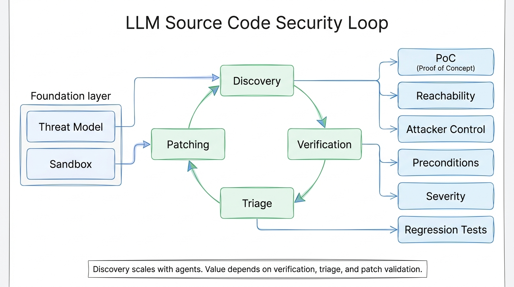

# Using LLMs to Secure Source Code: The Bottleneck Has Moved After Discovery

LLMs can now help security teams read code, identify suspicious paths, draft proof-of-concept exploits, and suggest patches. The harder question is no longer only how to find more issues. The harder question is how to verify, prioritize, and close them without overwhelming engineering teams.

Anthropic's article "Using LLMs to secure source code" describes a practical six-step loop for working with Claude Opus on source-code security:

1. Build a threat model.
2. Create a sandbox.
3. Run discovery.
4. Verify findings independently.
5. Triage by root cause, preconditions, and impact.
6. Patch, retest, and search for variants.

The key point is that discovery scales more easily than the downstream work. Anthropic notes that, as of May 22, 2026, its open-source scanning work had disclosed 1,596 vulnerabilities, with 97 known to be patched. That gap shows why a security workflow must budget for verification, triage, and patch validation before simply adding more scanning agents.

The first foundation is a threat model. The model needs to know what assets matter, which entry points are exposed, which inputs are trusted, and which vulnerability classes are relevant to the system. Without that context, an LLM may flag trusted configuration as attacker-controlled, or miss real risk because it assumes an internet-facing service is internal only.

The second foundation is a sandbox. Prompts are not enough to enforce security boundaries. Agents should not have access to production systems, credentials, or unrestricted network egress. A useful sandbox lets the team build the target, run tests, and execute PoCs in a repeatable environment that is close enough to production to support validation.

Discovery should then focus on recall. The article recommends giving the agent rich context and useful tools, while keeping prompts short. Long checklists can narrow model behavior and reduce novel findings. Large codebases should be partitioned by attack surface, endpoint, or component, then reviewed by parallel agents.

Verification should be separate from discovery. The verifier should run independently and look for reasons a finding may be wrong: upstream validation, authentication gates, type constraints, unreachable code, or compensating controls. When possible, the verifier should build and run a reproducible PoC.

Triage turns verified findings into an actionable queue. Duplicates should be grouped by root cause, not by the number of reports. Severity should be grounded in reachability, attacker control, preconditions, authentication requirements, read/write impact, and blast radius.

Patching closes the loop. A good workflow starts with a failing test, applies the smallest root-cause fix, confirms the original PoC no longer works, checks for regressions, and then runs an adversarial review against the patch. Human ownership remains necessary because generated patches can be too narrow, too broad, or disruptive to legitimate system behavior.

For an enterprise team such as NSSA, a small first exercise could be a single internal web service. Start by generating `THREAT_MODEL.md` from code, architecture docs, and historical security fixes. Let the service owner correct trust boundaries. Then run discovery with read-only access, move verification into an isolated sandbox, and only promote findings that include reachability, attacker control, preconditions, and impact evidence.

The practical takeaway is simple: LLMs can expand security coverage, but the workflow must preserve isolation, evidence, ownership, and patch validation.
