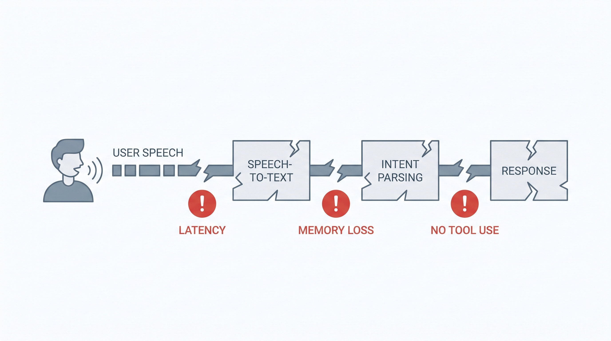
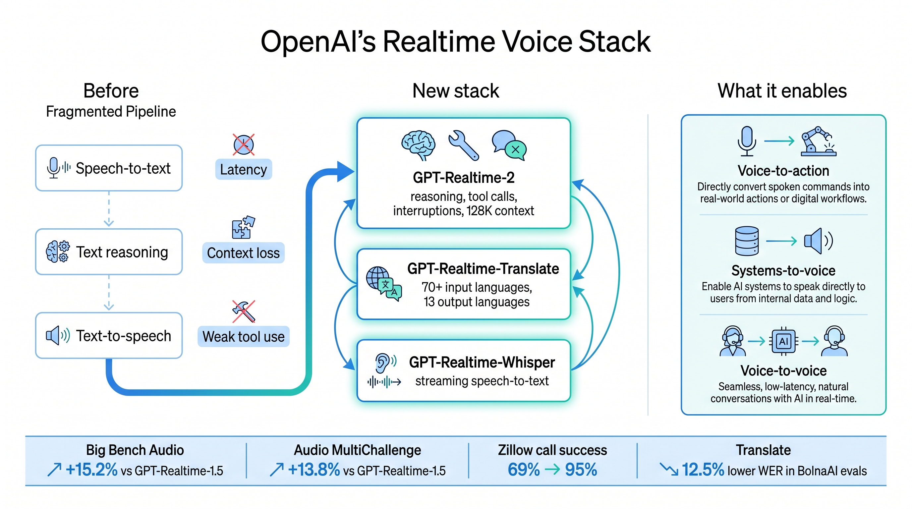
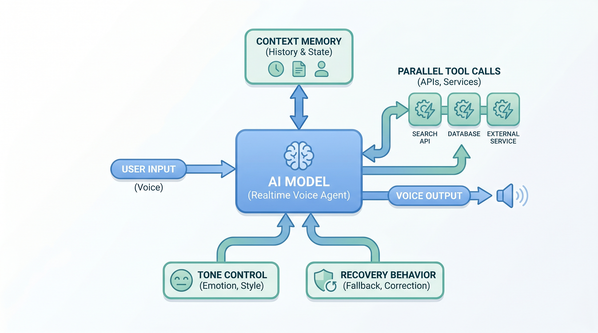

# Voice Agents Are Moving From Conversation to Workflow

OpenAI's new realtime voice models are less about natural-sounding speech and more about turning voice into a working interface.

The company introduced three audio models in the API: GPT-Realtime-2, GPT-Realtime-Translate, and GPT-Realtime-Whisper. Together, they cover realtime reasoning and tool use, live translation, and low-latency streaming transcription.

The important shift is that voice agents are no longer just a speech layer around a chatbot. OpenAI is pushing them toward systems that can listen, reason, translate, transcribe, call tools, recover from interruptions, and keep context while a conversation is still happening.

## Why the old voice stack was limited

Many voice products still follow a brittle pipeline: speech-to-text, text reasoning, then text-to-speech. That works for simple question answering, but it breaks down when the user changes requirements, interrupts the system, adds constraints, or expects the agent to act across business tools.

Useful voice agents need more than fast turn-taking. They need context management, recovery behavior, tool access, tone control, and production-grade safety boundaries.

## GPT-Realtime-2: reasoning while talking

GPT-Realtime-2 is OpenAI's first voice model with GPT-5-class reasoning. It is designed for live interactions where the model keeps the conversation moving while reasoning through a request, calling tools, handling corrections, and responding with the right tone.

Key capabilities include:

- Short preambles such as "let me check that" so users know the agent is working.
- Parallel tool calls with audible transparency, such as "checking your calendar."
- Stronger recovery behavior instead of silent failure.
- A longer context window, increasing from 32K to 128K.
- Better retention of domain terminology and proper nouns.
- More controllable tone and delivery.
- Adjustable reasoning effort across minimal, low, medium, high, and xhigh, with low as the default.

OpenAI reports that GPT-Realtime-2 high scores 15.2% higher than GPT-Realtime-1.5 on Big Bench Audio. GPT-Realtime-2 xhigh scores 13.8% higher on Audio MultiChallenge.

Zillow's early testing is especially concrete. On its hardest adversarial benchmark, GPT-Realtime-2 improved call success after prompt optimization from 69% to 95%, a 26-point lift. Zillow also reported stronger robustness on Fair Housing compliance.

## Translation and transcription complete the stack

GPT-Realtime-Translate supports speech translation from more than 70 input languages into 13 output languages. The target use cases include support, sales, education, events, media, and creator platforms.

BolnaAI reported that in Hindi, Tamil, and Telugu evaluations, GPT-Realtime-Translate delivered 12.5% lower word error rates than any other model it tested, with lower fallback rates and higher task completion.

GPT-Realtime-Whisper is a streaming speech-to-text model for low-latency transcription. It can power live captions, meeting notes, customer support workflows, healthcare documentation, sales calls, recruiting workflows, and voice agents that need continuous understanding.

## The product pattern

OpenAI describes three emerging patterns:

- Voice-to-action: users describe what they need, and the system reasons, calls tools, and completes the task.
- Systems-to-voice: software turns context into spoken guidance.
- Voice-to-voice: AI helps live conversations continue across languages or changing context.

The practical takeaway is simple: voice is becoming a workflow surface. The next generation of voice products will not be judged only by latency or voice quality. They will be judged by whether they can complete tasks safely, transparently, and in context.

Original source: https://openai.com/index/advancing-voice-intelligence-with-new-models-in-the-api
