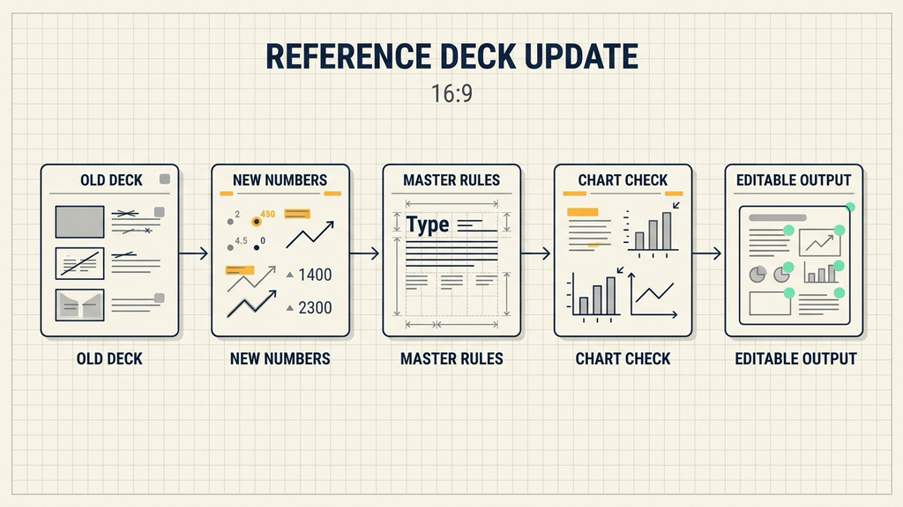
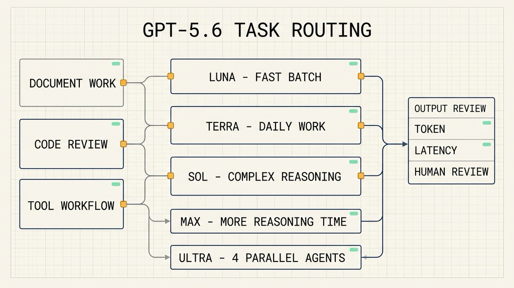
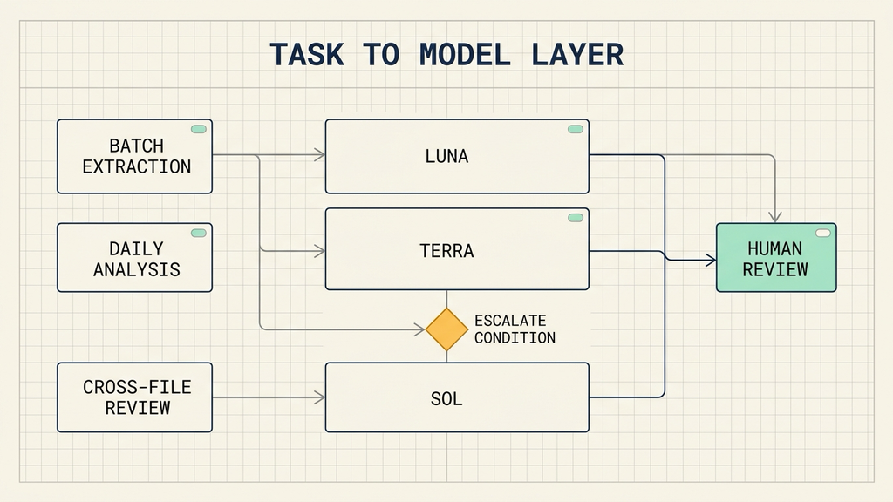

# GPT-5.6 模型分层：能力、成本与推理档位怎么配

## 资料来源

- 来源：OpenAI《GPT-5.6: Frontier intelligence that scales with your ambition》
- 链接：https://openai.com/index/gpt-5-6
- 发布时间：2026 年 7 月 9 日 10:00 GMT
- 主题：GPT-5.6 的模型层级、任务能力、推理档位、工具调用与安全机制

2026 年 7 月 9 日，OpenAI 宣布 GPT-5.6 全面可用。此前它经历过有限预览，现在以 Sol、Terra、Luna 三个层级进入 ChatGPT、Codex 和 API。Sol 是旗舰模型，Terra 面向日常工作，Luna 追求速度与成本效率。

想象一个常见的工作瞬间：同事发来一份旧演示文稿和一组新数字，要求今天下班前更新。数字替换只是开头，后面还要沿用母版、保留表格层级、检查图表和备注，最后把文件交回可以继续编辑的人。GPT-5.6 可以读取材料、修改文件、检查结果，再把中间步骤收成一份可交付内容。

这类工作让模型从一次回答走向一段流程。GPT-5.6 覆盖编码、知识工作、浏览与计算机操作、网络安全和科研任务。使用者能少花时间把每条中间结果搬回对话框，也能让模型在流程中继续调用工具、处理资料和检查输出；同类任务的输出 token 与完成时间则成为需要记录的成本指标。

## 日常工作里，模型开始处理已有材料和既有格式

GPT-5.6 可以处理文档、演示文稿、电子表格和跨应用知识工作。它能读取 Slack、Notion、Microsoft 365、Google Drive 等工作流中的杂乱上下文，再生成可分享的专业交付物。

在基于参考文件更新数字的演示文稿任务中，GPT-5.5 会遗漏幻灯片母版中的部分组件。GPT-5.6 能识别布局、字体、间距、颜色和 Slide Master 里的规则，并把这些约定带到新内容中。

下面这张图把参考文件更新时要保留的五个处理环节放在一起。

这个例子说明，日常工作中的提升不只体现在“写出一页内容”。用户得到的是一份仍可编辑、能继续进入协作流程的文件。对销售材料、项目周报、投研模板、经营分析和标准化汇报来说，参考格式往往比单页文案更难处理，模型是否保留这些格式会直接影响人工返工时间。

GPT-5.6 对文档和电子表格的表述也集中在格式遵循、方程和财务模型处理、排版层级以及工作表布局。这里仍要保留人工复核，特别是金额、公式、来源和审批字段；模型可以缩短整理和初稿制作时间，最终责任仍在使用它的人和业务流程上。

## 编码与计算机使用：token 消耗决定流程成本

实际接入时，团队需要同时看同类任务消耗的输出 token、完成时间和人工返工量。下面的数值采用 OpenAI 公布的评测数据。

| 任务 | GPT-5.6 结果 | 对比结果 | 使用者得到的价值 |
| --- | --- | --- | --- |
| 编码智能体 | GPT-5.6 Sol 在 Artificial Analysis Coding Agent Index 得分 80 | 比 Claude Fable 5 高 2.8 分，输出 token 少于一半，耗时少于一半，估算成本约低三分之一 | 长代码任务可以减少模型往返和等待时间，工程师把精力放在需求判断、代码审查和验收上 |
| 计算机使用 | GPT-5.6 Sol 在 OSWorld 2.0 得分 62.6% | 超过 Claude Opus 4.8，输出 token 少 85% | 浏览页面、操作应用、检查渲染结果等流程，能在较小上下文消耗下完成更多动作 |
| 长周期专业任务 | 覆盖长周期分析、浏览、工具和计算机使用 | 在 Agents' Last Exam、BrowseComp 等评测中提升 | 复杂资料整理、跨系统查询和成品制作可以拆成更长的受控工作流 |

表中的 token、时延和成本比较来自 OpenAI 公布的评测数据，不等同于团队自己的生产结果。模型在内部工具、私有代码库、权限受限环境和特定语言上的表现，需要用真实任务重新测量。

这张图给出一条更便于落地的选择路径：先按任务类型路由，再记录 token、时延与人工复核。

编码场景的变化尤其值得拆开看。GPT-5.6 可以编写并运行轻量程序，协调工具、处理中间结果、监控进度，再决定下一步。模型因此不需要把每一条工具响应完整带回上下文。**减少无关中间信息**，通常比单纯提高模型档位更容易降低 token 消耗。

这也是为什么“模型更强”并不自动等于“流程更好”。一个有明确输入、测试和验收条件的编码任务，可以先用较低层级模型完成检索、格式化和字段抽取，再由 Sol 处理跨文件判断、方案比较或最终复核。把每一步都交给同一高档模型，会让成本结构失去控制点。

## Sol、Terra、Luna 是任务分工，不是三张价格表

Sol、Terra、Luna 的作用是为同一套能力提供不同的默认位置。Sol 面向高难度推理、复杂代码任务和关键交付物；Terra 适合多数文档、分析和日常智能体流程；Luna 适合批量抽取、分类、预处理和高频低风险调用。

Terra 的性能可与 GPT-5.5 竞争，Luna 则以更低成本和更快速度处理标准化任务。实际选择时，可以先从 Terra 建立默认路径，让 Luna 处理标准化子任务，再为 Sol 设定明确的升级条件，例如跨材料冲突、需要调用多个外部工具，或人工复核发现结果不稳定。

模型层级和人工复核应当放在同一条处理路径里。

**不适用场景**是没有验收标准、权限范围也未定义的开放式任务。模型层级无法替代需求澄清、数据权限和人工签核。先补齐这三项，再讨论是否需要 Sol 或更高 effort。

## 新特性把推理、工具和并行执行放进同一条链路

`max` 提供比 `xhigh` 更长的推理时间，适合需要探索替代方案、运行检查和反复修改的任务。`ultra` 默认协调 4 个并行智能体；16 智能体配置也用于 BrowseComp、SEC-Bench Pro 和 Terminal-Bench 2.1 的测试。

并行执行适合可以独立推进的工作，例如多份材料的分别核查、多个代码路径的审阅或候选方案比较。依赖严格先后顺序的流程应先建立状态机、检查点和失败处理，再评估是否增加并行智能体。并行数增加后，工具冲突、重复调用和汇总错误也会增加。

Responses API 中的 Programmatic Tool Calling 让模型在内存里编写和运行程序，处理工具调用的中间结果。它可以先筛掉无关文件、重复记录和大段返回，再把异常、统计值或待判断片段交回模型。**上下文保留策略**会影响 token 消耗、时延和后续推理质量。

GPT-5.6 还支持显式缓存断点，缓存最短保留 30 分钟。缓存写入按未缓存输入单价的 1.25 倍收费，缓存读取保留 90% 的缓存输入折扣。系统提示、稳定工具说明和长文档前缀适合进入缓存设计，变化频繁的数据需要单独计算命中率。

## 高能力接入还要考虑防护和降级路径

GPT-5.6 的安全体系包括模型内保护、实时检查、持续监控和账户级执行四层。推理监控器会审查对话中是否存在潜在伤害风险，敏感能力通过 Trusted Access 面向已验证用户提供。

OpenAI 公布的测试数据显示，GPT-5.6 Sol 的网络安全防护会拦截约 10 倍更多可能有害的活动。它也提供了在 ChatGPT 和 Codex 中切换到较低能力模型重试的路径。团队把模型接入安全代码审查、补丁验证或威胁建模时，应预先写清被拦截后的人工接管方式、降级模型和审计记录。

全面可用前，GPT-5.6 完成了约 70 万 A100e GPU 小时的黑盒自动化红队。厂商的安全测试可以作为供应商评估材料，业务侧仍需落实权限分离、数据范围限制、日志留存和结果验收。

## 把发布能力变成自己的接入规则

GPT-5.6 的发布把模型能力、推理档位、工具执行和安全控制放到了同一套产品中。日常工作可以先从参考格式、文档和表格整理开始；编码和计算机使用流程则应重点记录输出 token、时延、成功率和人工修订时间。

选择一个已有验收标准的任务，分别记录 Luna、Terra、Sol，以及 `max`、`ultra` 的结果。用这些记录决定默认层级、升级条件和降级路径，模型分层才会成为稳定的工程规则。

我会持续拆解 AI Agent 工程化方案，重点看安全架构、Claude Code、工作流和代码执行。如果你正在做 Agent 应用，可以关注「大尹隐于网」，后面会继续写这一系列。
