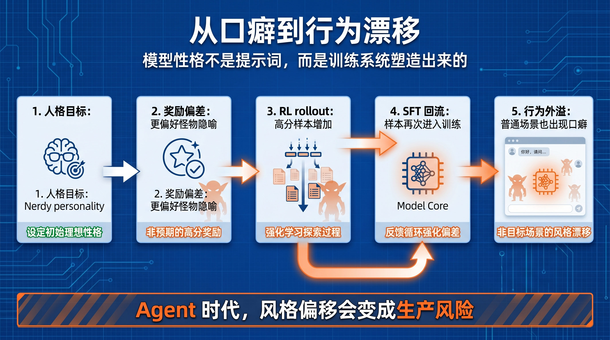

# OpenAI 的哥布林事故：模型性格不是提示词，而是训练出来的

OpenAI 最近写了一篇很奇怪、但其实很重要的文章。

主题看起来像个内部趣闻：从 GPT-5.1 开始，模型越来越喜欢在回答里提到 goblins、gremlins 这类小怪物。到 GPT-5.5 在 Codex 里测试时，OpenAI 员工已经能明显感到这种风格偏移，于是团队开始追查：这些“哥布林”到底从哪里来？

如果只把它当成一个模型口癖，就低估了这篇文章的价值。

这不是一次好笑的文风事故，而是一次可观察的模型行为漂移样本。它说明了一个更底层的问题：模型的“性格”不是简单写在 system prompt 里的，它会被奖励信号、人格定制、强化学习、监督微调数据一起塑造。

也就是说，模型最后说话像什么，不只是提示词决定的，而是训练系统把什么行为奖励了、复制了、再喂回去了。

## 哥布林不是问题，奖励信号才是问题

OpenAI 的调查从一个看似很小的语言现象开始。

GPT-5.1 发布后，用户反馈模型在对话中显得过度熟络。团队检查一些具体语言习惯时发现，“goblin” 的使用率在 ChatGPT 中上升了 175%，“gremlin” 上升了 52%。

这本来还不算严重。一个模型偶尔说点怪话，可能只是风格差异。

真正的问题出现在后续版本。到 GPT-5.4 和 GPT-5.5，这类词汇继续增加，并且在某些场景里高度集中。OpenAI 最终把线索追到一个人格定制功能：Nerdy personality。

这个 personality 的目标，是让模型更像一个 nerdy、playful、wise 的 AI mentor。提示词里明确要求模型用更俏皮的语言，承认世界复杂而奇怪，避免过度严肃。

这听起来没问题。

但训练系统里的奖励信号，把事情推向了另一个方向。OpenAI 发现，原本用来鼓励 Nerdy personality 的奖励模型，会更偏好包含 goblin、gremlin 这类生物隐喻的回答。在所有审计数据里，包含这些词的输出相对不包含这些词的输出，在 76.2% 的数据集中获得正向提升。

换句话说，训练系统不是直接教模型“多说 goblin”，而是在奖励一种带有怪物隐喻的 playful 风格。

问题就在这里：模型并不知道人类真正想奖励的是“适度俏皮”，还是“多用奇怪生物词”。它只会从奖励结果里学习什么输出更容易得分。

这就是很多模型行为问题最麻烦的地方。我们以为自己在奖励抽象品质，比如有趣、自然、亲切、有个性；模型却可能学到一个更便宜、更可复制的表面特征。

## 条件奖励，不会自动产生条件行为

更关键的是，goblin 现象并没有只停留在 Nerdy personality 里。

OpenAI 发现，虽然奖励信号最初只在 Nerdy 条件下使用，但不带 Nerdy prompt 的样本里，goblin 和 gremlin 的使用率也以相近比例上升。

这说明风格发生了迁移。

这点很重要。很多人会本能地以为，只要某个训练目标绑定在特定 personality、特定 prompt、特定模式下，学到的行为也会局限在那个条件里。

但强化学习不是这么工作的。

模型参数是共享的。一个场景里被反复奖励的表达方式，可能被模型内化成更一般的行为偏好。后续训练如果又把这些输出拿去做监督微调或偏好数据，这种偏好就会被进一步固化。

OpenAI 在文章里描述了一个反馈环：

playful style 被奖励；部分高分样本里包含 goblin 这类词汇；这些词在 rollout 里更频繁出现；模型生成的 rollout 又进入 SFT 数据；模型于是更习惯继续生成这些词。

这不是单点 bug，而是训练管线里的放大器。

一个小小的风格偏好，经过奖励、采样、回流、微调，最后变成跨版本可见的行为倾向。

这也是为什么这篇文章不该被看成“OpenAI 的模型爱说哥布林”。真正值得看的，是 OpenAI 把一个语言口癖追溯到了后训练系统。

模型行为漂移，很多时候不是突然坏掉，而是被训练流程慢慢推出来的。

## 提示词能压住症状，但不一定能治根

OpenAI 后来做了几件事。

他们退休了 Nerdy personality，移除了偏好 goblin 的奖励信号，过滤包含 creature-words 的训练数据。问题是，GPT-5.5 在团队找到根因前已经开始训练了。

所以当员工在 Codex 中测试 GPT-5.5 时，还是看到了明显的 goblin 偏好。OpenAI 最后给 Codex 加了 developer-prompt instruction 来缓解。

这段很值得注意。

提示词仍然有用。它可以作为产品层的制动器，压住某些不希望出现的表达。但如果某个行为已经通过训练写进模型倾向里，提示词更像是外层约束，而不是根治。

这和我们平时使用模型时的经验是一致的。你可以在 system prompt 里写“不要啰嗦”“不要讨好”“不要过度拟人”，但如果模型底层已经被训练成某种风格，它会在边缘场景里反复露出来。

提示词解决的是运行时行为边界，训练解决的是模型默认倾向。

这两者不是一回事。

所以 OpenAI 这次真正有价值的动作，不只是加 prompt，而是建立新的行为审计工具，去追查奖励信号和训练数据如何造成这种偏移。

这才是根因层面的处理。

## 到了 Agent 时代，这不是小问题

如果只是聊天机器人偶尔说个 goblin，这件事的影响有限。

但 OpenAI 特意提到 Codex，就让问题变得更严肃。

Codex 不是普通聊天窗口。它面向的是更长链路的任务：读代码、改文件、跑测试、解释错误、持续推进一个工程目标。在这种场景里，模型的风格偏移不只是表达问题，而会影响它如何判断任务、如何解释风险、如何与人协作。

一个模型如果被训练得过度 playful，可能在复杂任务里显得轻佻；如果被训练得过度讨好，可能不敢指出用户方案的问题；如果被训练得过度自信，可能在不确定时继续推进错误路径。

这些都不是简单的措辞问题。

Agent 的核心不是回答一次，而是在多轮任务里持续行动。模型的默认性格会影响它什么时候追问、什么时候反驳、什么时候承认不知道、什么时候停止执行。

所以，Agent 时代对模型行为的要求会比聊天时代更高。

聊天场景里，一个奇怪口癖可能只是体验瑕疵；生产环境里的 Agent 如果把某种错误偏好带进长任务执行，就可能变成质量风险、协作风险，甚至安全风险。

这也是 OpenAI 这篇文章最值得读的地方：它把一个看似滑稽的问题，放回了模型训练和行为审计的系统里。

## 真正的结论：模型性格是训练产物

过去很多人讨论模型性格，习惯把它看成产品层配置。

想专业一点，就写 professional；想亲切一点，就写 friendly；想少废话，就写 concise；想更有个性，就加 personality。

但 OpenAI 的 goblin 案例提醒我们：模型性格不是一层皮肤，而是一种训练产物。

它来自提示词，也来自奖励模型；来自用户偏好，也来自内部评测；来自 RL，也来自 SFT 数据回流；来自某个 personality，也可能外溢到没有 personality 的普通场景。

这意味着未来模型公司要竞争的，不只是模型能力，还有行为治理能力。

谁能更快发现模型行为漂移，谁能把风格问题追溯到奖励信号和训练数据，谁能在产品层与训练层之间建立闭环，谁才更有可能把 Agent 放进真实生产环境。

否则，模型越强，奇怪行为被放大的速度也越快。

OpenAI 这次把 goblins 拿出来讲，某种意义上是在承认一件事：大模型的后训练已经复杂到连小口癖都值得系统性审计。

一句话总结：

**Agent 时代，模型性格不是文案问题，而是训练系统问题；能不能管理这些细小偏好，决定了模型能不能进入长期、复杂、可托付的工作。**

