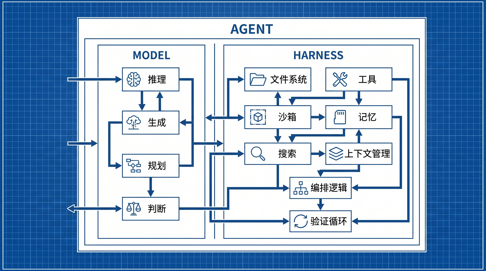
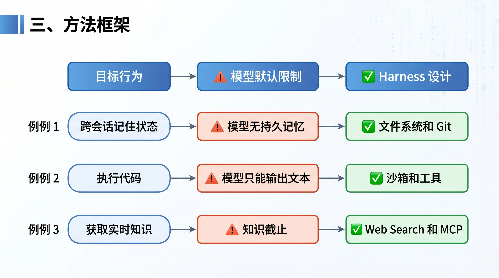
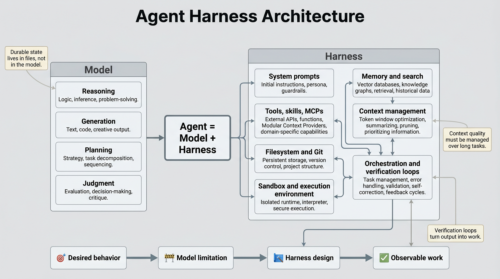

# What Is an Agent Harness?

LangChain's framing is simple: **Agent = Model + Harness**.

The model provides intelligence. The harness turns that intelligence into usable work.

In this framing, the harness is everything around the model: system prompts, tools, skills, MCPs, filesystems, sandboxes, browsers, orchestration logic, hooks, middleware, memory, search, compaction, and verification loops.

## Why the model is not enough

A raw model mostly receives inputs and produces text. By default, it does not maintain durable state across sessions, execute code, access current knowledge, set up environments, install packages, or verify real work.

Those are harness-level responsibilities.

The useful design question is not just "How smart is the model?" It is also "What system surrounds the model so that it can act, observe, remember, and correct itself?"

## Core harness components

### Filesystem and Git

The filesystem gives an agent a workspace. It can read data, inspect code, save intermediate results, and persist state across sessions.

Git adds history. It lets agents track changes, roll back errors, and coordinate across long tasks or multiple agents.

### Sandboxes and tools

Agents need an execution environment. Running generated code directly on a local machine is risky, and one local setup does not scale well to many workloads.

A sandbox gives the agent an isolated place to run code, inspect files, install dependencies, and complete tasks. Tools such as browsers, logs, screenshots, and test runners let the agent observe outcomes and form verification loops.

### Memory and search

Models cannot update their weights during a task. The practical way to add knowledge is context injection.

Memory files such as `AGENTS.md` can store durable lessons and be reloaded into future sessions. Web search and MCP tools can bring in current information that was not present during model training.

### Context management

Long tasks create noisy context. Tool outputs get large. Histories grow. Too many tool descriptions can degrade performance before the task even starts.

Harnesses handle this through compaction, tool-call offloading, and progressive disclosure through skills.

### Long-horizon execution

Long-running agents need planning, observation, verification, and continuity across context windows.

The article describes patterns such as filesystems and Git for durable state, planning files for task decomposition, test hooks for feedback, and Ralph Loops for continuing work when an agent attempts to stop before the goal is complete.

## Practical checklist

- Separate model responsibilities from harness responsibilities.
- Give the agent a real workspace.
- Use Git when work must be tracked or recovered.
- Run code in a sandbox.
- Provide the tools needed to observe results, not just to act.
- Store reusable memory in files that can be loaded later.
- Use search or MCP for current knowledge.
- Manage context quality with compaction and offloading.
- Add verification loops for important tasks.
- Define completion criteria for long-running work.

## Takeaway

Agent design is not only model selection. It is system design around the model.

The model contains intelligence. The harness makes that intelligence operational.
