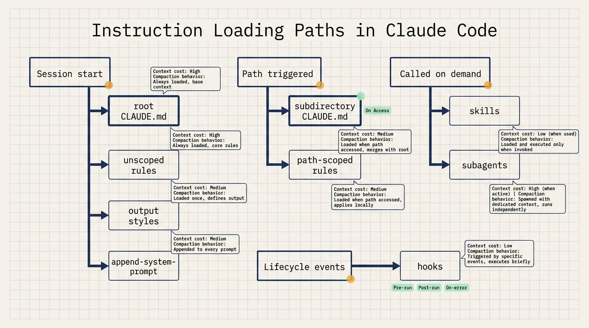
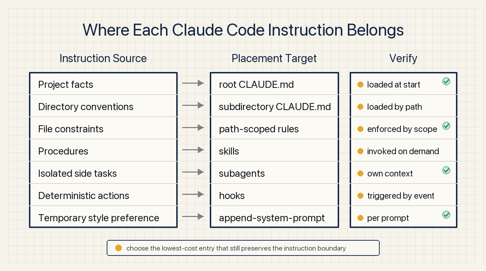
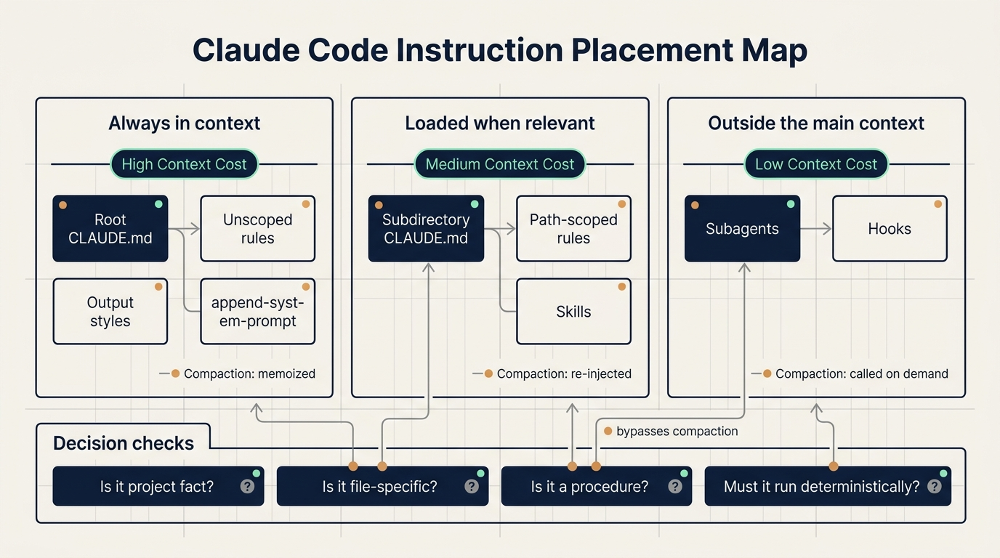

# Where Claude Code instructions should live

Teams often make Claude Code harder to steer by putting every instruction in one place. Build commands, release steps, file-specific rules, personal preferences, and security restrictions all end up in CLAUDE.md. It works for a while. Then the file grows, every session loads unrelated text, and the instructions that matter for the current task get diluted.

Claude Code now gives teams seven ways to steer behavior: CLAUDE.md files, rules, skills, subagents, hooks, output styles, and append-system-prompt. The useful way to choose between them is simple: when should the instruction load, should it survive compaction, and is it advice for the model or a deterministic action the system must enforce?

This guide uses one small scenario throughout: a team has a monorepo with `app/api`, `app/web`, and `infra`. They want Claude to know build commands, API validation rules, release procedures, security restrictions, and a few response preferences.



## Start with loading time

Root CLAUDE.md loads at session start and stays in context. It is a good place for facts Claude should know in every session: build commands, directory layout, monorepo structure, coding conventions, and shared team norms.

Subdirectory CLAUDE.md files load when Claude reads files under that directory. For example, `app/api/CLAUDE.md` loads when Claude works inside `app/api`. This fits directory-specific conventions such as API response shapes, error code rules, and test locations.

Rules can load at session start or be path-scoped. An unscoped rule behaves like CLAUDE.md because it is always present. A path-scoped rule loads only when matching files are touched.

Skills load their name and description at session start. The full body loads only when the skill is invoked. This makes skills a good home for procedures: release checklists, code review steps, migration runbooks, and deployment workflows.

Subagents also expose only their name, description, and tool list at session start. When called through the Agent tool, they work in their own context window. The main session receives only the final summary and metadata.

Hooks live outside the main context. They fire on lifecycle events such as tool calls, file edits, session start, or compaction. They are the right tool for actions that must happen deterministically: block a command, run a formatter, back up chat history, or post a notification.

Output styles inject instructions into the system prompt at session start and never compact. They have strong influence and can replace default Claude Code behavior.

Append-system-prompt adds temporary instructions at invocation time. It is useful for short-lived formatting, tone, or domain requirements.

## Keep CLAUDE.md as the project map

CLAUDE.md is stable because it loads at the beginning of the session and is reread after compaction. That same stability has a cost. Every line enters every engineer's session, even when the current task does not need it.

In the monorepo example, root CLAUDE.md should contain:

- Common commands such as `npm run build`, `npm test`, and `npm run lint`.
- A short directory map: `app/api` for backend APIs, `app/web` for frontend code, `infra` for deployment configuration.
- Team-wide conventions, such as running tests before handoff.
- Pointers to more specific files, such as `app/api/CLAUDE.md` for API conventions and a release skill for deployment steps.

CLAUDE.md should not become the storage location for every process. Anthropic's guidance is to keep it under 200 lines, give it an owner, and review changes like code.

Subdirectory CLAUDE.md files help monorepos. `app/api/CLAUDE.md` can describe API conventions. `infra/CLAUDE.md` can describe deployment conventions. Claude reads those files only when the corresponding directory is involved.

Organization-wide standards such as security or compliance can be deployed as centrally managed CLAUDE.md files through MDM or configuration management. Those can be made non-excludable by individual settings.

## Use rules for file constraints

Rules live in `.claude/rules/`. They are useful for constraints tied to specific files.

Example:

```yaml
---
paths:
  - "src/api/**"
  - "**/*.handler.ts"
---
All API handlers must validate input with Zod before processing.
```

This rule loads when Claude works on API handlers. It stays out of context for documentation changes, frontend styling work, and unrelated deployment tasks.

Good candidates for path-scoped rules:

- `migrations/**` can only append new migrations.
- `src/api/**` must validate input.
- `infra/**` changes must include a rollback note.

When a rule has no `paths`, it becomes mechanically close to CLAUDE.md. It loads all the time and always spends tokens. Write `paths` whenever the instruction applies only to part of the repository.

## Put procedures in skills

Skills live under `.claude/skills/`. Each skill has a `SKILL.md` plus optional scripts and resources. Claude sees the skill name and description at session start, then loads the full body only when the task invokes it.

This fits procedures. A release skill can include:

- Check the current branch.
- Run tests and build.
- Generate a changelog.
- Check for uncommitted files.
- Create a tag.
- Push and record the result.

Putting this into CLAUDE.md would spend tokens in every session. A skill spends those tokens only during release work.

After compaction, Claude Code re-injects invoked skills within a shared budget. If many skills have been invoked, the oldest ones drop first. A skill should stay focused on one workflow.

## Use subagents for isolated side work

Subagents live under `.claude/agents/`. Their body does not enter the parent conversation until they are called, and even then the subagent works in its own context window.

This fits tasks with lots of intermediate material:

- Deep search.
- Log analysis.
- Dependency audit.
- Large codebase reading.
- Parallel exploration.

Use a skill when you want the procedure to happen in the main thread and remain steerable step by step. Use a subagent when the work should be isolated and the main thread only needs the result.

## Use hooks for deterministic actions

Hooks handle work that must happen reliably. If a formatter must run after edits, a hook is more reliable than a written instruction asking the model to remember it.

Typical hook use:

- `PreToolUse` blocks dangerous commands.
- `PostToolUse` runs formatting or lint after edits.
- `PreCompact` backs up conversation state before compaction.
- Completion hooks post a message to Slack or another internal system.

Security restrictions should use hooks or permissions. A CLAUDE.md instruction such as "never delete production data" is still an instruction to a model. A `PreToolUse` hook can inspect the command and return exit code 2 to deny it.

## Use output styles and append-system-prompt carefully

Output styles inject into the system prompt and can replace Claude Code's default engineering behavior. That default includes habits such as scoping changes, handling security concerns, and verifying work. Replacing it can make Claude Code behave more like a general assistant.

Check built-in styles first: Proactive, Explanatory, and Learning cover many cases.

Append-system-prompt is better for temporary preferences. It applies to one invocation and is useful for format, tone, or domain instructions. It adds input tokens, and long or conflicting instructions can reduce adherence.

## A practical placement rule

Project facts go in root CLAUDE.md.

Directory conventions go in subdirectory CLAUDE.md.

File constraints go in path-scoped rules.

Procedures go in skills.

Isolated side tasks go in subagents.

Deterministic actions go in hooks.

Temporary style preferences go in append-system-prompt. Long-term role changes can use output styles after careful review.



## NSSA practice scenario

NSSA can try this on one internal web product repository.

First, keep root CLAUDE.md as a project map: `apps/web`, `apps/api`, and `packages/shared`, plus build, test, and lint commands.

Second, add `apps/api/CLAUDE.md` for API conventions and `apps/web/CLAUDE.md` for frontend component conventions.

Third, create a path-scoped rule for API handler validation.

Fourth, move the release process into a skill.

Fifth, use a `PreToolUse` hook for dangerous command blocking.

A simple validation pass: run one docs-only task, one API handler task, one release task, and one simulated dangerous command. The expected result is clear: the API rule loads only for API work, the release skill loads only for release work, and the hook blocks the dangerous command.



## Source

- Title: Steering Claude Code: CLAUDE.md files, skills, hooks, rules, subagents and more
- Source: Claude Blog
- URL: https://claude.com/blog/steering-claude-code-skills-hooks-rules-subagents-and-more
- Published: June 18, 2026
- Topic: Claude Code instruction loading, context cost, compaction behavior, and customization methods

## Review checklist

1. Keep CLAUDE.md short and owned.
2. Move directory-specific conventions into subdirectory CLAUDE.md.
3. Use `paths` for file-specific rules.
4. Put procedures into skills.
5. Use hooks or permissions for actions that must be enforced.
