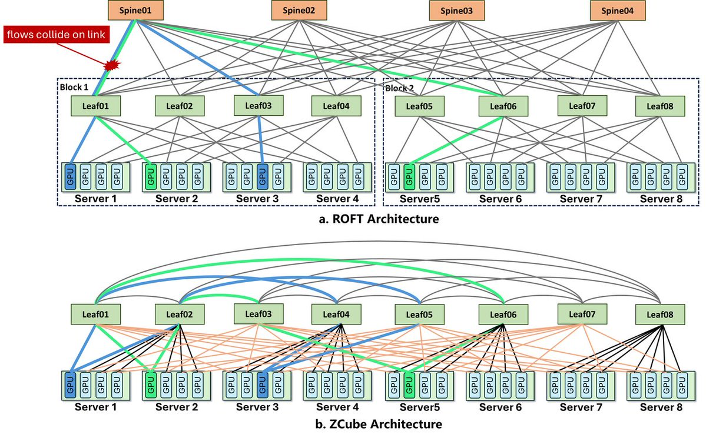
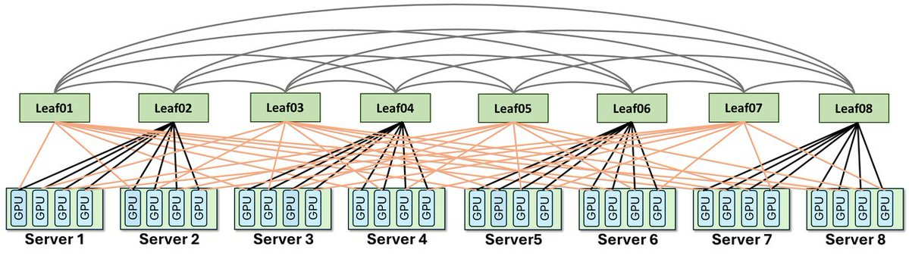
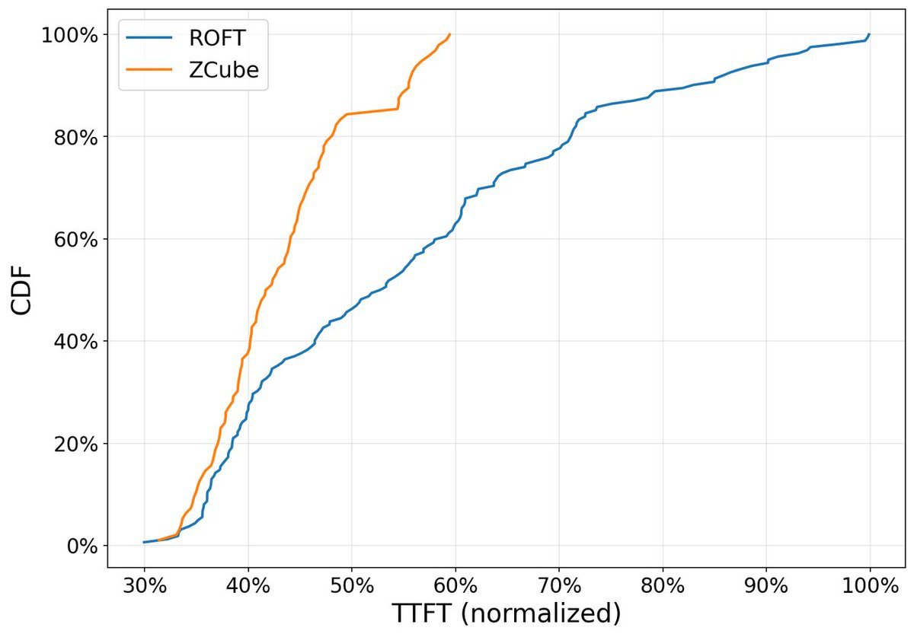

# ZCube: Understanding the Network Bottleneck in LLM Inference

This is a learning-oriented rewrite of Z.ai's article on ZCube, a network architecture designed for large-scale LLM inference clusters. The core idea is simple: as inference moves toward long-context workloads and Prefill-Decode disaggregation, the network is no longer just plumbing. It directly affects throughput, time to first token, tail latency, and serving cost.

## Why Inference Networking Becomes a Bottleneck

In earlier inference systems, the main focus was often GPU count, memory, model size, runtime performance, and scheduling. The network was usually treated as the background layer that connected machines.

That assumption breaks down when long-context inference and Prefill-Decode disaggregation become common.

In a disaggregated inference setup:

- Prefill reads and processes the full prompt.
- Decode generates output tokens step by step.
- KV Cache stores intermediate key-value states so the model does not need to recompute the entire context.

Once Prefill and Decode run on separate nodes, KV Cache is no longer just local memory state. It becomes cross-node traffic.

The more requests the system serves, and the longer the context window becomes, the more data must move between Prefill and Decode nodes. That puts the network directly on the critical path.

In production benchmarking for the GLM-5.1 coding workload, ZCube reported three results without changing GPUs, the software stack, or applications:

- 33% lower switch and optical module CapEx.
- 15% higher average GPU inference throughput.
- 40.6% lower TTFT P99.

The important point is that these gains came from network architecture, not from replacing compute hardware.

## How Bandwidth Affects Inference Performance

Z.ai tested the effect of networking on a 512-GPU cluster while keeping GPU compute, software stack, model, and application logic unchanged. Only the available NIC bandwidth cap was changed.

When network bandwidth increased from 100Gbps to 200Gbps, overall inference throughput improved by about 19%, while Time to First Token, or TTFT, decreased by about 22%.

TTFT is the delay between a user request and the first generated token. For online inference services, it has a direct impact on perceived responsiveness.

The lesson is that LLM inference is not only constrained by GPU compute. Network bandwidth and effective bandwidth utilization can also constrain the entire service.

## Where ROFT Starts to Struggle

AI clusters commonly use Clos or Fat-Tree networks. These architectures scale by stacking multiple switch layers, typically Leaf and Spine layers.

This works well when traffic can be balanced evenly. In practice, real routing policies and real traffic patterns often make traffic uneven. Some links become busy while others remain underused.

ROFT, or Rail-Optimized Fat-Tree, tries to reduce cross-layer forwarding overhead by grouping GPUs by index, or rail. This can work well for certain training traffic patterns.

Prefill-Decode inference is different.

Training traffic often has structured communication patterns such as AllReduce. Inference traffic is more dynamic. One Prefill node may need to transfer KV Cache to different Decode nodes depending on live requests. Source, destination, and traffic volume can all change.

Under that traffic pattern, ROFT's rail mapping does not always translate into load balancing. Traffic may concentrate on a small number of Leaf switches or links, creating local hotspots.

The result can be:

- Persistent load hotspots on some Leaf switches.
- Transfer throughput below available NIC capacity.
- Queue buildup on switch egress ports.
- PFC backpressure.
- Higher TTFT and amplified tail latency.

PFC backpressure is a mechanism used to avoid packet loss, but when congestion persists, it can propagate blocking upstream and affect more traffic.

## Two Kinds of Congestion

It is useful to separate congestion into two categories.

The first category is unavoidable congestion. If many GPUs send data to the same destination at the same time, the final-hop link must be shared. Congestion control and traffic shaping can help, but topology alone cannot remove the fundamental contention.

The second category is avoidable congestion. This happens when topology design, traffic mapping, or multipath utilization causes traffic to collide even though it could have been distributed more evenly.

Prefill-Decode inference can create a lot of this second type. KV Cache traffic is dynamic and asymmetric. If the network topology does not match that traffic pattern, the system repeatedly creates hotspots and link conflicts.

ZCube is aimed at this topology-induced congestion.

Source: Z.ai X Article.

## The Core Design of ZCube

ZCube moves away from the traditional Clos approach of stacking Spine and Leaf switch layers. It uses a flatter GPU server interconnect.

The main design choices are:

1. Remove the Spine switch layer.
2. Divide Leaf switches into two equal groups, usually odd-numbered and even-numbered switches.
3. Build a complete bipartite interconnect between the two switch groups.
4. Connect the two ports of each GPU NIC through a hybrid single-rail and multi-rail access pattern.

A complete bipartite interconnect means every switch on one side connects to every switch on the other side. This gives traffic a wider path space and reduces the chance that flows will concentrate on a few links.

For a dual-port NIC setup, assume:

- Each GPU has a corresponding two-port NIC, so `p = 2`.
- There are `n` GPUs.
- Each switch connects to `k` GPUs.
- The total number of switches is `2n/k`.

For GPU `i`:

- The first port connects to odd-numbered switch `((i−1) mod (n/k)) × 2 + 1`.
- The second port connects to even-numbered switch `⌈i/k⌉ × 2`.

The two access patterns are complementary. One behaves more like single-rail access for contiguous GPU IDs. The other spreads GPUs by relative position across groups. Together, they provide more balanced paths for both training and inference traffic.

Source: Z.ai X Article.

## Key Properties

### Two-Switch-Hop Diameter

In ZCube, any two GPUs can reach each other through at most two switch hops.

This sits between two simpler designs:

- A single-layer switch network has fewer hops but limited scale.
- A conventional two-layer switch network scales better but usually requires more hops and higher latency.

ZCube tries to preserve scalability while keeping paths short.

### Load Balancing for Dynamic Inference Traffic

ZCube's routing strategy uses the flattened topology so that each GPU pair has a unique optimal path. This avoids conflicts caused by arbitrary multipath selection.

The hybrid single-rail and multi-rail access pattern also helps distribute traffic across the network fabric.

For Prefill-Decode inference, this matters because source-destination relationships are unstable and NIC load can be highly uneven. ZCube attempts to move flows that would collide under ROFT onto more suitable paths.

### Scalability

With one layer of 51.2T switches, each with 128 400Gbps ports, ZCube can build a network connecting 16,384 400Gbps NICs.

That means the design is not only for small demonstrations. It targets large-scale training and inference clusters.

## Production Cluster Test

ZCube was deployed in a thousand-GPU production cluster running GLM-5.1 coding inference services. The cluster was migrated from ROFT to ZCube.

This was not a simple switch replacement. Removing the Spine layer meant that existing cabling patterns, IP addressing, routing policies, and switch configuration methods could not be reused directly.

Harnets.AI built a ZCube-centered deployment solution with:

- ZCube Controller.
- Data center layout design tooling.
- Cabling correctness verification.
- Automated configuration generation.
- Batch deployment.

That deployment tooling matters because a topology is only useful if it can be implemented reliably at production scale.

After migration, the same cluster running GLM-5.1 coding inference showed:

- More than 15% higher average GPU inference throughput.
- 40.6% lower TTFT P99.
- Around one-third savings in switch and optical module hardware.
- Stable operation for more than two weeks at the time of publication.

Source: Z.ai X Article.

## Why This Matters

LLM inference is moving from isolated component optimization toward system-level co-design.

It is no longer enough to optimize only the model, kernels, runtime, scheduler, or GPU utilization. Long-context inference, Prefill-Decode disaggregation, MoE, and mixed training-inference workloads all reshape internal cluster communication patterns.

The larger lesson from ZCube is that network topology is not a passive background layer. It can directly affect token generation efficiency, system stability, and serving cost.

## Key Takeaways

1. Long-context inference and Prefill-Decode disaggregation turn KV Cache into significant cross-node traffic.
2. ROFT can work well for some training traffic, but dynamic and asymmetric inference traffic can create local hotspots.
3. Some congestion is unavoidable, but topology-induced congestion can be reduced through architecture.
4. ZCube removes the Spine layer, uses odd/even switch groups, builds a complete bipartite interconnect, and combines single-rail with multi-rail access.
5. In the reported GLM-5.1 coding inference workload, ZCube improved average GPU inference throughput by more than 15%, lowered TTFT P99 by 40.6%, and reduced network hardware cost by about one-third.
