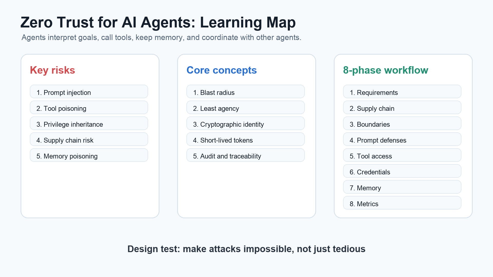
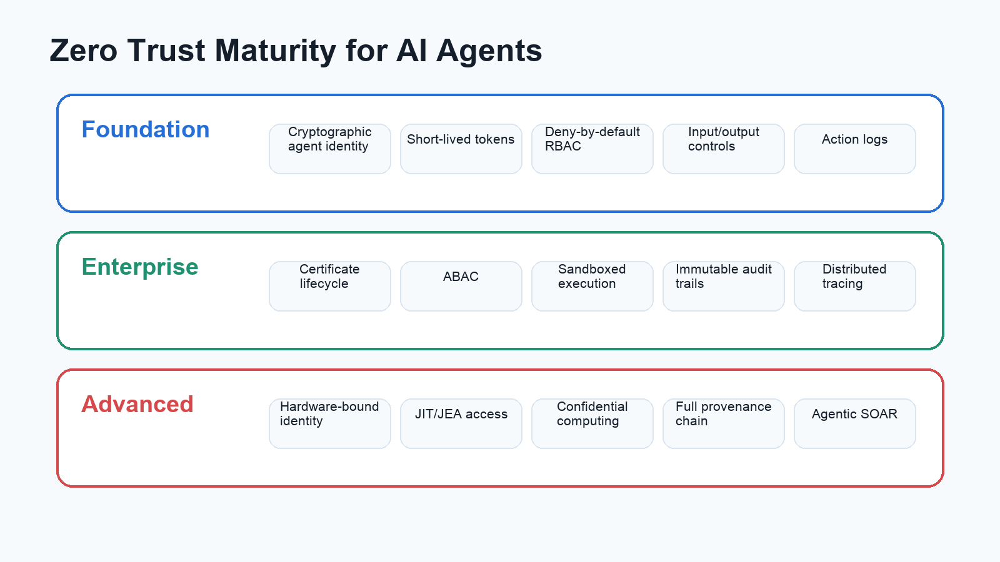
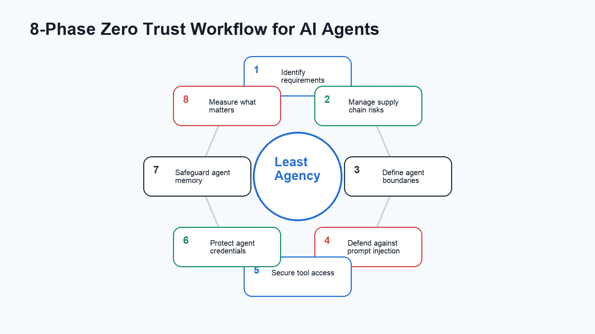

# Zero Trust for AI Agents: Study Notes from Anthropic's Deployment Framework

Anthropic's "Zero Trust for AI Agents" PDF is best read as a practical learning document, not as a short product announcement. The blog post is brief, but the PDF lays out a full framework for deploying autonomous agents in enterprise environments.

The main lesson is simple: once agents can call tools, access systems, keep memory, and coordinate with other agents, security has to cover identity, permissions, tools, memory, logging, and response.

## What makes agent security different

Traditional software usually executes predefined logic. Agents work from goals. They decide which steps to take, which tools to call, and how to combine context across tasks.

This changes the threat model.

Agents can:

- execute multi-step operations without human approval at every step
- access APIs, databases, file systems, external services, and MCP tools
- interpret ambiguous instructions
- retain context across sessions
- coordinate with other agents

That is why the document introduces two useful concepts: blast radius and least agency.

Blast radius means the maximum damage an agent can cause if it is compromised or misdirected. Least agency extends least privilege: it limits not only what an agent can access, but what each tool can do, how often, and under which context.

## Main threat categories

The PDF highlights several major risks.

Prompt injection can be direct through user input or indirect through external content such as webpages, emails, or documents. Indirect injection is especially dangerous because the user may never see the malicious instruction.

Tool misuse happens when an agent uses legitimate tools in harmful sequences. A CRM read tool and an external email tool may each be acceptable alone, but together they can become an exfiltration path.

Tool poisoning affects MCP tool descriptors, schemas, metadata, or server implementations. If a tool lies about what it does, the agent may invoke dangerous behavior while believing it is using a trusted capability.

Identity and privilege abuse include unscoped delegation, confused-deputy behavior between agents, and cached credentials that persist across sessions.

Supply chain risk covers models, fine-tuning data, MCP servers, API integrations, agent frameworks, and open-source dependencies.

Memory poisoning affects long-term context. Once malicious content enters memory or a RAG store, it can influence future sessions.

## The three maturity tiers

Anthropic organizes controls into three tiers.

Foundation is the minimum viable security baseline. It includes cryptographic agent identity, short-lived scoped tokens, deny-by-default RBAC, identity-based isolation, basic input/output controls, and comprehensive logging.

Enterprise is the target for most serious deployments. It adds certificate lifecycle management, mTLS, ABAC, dynamic privilege adjustment, sandboxed execution, immutable audit trails, distributed tracing, anomaly detection, and formal governance.

Advanced applies to high-risk or regulated environments. It includes hardware-backed identity, attestation, JIT/JEA access, confidential computing, full provenance chains, multi-layer validation, immutable infrastructure, and agentic SOAR.

The important point is that Foundation is no longer weak. Long-lived API keys, shared service accounts, and controls that only add friction do not meet the new baseline.

## The 8-phase workflow

The PDF turns the architecture into an implementation workflow:

1. Identify requirements
2. Manage supply chain risks
3. Define agent boundaries
4. Defend against prompt injection
5. Secure tool access
6. Protect agent credentials
7. Safeguard agent memory
8. Measure what matters

This workflow is the most reusable part of the document. It can be used as a deployment checklist before connecting agents to real enterprise systems.

## The practical takeaway

The framework is not telling teams to avoid agents. It is telling them to deploy agents with boundaries.

Start with read-only access. Separate read and write permissions. Avoid shared credentials. Treat MCP servers and tools as supply chain components. Keep memory isolated and versioned. Log every meaningful action. Measure dwell time and coverage. Keep humans responsible for high-impact containment and disclosure decisions.

Enterprise agent adoption is not only a model capability problem. It is a boundary design problem.
